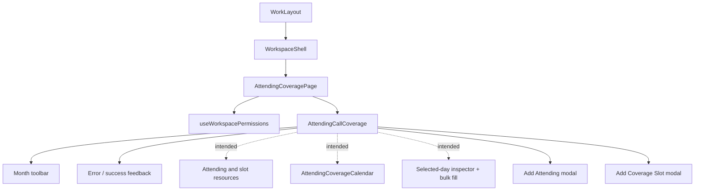
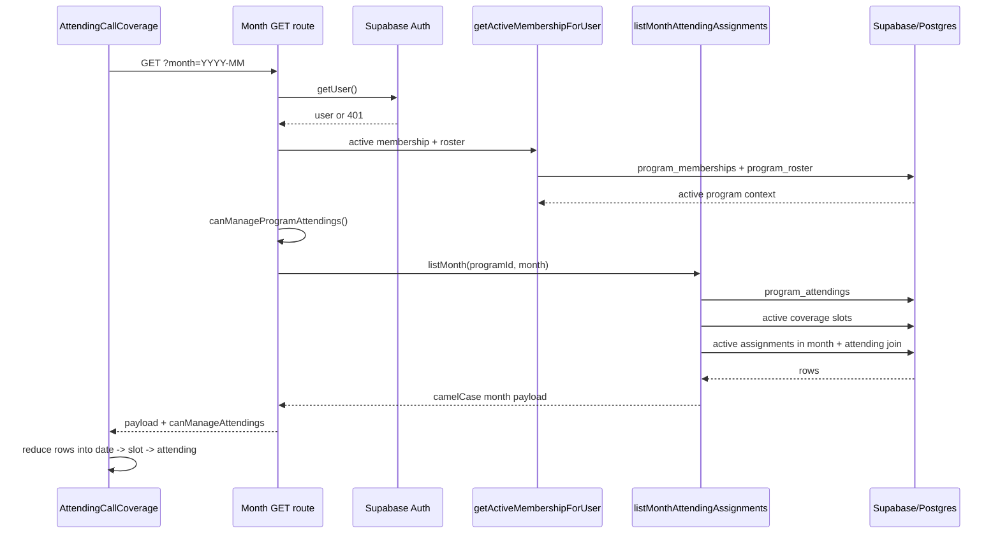
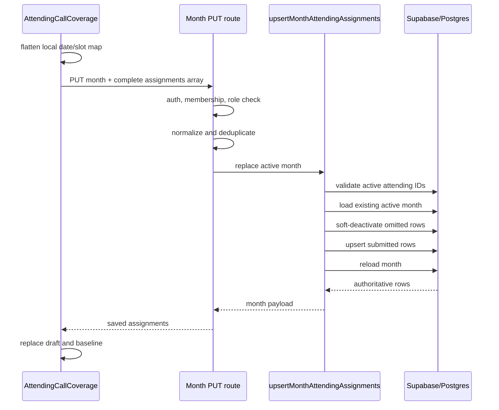
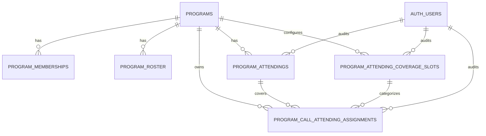

# Attending Coverage UX Audit

Audit date: June 15, 2026  
Scope: Current local `snaportho-web` worktree  
Method: Read-only code, schema, permission, type-check, test, and unauthenticated runtime inspection

## Executive Summary

Attending Coverage is currently an in-progress feature rather than a complete end-to-end workflow.
The repository contains:

- A stable attending roster manager under Program Settings.
- API and database foundations for attendings and date-based assignments.
- A new, uncommitted slot/service model for multiple coverage assignments per date.
- A new Attending Coverage page, calendar component, assignment state model, bulk-fill logic, and creation modals.

However, the current checkout is not usable as a coverage-management product:

1. The main page renders literal placeholder text instead of the calendar, resource list, and inspector.
2. The current worktree does not type-check.
3. The multi-slot schema conflicts with an older uniqueness constraint, so multiple active slots on one date are likely blocked.
4. The slot-aware upsert conflict target does not match the new unique index.
5. Frontend page permissions conflict with API and RLS permissions.
6. Program members can read coverage through the backend but are redirected away from the page.
7. The feature is discoverable only through `Call Hub -> Add Call -> Attending Coverage`.
8. There is no first-class mobile workflow, list view, search, audit history, conflict prevention, or integration into the resident call calendar.

The strongest redesign direction is not a visual reskin. It is to establish one canonical
coverage workspace with:

- Consistent permissions.
- A transaction-safe assignment API.
- A corrected one-assignment-per-date-and-slot data model.
- Calendar and list views sharing the same filters.
- A persistent day editor or mobile bottom sheet.
- Clear draft, save, conflict, and historical states.

## Audit Boundary

### Current worktree status

The audit intentionally describes the checked-out worktree, including uncommitted files.

Modified tracked files:

- `src/app/api/program/call-attending-assignments/month/route.ts`
- `src/app/work/call/add/page.tsx`
- `src/lib/workspace/call/attendings-shared.ts`
- `src/lib/workspace/call/attendings.ts`
- `src/lib/workspace/call/types.ts`

Untracked feature files:

- `src/app/api/program/attending-coverage-slots/route.ts`
- `src/app/work/call/attending-coverage/page.tsx`
- `src/components/workspace/call/attendingcallcoverage.tsx`
- `src/components/workspace/call/attendingcoveragecalendar.tsx`
- `supabase/migrations/20260610_120000_program_attending_coverage_slots.sql`
- `supabase/verification/attending_coverage_slots.sql`

The attending roster and original single-assignment backend foundation are present in `HEAD`.
The coverage page and multi-slot extension are not.

### Runtime limitation

Direct runtime navigation to `/work/call/attending-coverage` redirected the unauthenticated
browser to `/work/welcome`. No admin credentials or seeded authenticated browser state were
available. Journeys below are therefore code-traced, not claimed as authenticated usability
observations.

## 1. Current Architecture

### 1.1 Feature inventory

| Layer | File | Responsibility | Current status |
|---|---|---|---|
| Page | `src/app/work/call/attending-coverage/page.tsx` | Permission gate and page shell | New, untracked |
| Page entry | `src/app/work/call/add/page.tsx` | Only direct UI link to coverage page | Modified |
| Call hub | `src/app/work/call/callhubclient.tsx` | Links to Add Call, not directly to coverage | Existing |
| Coverage controller | `src/components/workspace/call/attendingcallcoverage.tsx` | Month state, fetch, save, bulk fill, creation modals | New, incomplete |
| Calendar | `src/components/workspace/call/attendingcoveragecalendar.tsx` | Month grid and assignment summaries | New, disconnected |
| Roster UI | `src/components/workspace/settings/programattendingsmanager.tsx` | Create, rename, activate/deactivate attendings | Existing |
| Settings host | `src/app/work/settings/settingsclient.tsx` | Program Attendings settings section | Existing |
| Workspace shell | `src/components/workspace/workspaceshell.tsx` | Desktop sidebar, mobile tabs/drawer | Existing |
| Sidebar | `src/components/workspace/workspacesidebar.tsx` | Call and Settings navigation | Existing |
| Month API | `src/app/api/program/call-attending-assignments/month/route.ts` | Read and replace a month of assignments | Existing, modified |
| Attending collection API | `src/app/api/program/attendings/route.ts` | List and create attendings | Existing |
| Attending item API | `src/app/api/program/attendings/[id]/route.ts` | Rename or activate/deactivate | Existing |
| Slot API | `src/app/api/program/attending-coverage-slots/route.ts` | List active slots and create slots | New, untracked |
| Service | `src/lib/workspace/call/attendings.ts` | Queries, mapping, validation, month replacement | Existing, modified |
| Shared validation | `src/lib/workspace/call/attendings-shared.ts` | Roles, date/month validation, input normalization | Existing, modified |
| Types | `src/lib/workspace/call/types.ts` | Domain payloads | Existing, currently invalid |
| Permission source | `src/lib/workspace/access-control.ts` | Generic workspace permissions | Existing |
| Membership source | `src/lib/workspace/memberships.ts` | Active program and roster lookup | Existing |
| Schema foundation | `supabase/migrations/20260606_090000_program_attendings_foundation.sql` | Attendings, assignments, RLS | Existing |
| Slot migration | `supabase/migrations/20260610_120000_program_attending_coverage_slots.sql` | Slots, `slot_id`, migration, RLS | New, untracked |
| Tests | `src/lib/workspace/call/attendings.test.ts` | Role and normalization checks | Existing, no slot coverage |

### 1.2 Navigation pathways

#### Coverage assignment page

Only coded path:

```text
Workspace
  -> Call
  -> Add Call
  -> Attending Coverage
```

References:

- Call Hub `Add Call`: `src/app/work/call/callhubclient.tsx:1761`
- Add Call `Attending Coverage`: `src/app/work/call/add/page.tsx:77`

There is no direct Attending Coverage item in:

- Workspace sidebar.
- Mobile bottom tabs.
- Call Hub action group.
- Program Settings section.

#### Attending roster

```text
Workspace
  -> Program Settings
  -> scroll to Program Attendings
```

The settings route is available only to users with `canManageProgramSettings`, which the generic
permission model restricts to roster admins.

### 1.3 Intended frontend component hierarchy



Actual current render:

```text
AttendingCallCoverage
  -> Toolbar
  -> Feedback
  -> "Left resources (sidebar)"
  -> "Center calendar"
  -> "Right inspector"
  -> hidden/inaccessible modal branches
```

The imported `AttendingCoverageCalendar` is never rendered.

### 1.4 State management

The feature uses component-local React state. There is no shared store, server component data
hydration, React Query, SWR, or form library.

Core state:

- `visibleMonth`
- `attendings`
- `slots`
- `assignments`
- `initialAssignments`
- `selectedDateKey`
- `loading`, `saving`, `creating`
- `error`, `successMsg`
- modal form fields
- bulk-fill fields

Assignment shape:

```ts
Record<coverageDate, Record<slotId, attendingId>>
```

This is compact for rendering but loses row metadata such as assignment ID, active state,
creator, timestamps, and coverage scope.

### 1.5 Data fetching

Coverage controller:

```text
GET /api/program/call-attending-assignments/month?month=YYYY-MM
```

The response is expected to contain:

- Program ID.
- Permission flag.
- Month range.
- All program attendings.
- Active coverage slots.
- Active assignments in the month.

Roster manager:

```text
GET /api/program/attendings
```

Strategies:

- Browser `fetch`.
- `credentials: include`.
- Mostly `cache: no-store`.
- Manual JSON parsing.
- Manual loading/error state.
- Refetch after Settings mutations.

Missing controls:

- No request cancellation.
- No stale-response protection during rapid month navigation.
- No caching or prefetch of adjacent months.
- No offline behavior.
- No retry backoff.

### 1.6 Mutations

| Action | Endpoint | Strategy |
|---|---|---|
| Create attending | `POST /api/program/attendings` | Optimistically append on coverage page |
| Rename/deactivate attending | `PATCH /api/program/attendings/:id` | Refetch full roster |
| Create slot | `POST /api/program/attending-coverage-slots` | Append, then refetch month |
| Save assignments | `PUT /api/program/call-attending-assignments/month` | Full-month replacement |
| Remove assignment | Same month `PUT` | Omit row; backend soft-deactivates it |

Assignment editing is local-draft-first:

1. Edit nested local state.
2. Show `Unsaved`.
3. User selects `Save Changes`.
4. Send the entire active month.
5. Replace local state with response.

There is no optimistic server update for assignments. There is also no autosave or per-change
mutation.

### 1.7 Optimistic updates

- Creating an attending appends it immediately after a successful response.
- Creating a slot appends it, then immediately reloads the month, making the append redundant.
- Assignment changes are optimistic only in the sense that they alter a local draft; nothing is
  persisted until the global save.

### 1.8 Error handling

Strengths:

- APIs return explicit 401, 400, and 403 responses for common authorization failures.
- Coverage page exposes a retry action.
- Settings exposes loading, error, and retry states.

Weaknesses:

- Most database constraint failures become generic 500 responses.
- Slot loading swallows all errors and returns an empty array, making outages look like
  "no slots configured."
- The intended missing-column fallback around the assignment select is ineffective because
  Supabase query errors are returned as values rather than thrown.
- Month save is not atomic; a failure after deactivation can leave partial data loss.
- The UI has no recovery workflow for save conflicts.

## 2. Backend Request and Response Flow

### 2.1 Load month



### 2.2 Save month



Failure boundary: deactivation and upsert are separate calls with no transaction.

### 2.3 Data transformations

Database snake_case rows are mapped to camelCase domain objects in `attendings.ts`.

Assignment rows are enriched with slot metadata from a separately loaded slot map:

- `slotId`
- `slotName`
- `slotAbbreviation`
- `slotColor`

The UI then discards most row-level metadata and retains only:

```text
date -> slot -> attending
```

## 3. Database Architecture

### 3.1 ERD



### 3.2 `program_attendings`

| Column | Type | Notes |
|---|---|---|
| `id` | UUID PK | Generated |
| `program_id` | UUID FK | Cascades with program |
| `full_name` | text | Required, trimmed non-empty check |
| `display_name` | text nullable | Optional label |
| `is_active` | boolean | Soft availability |
| `created_by`, `updated_by` | UUID nullable FK | Set null on user deletion |
| `created_at`, `updated_at` | timestamptz | Audit timestamps |

Index:

```text
(program_id, is_active, full_name)
```

Expected cardinality:

- One program to 10-100+ attending records.
- Attendings are not globally deduplicated.
- No uniqueness constraint prevents duplicate names within a program.

Deletion:

- No attending DELETE API.
- Assignment FK uses `ON DELETE RESTRICT`.
- UI uses deactivate/reactivate.

### 3.3 `program_attending_coverage_slots`

| Column | Type | Notes |
|---|---|---|
| `id` | UUID PK | Generated |
| `program_id` | UUID FK | Cascades with program |
| `name` | text | Required |
| `abbreviation` | text | Required |
| `color` | text nullable | No format constraint |
| `is_active` | boolean | Defaults true |
| `sort_order` | integer | Defaults 0 |
| `description` | text nullable | Not exposed in current modal |
| audit columns | mixed | Same pattern as attendings |

Index:

```text
(program_id, is_active, sort_order, name)
```

Expected cardinality:

- One program to 1-20 coverage services/slots.
- No uniqueness constraint on program + name or abbreviation.

Deletion:

- Assignment FK uses `ON DELETE RESTRICT`.
- RLS allows managers to delete, but there is no API or UI for update/deactivate/delete.

### 3.4 `program_call_attending_assignments`

| Column | Type | Notes |
|---|---|---|
| `id` | UUID PK | Generated |
| `program_id` | UUID FK | Program ownership |
| `attending_id` | UUID FK | Required, delete restricted |
| `coverage_date` | date | Required |
| `coverage_scope` | text | Defaults `program_call` |
| `slot_id` | UUID nullable FK | Added by slot migration |
| `is_default` | boolean | Defaults true |
| `is_active` | boolean | Soft deletion |
| audit columns | mixed | Creator/updater and timestamps |

Intended cardinality:

- One active assignment per program + date + scope + slot.
- One attending may cover many dates.
- One slot may have one attending on a date.

### 3.5 Index and constraint conflict

Original constraints:

```text
identity:
(program_id, coverage_date, coverage_scope, attending_id, is_default)

single active default:
(program_id, coverage_date, coverage_scope)
WHERE is_default = true AND is_active = true
```

New slot constraint:

```text
(program_id, coverage_date, coverage_scope, slot_id, is_default)
WHERE slot_id IS NOT NULL AND is_active = true
```

Critical issue:

The old `single active default` index remains. The UI sends `isDefault: true` for every slot.
Therefore a second slot on the same date and scope conflicts with the old index even if its
`slot_id` differs.

The application upsert specifies:

```text
(program_id, coverage_date, coverage_scope, slot_id, attending_id, is_default)
```

No unique index has that exact key. The new index also has a partial predicate. The slot-aware
upsert therefore has no matching conflict arbiter and is likely to fail.

### 3.6 Supporting tables

`programs`

- Parent tenant boundary.

`program_memberships`

- Connects user to active program.
- Supplies membership role and active date range.

`program_roster`

- Supplies claimed roster identity, roster role, and `isAdmin`.

`auth.users`

- Authentication and audit foreign keys.

### 3.7 Data integrity gaps

- `slot_id` is not validated as belonging to the assignment's `program_id`.
- Attending membership is validated in the service, but not through a composite database FK.
- Slot name and abbreviation can be duplicated in a program.
- Color accepts any text.
- Month validation checks `YYYY-MM` shape but not month 01-12.
- Date validation checks string shape but not calendar validity.
- Existing assignments to inactive attendings can be loaded, but the calendar hides inactive
  attendings from its lookup and can display those rows as unassigned.

## 4. Permissions Audit

### 4.1 Backend and RLS policy

Can view:

- Any active program member whose membership date range includes today.

Can create/edit attending, slot, or assignment:

- Roster admin.
- `admin`
- `program_admin`
- `coordinator`
- `chief`
- `chief_resident`
- `faculty`
- `faculty_lead`

Can delete:

- Assignment RLS permits delete, though the service uses soft deactivation.
- Slot RLS permits delete through `FOR ALL`, though no route exposes it.
- Attending delete is not granted or exposed.

### 4.2 Frontend gates

Coverage page first gate:

```text
canEditCallAssignments OR mode=admin OR isAdmin
```

Generic `canEditCallAssignments` is true only for roster admins.

Coverage controller second gate:

```text
canManageAttendings from feature API
```

Result:

| User | Backend/RLS | Coverage page | Settings roster |
|---|---|---|---|
| Roster admin | Manage | Allowed | Allowed |
| Coordinator/chief/faculty role, not `isAdmin` | Manage | Redirected | Redirected |
| Resident member | Read | Redirected | Hidden |
| No active membership | None | Redirect/welcome | Hidden |

The UI is therefore stricter than the backend, and no one gets the intended read-only coverage
experience.

## 5. User Journey Maps

These are based on current code paths. "Blocked" means the current placeholder render prevents
completion.

### Journey A: Create an attending

#### Working Settings path

1. Open Workspace.
2. Select `Program Settings` in the sidebar, or `More -> Settings` on mobile.
3. Scroll to `Program Attendings`.
4. Select `Add Attending`.
5. Enter one `Display name`.
6. Select `Create attending`.
7. Wait for POST and full-list refetch.
8. Observe a global settings banner.

Nominal clicks: 4 plus typing and scrolling.

Constraints:

- Available only to roster admins through Settings.
- The form states display name and full name are stored together.
- Placeholder encourages `Dr. Jane Doe`, while the coverage modal says no `Dr.` prefix.
- No email, specialty, service eligibility, contact, or external identifier.
- Duplicate names are allowed.

#### Intended coverage-page path

1. Call Hub.
2. Select `Add Call`.
3. Select `Attending Coverage`.
4. Select an Add Attending control in the left resource panel.
5. Enter first name.
6. Enter last name.
7. Optionally enter email.
8. Choose active status.
9. Select `Create Attending`.

Current result: blocked. The resource panel is a placeholder and no button opens the modal.

Additional defect: email is captured by the modal but never submitted or stored.

### Journey B: Assign coverage to a date

Intended path:

1. Call Hub.
2. Select `Add Call`.
3. Select `Attending Coverage`.
4. Navigate to the month with previous/next or Today.
5. Select a date in the month grid.
6. In the right inspector, choose an attending for each slot.
7. Repeat for other dates as needed.
8. Select `Save Changes`.

Current result: blocked. The calendar and inspector are not mounted.

Intended interaction count for one assignment: at least 6 clicks from Call Hub, plus save.

### Journey C: View future coverage

Intended manager path:

1. Call Hub.
2. Select `Add Call`.
3. Select `Attending Coverage`.
4. Select next month repeatedly.
5. Scan date cells and slot rows.

Current result:

- Manager sees placeholder columns instead of coverage.
- Authorized non-admin editors are redirected.
- Read-only members are redirected.

There is no:

- Search by attending.
- Filter by service.
- List/agenda view.
- Jump-to-date picker.
- Multi-month overview.
- Resident-facing coverage surface.

### Journey D: Modify an assignment

Intended path:

1. Navigate to coverage month.
2. Select the date.
3. Change the slot's attending in the inspector.
4. Observe `Unsaved`.
5. Select `Save Changes`.

Alternative intended overview action:

- Select the clear `X` in a calendar slot row.
- Reassign through the inspector.
- Save globally.

Current result: blocked.

### Journey E: Remove an assignment

Intended path:

1. Open month.
2. Select date or clear `X` directly on a slot.
3. Set attending to empty.
4. Select `Save Changes`.
5. Backend soft-deactivates any active row omitted from the submitted month.

Current result: blocked.

Risk:

- Removal has no confirmation.
- Bulk mode can clear a date range when no attending is selected.
- Full-month save can remove another user's concurrent additions.

### Journey F: Mobile workflow

Code-traced path:

1. Open Workspace on phone.
2. Select `Call` in fixed bottom navigation.
3. Select `Add Call`.
4. Select `Attending Coverage`.
5. Use the same desktop-oriented toolbar and month grid.
6. Intended three-column layout stacks vertically below `lg`.
7. Intended date selection would require scrolling from the calendar to a separate inspector.
8. Save control remains in the top toolbar.

Current result: placeholder body.

Mobile concerns even after reconnecting components:

- Seven columns at phone width make each 92px-minimum date cell impossible without clipping,
  compression, or unreadable content.
- The shell deliberately uses `overflow-x-clip`, so overflow can be hidden instead of scrollable.
- Month label, navigation, Settings, unsaved status, discard, and save share one non-wrapping row.
- The page title row has no small-screen adaptation.
- Calendar cells contain slot count, slot badge, attending name, clear control, and status marker.
- A right-side inspector stacking below the calendar creates a long navigation distance.
- Save is far from the edited control.
- No bottom sheet, agenda view, or sticky mobile save bar exists.

## 6. UX Evaluation

### 6.1 Discoverability: Poor

- Coverage is one level below `Add Call`, which semantically suggests creating resident call
  entries rather than managing attending coverage.
- No direct Call Hub action exists.
- No sidebar item exists.
- Settings has Program Attendings but no link to coverage assignments.
- The coverage page's own Settings button opens generic Settings without anchoring to Attendings.

### 6.2 Learnability: Poor

- Roster, slots, and assignments are separate concepts with no onboarding explanation.
- `coverage_scope`, `slot`, and `default` are domain concepts with unclear user-facing semantics.
- The Month/List toggle visually promises a list view that does not exist and is not interactive.
- The UI contains contradictory naming guidance around professional prefixes.
- Slot sort order is exposed as a raw number.

### 6.3 Efficiency: Poor to moderate in intended design

Positive:

- Local drafting allows several edits before one save.
- Direct clear in a date cell could be fast.
- Bulk-fill primitives could reduce repetitive work.

Negative:

- Entry requires detouring through Add Call.
- A one-day assignment still requires a global save.
- Roster management is split between Settings and an intended duplicate modal.
- Month-only API and navigation are inefficient for long future ranges.
- No keyboard shortcuts, copy/paste, repeat pattern, or drag fill.

### 6.4 Information density: Unbalanced

The proposed calendar tries to show every slot and attending in every day cell.

- With 1-3 slots, the grid can be scannable on desktop.
- With 5-10 slots, cells become dense and truncate names.
- At 10+ slots, the fixed-height month grid cannot represent the data.
- The slot count repeats in every date cell even though it is constant across the month.
- Status border, background, dot, slot row state, and text all encode overlapping completion data.

### 6.5 Visual hierarchy: Fragmented

- Coverage page uses a light, flat scheduling aesthetic.
- Add Call and Settings use dark, rounded, high-contrast surfaces.
- Moving between them feels like changing products.
- The top toolbar prioritizes generic Settings and a fake view toggle alongside the actual save.
- Full/partial/empty status competes visually with the assignment names, which are the primary
  information users need.

### 6.6 Cognitive load: High

Users must mentally track:

- Which month is loaded.
- Which date is selected.
- Which slot is being edited.
- Which edits are local.
- Whether a success message means local bulk changes or server persistence.
- Whether empty attending means "clear."
- Whether Settings or inline Add is the canonical roster editor.

The message "Bulk updated ... locally" helps, but uses a success treatment for unsaved data.

### 6.7 Error prevention: Weak

- No confirmation for bulk clear.
- No preview/count breakdown before bulk apply.
- No validation that start is before end.
- No check that slots belong to the program.
- No concurrency token.
- No transactional save.
- `Today` can switch months without the unsaved-change confirmation used by previous/next.
- Browser back, sidebar navigation, and Settings navigation have no dirty-state guard.
- Discard uses a shallow copy; subsequent nested edits can mutate the baseline and break dirty
  detection after a discard.
- Inactive assigned attendings can appear unassigned in the calendar.

### 6.8 Scalability

#### 10 attendings

- Alphabetical select is workable.
- Calendar names are generally scannable.
- Resource sidebar could work without search.

#### 30 attendings

- Selects become slow to scan.
- Name collisions and similar surnames become likely.
- Search/typeahead and service eligibility become necessary.
- Resource sidebar needs counts, filters, and virtualization or compact rows.

#### 100 attendings

- Plain select/list patterns fail.
- Loading all attendings every month is wasteful.
- Need server-side or client-indexed search, stable identifiers, specialty/service metadata, and
  possibly attending groups.
- Audit history and bulk operations become essential.

Slot scalability:

- Month cells are the primary bottleneck before attending count.
- More than roughly 3-4 visible slots per day needs a different representation.

### 6.9 Mobile usability: Poor

A resident could not comfortably use the intended dense month editor on a phone.
A coordinator could perform occasional emergency changes only with a mobile-specific agenda or
day-sheet interaction.

Recommended mobile mental model:

```text
Agenda/list -> select date -> bottom sheet -> choose slot/attending -> immediate or sticky save
```

Not:

```text
Desktop month grid squeezed into seven columns -> scroll to inspector -> scroll back to save
```

## 7. Technical Constraints and Risks

### Critical

1. Main assignment UI is disconnected and replaced by placeholders.
2. TypeScript fails due to missing `ProgramAttendingCoverageSlot` import.
3. TypeScript fails due to duplicate `ProgramCallAttendingAssignment` declarations.
4. Old single-default index prevents multiple active slot assignments per date/scope.
5. Slot-aware upsert conflict target does not match a unique index.
6. Month replacement is non-transactional and can partially deactivate data before an upsert
   failure.

### High

1. Page/UI permission gates disagree with feature API and RLS.
2. Read-authorized members have no view surface.
3. No optimistic concurrency; last full-month writer wins.
4. Slot IDs are not program-validated.
5. Missing-column read fallback is not triggered for returned Supabase errors.
6. Slot loader hides all failures as empty data.
7. Dirty state can be corrupted after discard due to shallow nested-object reuse.
8. No unsaved-change guard for Today, Settings, Back to Call, browser back, or sidebar links.

### Medium

1. No slot edit/deactivate API or UI.
2. No direct delete; soft-deactivation semantics are invisible to users.
3. Assignment UI discards audit metadata.
4. Existing inactive-attending assignments can render as unassigned.
5. No direct integration with call calendar, exports, Google Calendar, notifications, or swaps.
6. API payload always loads the full attending roster.
7. Month fetch races can display stale data after rapid navigation.
8. Duplicate slot names, abbreviations, and attending names are allowed.
9. Email field is dead UI.
10. Calendar and parent duplicate attending-name normalization logic.

### Test and build status

`tsc --noEmit` fails with three feature-related errors.

Focused attending test execution also fails under the current ESM loader because the test uses
CommonJS `require`. Existing test cases cover:

- Role normalization.
- Attending input trimming.
- Month range.
- Single-scope assignment normalization.

They do not cover:

- Slots.
- Multi-slot uniqueness.
- Database conflict behavior.
- Permission parity.
- Month replacement transactionality.
- React interactions.
- Mobile rendering.

## 8. Benchmarking

The useful patterns are product principles, not visual imitation.

### Google Calendar

Applicable patterns:

- Direct calendar entry rather than nesting scheduling under an unrelated create flow.
- Day/week/month view switching.
- A clear Today action.
- Multiple calendars that can be shown or hidden.
- Keyboard shortcuts and accessible calendar navigation.

SnapOrtho opportunity:

- Treat coverage slots like toggleable calendar layers.
- Make date interaction direct.
- Add a real agenda/list view for dense and mobile contexts.

Official reference:
https://support.google.com/calendar/answer/2465776

### Linear

Applicable patterns:

- Keyboard-first navigation.
- Command menu for infrequent actions.
- Fast inline edits with minimal modal use.
- Clear status and optimistic feedback.
- Filters encoded as a coherent query, not scattered controls.

SnapOrtho opportunity:

- Add keyboard month/date navigation and quick assignment.
- Move slot management and secondary actions into a command/menu surface.
- Keep the primary screen focused on coverage gaps and assignments.

### Notion Calendar

Applicable patterns:

- Calendar and source data stay connected.
- Multiple calendars can be connected and hidden.
- Double-click/direct manipulation creates or edits an item.
- Today and directional keyboard shortcuts reduce navigation cost.
- Context is linked rather than duplicated.

SnapOrtho opportunity:

- Link an assignment to the attending record, service, notes, and call schedule context.
- Avoid maintaining separate roster behavior in Settings and Coverage.
- Make selected-day context available without leaving the calendar.

Official reference:
https://www.notion.com/help/guides/getting-started-with-notion-calendar

### Motion

Applicable patterns:

- Automatic replanning when circumstances change.
- Capacity and risk signals are surfaced before failure.
- The system emphasizes what needs attention rather than displaying all data equally.

SnapOrtho opportunity:

- Highlight uncovered dates, conflicts, and workload imbalance.
- Offer repeat and fill suggestions.
- Do not make automation opaque; require review before applying broad changes.

Official reference:
https://www.usemotion.com/features/ai-calendar

### Hospital staffing and call scheduling systems

Applicable patterns:

- Layered qualification rules.
- Coverage-gap dashboards.
- Role-based publishing and approvals.
- Audit history.
- Notifications and escalation.
- Fairness/workload summaries.
- Schedule versioning and effective dates.

SnapOrtho opportunity:

- Separate draft from published coverage.
- Model qualifications/service eligibility.
- Record who changed what and why.
- Notify affected residents/coordinators when published coverage changes.

### Shift scheduling tools

Applicable patterns:

- Copy week/month.
- Repeat patterns.
- Open/unfilled shift emphasis.
- Bulk publish.
- Mobile agenda and shift-detail sheets.
- Conflict warnings before save.

SnapOrtho opportunity:

- Add copy-forward, weekdays/weekends, and recurring-range tools with preview and undo.
- Make uncovered slots the default working queue.

## 9. Redesign Recommendations

### 9.1 Quick wins

| Problem | Proposed solution | UX benefit | Complexity | Risk |
|---|---|---|---|---|
| Hidden entry point | Add `Attending Coverage` directly to Call Hub admin actions | Removes misleading Add Call detour | Low | Low |
| Fake List toggle | Remove it until implemented, or build a basic agenda | Restores trust | Low/Medium | Low |
| Generic Settings link | Deep-link or open a coverage-specific settings drawer | Preserves context | Low | Low |
| Contradictory names | Use one canonical `Full name` label and one formatting rule | Less confusion | Low | Low |
| Dead email field | Remove until schema and workflows support it | Prevents false expectation | Low | Low |
| Raw sort number | Replace with automatic ordering or drag reorder later | Reduces technical UI | Low | Low |
| Weak empty state | Explain: add attendings, configure slots, then assign | Improves onboarding | Low | Low |
| Unsaved navigation | Guard all route/month changes and browser unload | Prevents accidental loss | Medium | Low |
| Dangerous bulk clear | Require explicit `Clear assignments` mode and confirmation | Prevents mass deletion | Low | Low |
| Date validation | Validate real dates, month bounds, and start <= end | Prevents silent no-op/error | Low | Low |
| Inactive rendering | Display assigned inactive attendings with an `Inactive` badge | Preserves historical truth | Low | Low |

Prerequisite quick wins before UX evaluation:

- Reconnect the calendar and inspector or remove the route from navigation.
- Fix type errors.
- Correct the database indexes and upsert.

### 9.2 Medium improvements

#### A. Real list/agenda view

Problem:

Month cells cannot scale to many slots or mobile.

Solution:

- Rows by date.
- Columns or grouped rows by service.
- Filters for uncovered, attending, slot, and date range.
- Inline assignment controls.

Benefit:

- Higher density.
- Better mobile and accessibility.
- Easier gap scanning.

Complexity: Medium  
Risk: Low

#### B. Responsive day editor

Problem:

Desktop right inspector does not translate to mobile.

Solution:

- Desktop: persistent right panel.
- Mobile: bottom sheet opened from a date.
- Sticky save/discard area close to edits.

Benefit:

- One interaction model adapted by form factor.

Complexity: Medium  
Risk: Medium

#### C. Searchable attending picker

Problem:

Plain lists/selects fail at 30-100 attendings.

Solution:

- Search by name.
- Show specialty/service eligibility.
- Recent/frequent attendings first.
- Preserve inactive historical values.

Benefit:

- Faster assignment and fewer wrong-person errors.

Complexity: Medium  
Risk: Low

#### D. Safe bulk editor

Problem:

Current presets can immediately mutate local state and can clear ranges accidentally.

Solution:

- Explicit operation: assign, clear, copy, repeat.
- Date and weekday preview.
- "This will change 22 assignments" summary.
- Apply, undo, then publish/save.

Benefit:

- Retains speed without sacrificing control.

Complexity: Medium  
Risk: Medium

#### E. Coverage slot management

Problem:

Slots can only be created.

Solution:

- Rename, recolor, reorder, deactivate.
- Warn when a slot has future assignments.
- Prevent duplicate names/abbreviations.

Benefit:

- Makes the service model maintainable.

Complexity: Medium  
Risk: Medium

#### F. Permission unification

Problem:

Three permission systems disagree.

Solution:

- Define `canViewAttendingCoverage` and `canManageAttendingCoverage` once.
- Return them from workspace info.
- Reuse in page, API, navigation, and tests.
- Match RLS role semantics.

Benefit:

- Correct access and predictable navigation.

Complexity: Medium  
Risk: Medium

### 9.3 Major redesign concepts

#### Concept 1: Coverage Operations Workspace

Problem:

The feature is isolated from the Call Hub and prioritizes calendar chrome over operational gaps.

Solution:

Create a dedicated Call Hub sub-workspace:

```text
Coverage
  - Uncovered
  - Calendar
  - Agenda
  - Attendings
  - Services
  - History
```

Default view shows:

- Upcoming uncovered slots.
- Changes since last publish.
- Coverage by service.
- Workload distribution.

Benefit:

- Matches coordinator goals.
- Scales beyond one month.
- Makes gaps actionable.

Complexity: High  
Risk: Medium

#### Concept 2: Draft and Publish Model

Problem:

Global month save is neither collaborative nor safe.

Solution:

- Create schedule versions or a draft change set.
- Save edits continuously.
- Validate conflicts.
- Publish atomically.
- Preserve rollback and audit history.

Benefit:

- Prevents lost updates.
- Supports multi-admin collaboration.
- Makes notifications meaningful.

Complexity: High  
Risk: High

#### Concept 3: Unified Resident and Attending Call Timeline

Problem:

Resident call and attending coverage are separate systems.

Solution:

- Overlay attending service coverage on the existing program call calendar.
- Allow admins to edit both layers with filters.
- Give residents a read-only "Who is covering?" detail.
- Include attending coverage in exports and calendar sync where appropriate.

Benefit:

- One source of truth at the point of care.
- Stronger discoverability.
- Less context switching.

Complexity: High  
Risk: High

#### Concept 4: Rules-Assisted Coverage

Problem:

Manual assignment does not scale and does not prevent inequity or qualification mistakes.

Solution:

- Add service eligibility and availability.
- Show conflict and workload warnings.
- Suggest a candidate, copy-forward, or rotation pattern.
- Require human review before publish.

Benefit:

- Faster scheduling with better error prevention.

Complexity: High  
Risk: High

## 10. Recommended Target Workflow

### Create or manage an attending

```text
Call Hub -> Coverage -> Attendings -> Add
```

The same attending record is available from:

- Coverage workspace.
- Program Settings.
- Assignment picker.

No duplicate form implementation.

### Assign coverage

```text
Coverage -> Calendar or Agenda
-> select empty slot
-> searchable attending picker
-> validate
-> save draft automatically
-> publish when ready
```

### Modify or remove

```text
Select assignment
-> replace or clear
-> show impact and conflicts
-> undo available
-> publish/audit
```

### View future coverage

```text
Coverage -> Agenda
-> choose date range
-> filter service/attending/uncovered
```

### Mobile

```text
Call -> Coverage -> Agenda
-> tap date
-> bottom sheet
-> assign/replace/clear
-> sticky save or autosaved draft
```

## 11. Suggested Delivery Sequence

### Foundation

1. Decide and document canonical assignment identity.
2. Fix indexes, foreign-program validation, and transactionality.
3. Unify permissions.
4. Add API and schema tests.
5. Restore type-checking.

### Functional baseline

1. Reconnect calendar and editor.
2. Add direct navigation.
3. Implement read-only member experience.
4. Add reliable unsaved-change protection.
5. Add slot lifecycle management.

### UX scale

1. Add agenda/list view.
2. Add searchable attending picker.
3. Add mobile bottom sheet.
4. Add safe bulk preview and undo.
5. Add filters and coverage-gap summaries.

### Operational maturity

1. Draft/publish.
2. Audit history.
3. Notifications.
4. Call-calendar integration.
5. Qualification, fairness, and assisted scheduling.

## 12. Verification Evidence

### Type check

Command:

```text
./node_modules/.bin/tsc --noEmit
```

Observed failures:

- Missing `ProgramAttendingCoverageSlot` name in `attendings.ts`.
- Duplicate `ProgramCallAttendingAssignment` identifiers in `types.ts`.

### Focused test

Command:

```text
node --import ./test-loader.mjs --test src/lib/workspace/call/attendings.test.ts
```

Observed failure:

- `require is not defined in ES module scope`.

### Runtime

Attempted:

```text
http://localhost:3000/work/call/attending-coverage
```

Observed:

```text
redirect to /work/welcome
```

The public welcome page renders correctly, but it does not expose Attending Coverage.

## Final Assessment

Attending Coverage has a useful domain foundation, especially the separation of program
attendings from resident call assignments and the move toward service-specific slots. The current
UX should not be polished in place yet because its core workflow is disconnected and its
multi-slot persistence model is internally contradictory.

The immediate redesign prerequisite is to make the domain contract trustworthy:

```text
one program
  -> many coverage slots
  -> one active attending assignment per date + scope + slot
```

Once that invariant, permissions, and transaction model are stable, the best product direction is
a coverage operations workspace with calendar and agenda views, a responsive day editor,
read-only resident visibility, and draft/publish safety.
