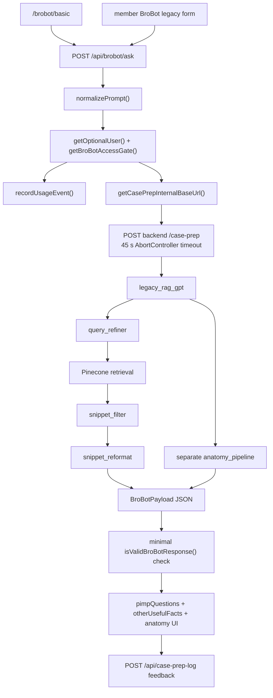

# Case Prep Stage 1 — Legacy Retrieval and Synthesis Audit

Date: 2026-07-19  
Revised after direct inspection of the locally added `snaportho-caseprep` repository.

## Executive recommendation

Improving the legacy pipeline is the best near-term path **only if Stage 1 is implemented as a gated replacement engine behind the existing `/case-prep` contract, not as another independent Case Prep surface**.

The current production legacy engine is too weak to incrementally improve by prompt editing alone:

- all five representative requests used `legacy_rag_gpt` with no canonical procedure identity;
- every response reported `procedure_slug: null` and `match_method: none`;
- responses took 10.97–14.08 seconds from a direct request;
- the endpoint exposes no Pinecone result identities, scores, chunks, metadata, index version, or citations even though the backend retriever has some of those values internally;
- output mixes procedure families and contains clinically unsafe anatomy;
- production V2 is feature-disabled even though the curated store reports 24 certified records;
- the existing web V2 client contract does not match the feature-disabled production V2 response shape;
- current production KG claims and decision points are empty by construction in the public neighborhood RPC;
- BroBot's newer bounded KG provider is shadow-only and explicitly does not influence answers.

The smallest viable Stage 1 is therefore:

```text
existing /case-prep request
  -> one canonical resolver
  -> certified registry lookup
  -> bounded, reviewed KG relationship retrieval
  -> KG-informed Pocket Pimped retrieval with observable candidates
  -> one source-separated synthesis call
  -> deterministic schema + citation validation
  -> additive legacy-compatible response
```

This is a medium-complexity integration, not a frontend redesign or V2 packet build. Estimated engineering scope is **4–6 weeks**, plus attending review time, for a five-case shadow comparison and a smaller safe rollout cohort.

## Evidence and test boundary

### Directly inspected

- current web entry routes, callers, contracts, renderers, timeouts, analytics, and configuration;
- curated registry proxy and Case Prep V2 client;
- generic BroBot Case Prep context path;
- production KG RPC definitions;
- bounded BroBot KG shadow provider, cache, policies, telemetry, and deadline;
- Anki/Pocket Pimped mapping artifacts;
- production Case Prep `/health`, `/case-prep`, and `/case-prep/v2` responses.

### Not available in this workspace

The backend repository is now locally present and was inspected directly. The audit now verifies the embedding model, record construction, metadata, query ladder, score threshold, top-k values, deduplication, model prompts, concurrency, and fallback behavior.

Two runtime values remain unavailable: the deployed `PINECONE_INDEX` value and Pinecone API credentials are environment-only and are not stored locally. The normal Case Prep retriever supplies no namespace, so it queries the configured index's default namespace. Raw production top-k candidates still cannot be obtained through the public API. This audit therefore distinguishes direct code findings, local corpus analysis, and observable production output; it does not label reconstructed lexical candidates as Pinecone results.

### Backend implementation verified

- `main.py` dispatches `/case-prep` to `v1_legacy.run_caseprep_v1()` unless `version=v2` and V2 is enabled.
- V1 calls `query_refiner.refine_query()` using `gpt-4o-mini`.
- `vector_search.get_case_snippets()` embeds the expanded query with `text-embedding-3-small` (1,536 dimensions).
- It runs a widening six-query filter ladder with top-k values 50, 50, 75, 75, 100, and 100, stopping after 40 unique results; an unfiltered top-100 fallback runs only when ten or fewer unique results remain.
- It filters at cosine score `>= 0.55` and can return as many as 200 snippets.
- It deduplicates only by Pinecone ID or exact normalized-text MD5; there is no semantic deduplication, reranking, diversity selection, or cache.
- `gpt_refiner` passes at most 8,000 characters and 45 snippets through a permissive `gpt-4o-mini` relevance mask, then a second `gpt-4o-mini` reformatter.
- The relevance filter says to keep uncertain snippets; malformed masks and all-dropped results also fail open by keeping everything.
- In parallel, `anatomy_gpt.run_pipeline_fast()` makes two `gpt-4.1-mini` Responses API calls: approach selection and anatomy-quiz generation.
- One uncached V1 request therefore normally makes one query-refiner call, one embedding call, up to six sequential Pinecone queries, two snippet-processing model calls, and two anatomy model calls.
- Source text may include `[Source: ...]` during reformatting, but output Q&A/facts discard source IDs and citations.

### Raw production fixtures

Direct production legacy outputs were captured without modifying production data:

- [Carpal tunnel release](./fixtures/case-prep-stage1-2026-07-19/carpal_tunnel.legacy.json)
- [Distal radius ORIF](./fixtures/case-prep-stage1-2026-07-19/distal_radius.legacy.json)
- [ACL reconstruction](./fixtures/case-prep-stage1-2026-07-19/acl.legacy.json)
- [Posterior THA](./fixtures/case-prep-stage1-2026-07-19/posterior_tha.legacy.json)
- [Intertrochanteric fracture fixation](./fixtures/case-prep-stage1-2026-07-19/intertrochanteric.legacy.json)

The fixtures contain generated educational content and must not be treated as certified clinical guidance.

## 1. Current legacy architecture

### Exact active request path



Backend function names `query_refiner`, `snippet_filter`, `snippet_reformat`, and `anatomy_pipeline` are reported by the live response's `ai_used` field. Their source implementation and prompts are not present locally.

### Active entry routes and callers

| Surface | Route/service | Behavior | Classification |
|---|---|---|---|
| Basic Case Prep | `src/app/brobot/basic/page.tsx` → `POST /api/brobot/ask` | Legacy V1 product; renders two bullet lists plus anatomy | Improve behind flag, later migrate |
| Member legacy Case Prep | `src/app/brobot/brobotmember.tsx` | Uses legacy BroBot/Case Prep response contract and separate feedback path | Improve/migrate with basic surface |
| Secure legacy proxy | `src/app/api/brobot/ask/route.ts` | Auth/quota, then `POST /case-prep`, 45-second timeout | Keep access gate; replace upstream engine behavior |
| Case Readiness | `getStudentCasePrepContext()` → `requestCasePrepV2()` → `/case-prep/v2` | Independent resolution and rendering | Do not change in Stage 1; production currently returns disabled V2 |
| Web V2 proxy | `POST /api/case-prep/v2` | Expects normalized V2 envelope | Keep separate; contract mismatch needs operational fix, not Stage 1 redesign |
| Generic BroBot | `POST /api/brobot/chat` → `getCasePrepCertifiedContext()` | Independently infers slug, fetches registry, selects 5 sections × 520 chars | Do not reuse this truncation; share resolver later |
| Mobile configuration | `GET /api/mobile/config` | Defaults `brobotCasePrepApiVersion` to `v1` | Keep rollout control; make enriched flag explicit |
| Feedback | `POST /api/case-prep-log` | Stores prompt, opaque response JSON, helpfulness | Improve telemetry; preserve compatibility |

### Legacy request contract

The web proxy accepts any of `prompt`, `caseDescription`, `query`, `message`, `text`, or `case`, normalizes to:

```ts
{ prompt: string }
```

It sends only `{ prompt }` upstream. Training level, requested approach, user identity, conversation identity, selected case, and source policy are not included.

### Legacy response contract

The frontend types only:

```ts
type BroBotPayload = {
  pimpQuestions: string[];
  otherUsefulFacts: string[];
  anatomy?: AnatomyPayload | null;
};
```

Production additionally returns:

- `caseprep_version: "v1"`;
- `engine: "legacy_rag_gpt"`;
- `content_status: "legacy"`;
- `procedure_slug: null`;
- `match_method: "none"`;
- `rag_used: true`;
- `ai_used` stages;
- `warnings`;
- a duplicate `payload` object.

The web validator checks only that `pimpQuestions` exists and is an array. It does not validate anatomy, fact structure, citations, warnings, source status, or provenance.

### Hidden duplicate paths

The same case can be independently resolved/retrieved in four ways:

1. Legacy V1: no canonical identity in the response; generic RAG.
2. V2/Case Readiness: backend resolver and curated store.
3. Generic BroBot: `mappedSlugForText()` + `fetchRegistryIndex()` + `fetchRegistryProcedure()`.
4. KG shadow retrieval: intent/clinical-context normalization + `retrieve_brobot_kg_shadow` RPC.

Stage 1 must use the backend V2 resolver or extract its resolver into a shared service. It must not add a fifth resolver.

### Current production runtime status

`GET https://caseprep.snap-ortho.com/health` returned in 300 ms:

| Field | Value |
|---|---|
| `v1_available` | `true` |
| `v2_available` | `false` |
| `caseprep_default_version` | `v1` |
| `enable_caseprep_v2` | `false` |
| `enable_caseprep_v2_rag_fallback` | `true` |
| `rag_available` | `true` |
| `resolver_available` | `true` |
| curated store | available, registry-backed |
| certified count | 24 |
| catalog loaded | 30 |

Every direct `/case-prep/v2` validation request returned in about 242–258 ms with `content_status: "unsupported"` and warning `ENABLE_CASEPREP_V2 is false`.

The current web `CasePrepV2EnvelopeSchema` expects `{ caseprep_version, engine, case_prep: ... }`, but disabled production V2 returns the legacy-compatible top-level response. `requestCasePrepV2()` will reject this as an invalid response contract; Case Readiness then silently becomes unavailable. That is an operational integration defect.

### Local resolver and registry verification

The backend resolver was run locally without OpenAI for all five validation cases:

| Request | Canonical result | Method | Confidence |
|---|---|---|---:|
| Carpal tunnel release | `carpal_tunnel_release` | alias | 1.00 |
| Distal radius fracture ORIF | `distal_radius_fracture_orif` | alias | 1.00 |
| ACL reconstruction | `acl_reconstruction` | alias | 1.00 |
| Posterior total hip arthroplasty | `tha_posterior` | alias | 1.00 |
| Intramedullary fixation of an intertrochanteric fracture | `intertrochanteric_hip_fracture_orif` | contains | 0.95 |

The resolver is immediately reusable for Stage 1. One unsafe default remains documented in its source: generic `THA`, `total hip arthroplasty`, and `hip replacement` intentionally resolve to `tha_posterior`. Stage 1 must override this behavior and require approach clarification unless the request explicitly says posterior.

Registry verification found 60 procedures, 0 structural errors, and 25 warnings. Twenty-four are certified/live. Twenty-three of those are missing indications under a transitional exception. Three live manifest hashes do not match the canonical JSON hash of the payload: `reverse_shoulder_arthroplasty`, `hip_hemiarthroplasty`, and `tka`.

Validation-cohort readiness is narrower than the five requested cases:

| Case | Registry state | Coverage | Sources | Stage 1 implication |
|---|---|---:|---:|---|
| Carpal tunnel | partial/unreviewed/not live | 0 | 0 | Cannot provide curated backbone; content work required before rollout |
| Distal radius ORIF | certified/live | 90 | 4 | Usable only after contamination, indications, fixation/fluoro, and postop repair |
| ACL reconstruction | certified/live | 90 | 3 | Usable only after indications, graft/fixation, and rehab repair |
| Posterior THA | certified/live | 100 | 2 | Strong approach anatomy; incomplete full-procedure decision content |
| Intertrochanteric fixation | partial/unreviewed/not live | 0 | 0 | Cannot provide curated backbone; content work required before rollout |

### Component disposition

| Component | Decision | Reason |
|---|---|---|
| `/api/brobot/ask` auth, guest, quota handling | Keep | Mature access boundary |
| 45-second blank-wait timeout | Remove now | Unsafe product behavior; use bounded stages and degraded output |
| Legacy response fields | Keep additively | Avoid breaking current web/mobile clients |
| V1 generic query refinement | Bypass in enriched mode | Canonical/KG identity should drive expansion |
| Current Pinecone retriever | Improve if raw units are usable | Needs traceability, filters, diversity, citations |
| Snippet filter/reformat calls | Bypass in enriched mode | Replace with one synthesis call and deterministic preselection |
| Separate anatomy pipeline | Remove from enriched mode | It generated unsafe facts and duplicates synthesis |
| Curated registry | Keep, authoritative | Best procedural backbone |
| BroBot KG shadow provider/RPC | Reuse narrowly | Already bounded, cached, timed, and instrumented |
| Generic BroBot Case Prep truncation | Do not reuse | Loses structure and revision identity |
| Basic frontend | Keep for Stage 1 | Add structured sections progressively; no redesign required |
| Opaque feedback log | Improve | Insufficient retrieval/source telemetry |

## 2. Stage 1 readiness assessment

| Subsystem | Readiness | Evidence | Stage 1 action |
|---|---|---|---|
| Legacy route/access gate | Ready | Auth, guest sessions, quota, usage outcomes exist | Preserve |
| Canonical resolver | Usable with narrow repair | Backend reports resolver available; V2 disabled; V1 does not use it | Invoke resolver before retrieval; return identity/confidence |
| Curated store | Usable with narrow repair | Live health reports 24 certified and available | Add certified-only lookup in enriched flow |
| Curated content quality | Requires case-specific repair | Prior verified contamination/missing indications; current V1 does not use it | Repair only enabled cohort |
| KG candidate/fact retrieval | Usable with narrow repair | Bounded shadow RPC/provider, 275 ms deadline, 30-minute cache | Adapt to Case Prep input and source bundle |
| KG claims/decision points | Requires substantial work | Production neighborhood RPC hardcodes both as empty; provider says active release contains none | Do not promise them in Stage 1; manually curate critical reasoning or defer |
| KG aliases | Retrieval guidance only | New shadow candidates expose alias score; public topic RPC only exact slug/label substring | Use candidate resolver; do not expose alias-derived facts |
| KG relationships | Case-dependent; review required | Fact contract has review/risk/provenance, but production quality varies | Only user-facing when review/risk/provenance policy passes |
| Pocket Pimped corpus | Usable with narrow metadata repair | 1,461 intact Q/A units; embedding/upsert code verified; procedure metadata only 18.2% | Version index and backfill cohort identity metadata |
| Pocket retrieval output | Requires substantial work | Six-rung widening ladder, mixed default namespace, exact-only dedupe, no reranking/citations/cache | Hard filters, source-aware merge, semantic dedupe, diversity, stable IDs, evaluation |
| One-call synthesis | Requires implementation | Current V1 uses at least three text stages plus anatomy pipeline | Add one structured synthesis call behind flag |
| Citation validation | Requires implementation | V1 returns none | Stable source IDs + deterministic claim/source validation |
| Caching | Requires narrow implementation | KG shadow has in-process TTL; Case Prep fetches use `no-store`; no synthesis cache visible | Add versioned retrieval and result cache |
| Frontend | Usable with narrow repair | Can render legacy fields; structured sections absent | Add optional structured guide renderer with fallback |
| Analytics | Usable with substantial extension | Request latency/outcome exists; no retrieval contributions | Add structured Stage 1 trace |
| Resource graph/mastery | Defer to V2 | Outside Stage 1 scope | Do not build |

## 3. Representative legacy results

### Measured production behavior

One request per case was performed concurrently after a health probe. These values establish functionality and approximate current latency, not statistically valid p50/p95 measurements.

| Case | Total time | Pimp questions | Other facts | Canonical match | Key failure |
|---|---:|---:|---:|---|---|
| Carpal tunnel release | 13.81 s | 10 | 3 | none | Duplicate open-vs-endoscopic questions; unsafe superficial-anatomy answer |
| Distal radius ORIF | approximately 11–14 s; output captured, timing line lost in the first shell batch | 4 | 2 | none | Radial-shaft bow fact contaminates distal-radius guide; inconsistent reduction thresholds |
| ACL reconstruction | 10.97 s | 11 | 6 | none | Fact-heavy tunnel trivia; no operative thesis, indication logic, graft decision framework, or bailout |
| Posterior THA | 11.84 s | 5 | 3 | none | Hip-fusion position is irrelevant contamination; no patient/implant decision logic |
| Intertrochanteric fixation | 14.08 s | 9 | 2 | none | Mixes subtrochanteric and intertrochanteric questions; no coherent reduction/fixation flow |

All five returned `rag_used: true`, the same four AI stages, no warnings, no citations, and no procedure slug.

### Clinical safety findings

The generated carpal tunnel anatomy quiz asks which superficial nerves are encountered and answers **“Median and ulnar nerves.”** That is not safe as resident preparation and should block launch of this pipeline without clinician review and deterministic validation.

Other observed problems:

- carpal tunnel repeats open-versus-endoscopic outcomes three times;
- carpal tunnel claims the median nerve runs between FDS and FCR, while noting FCR is outside the tunnel—confusing and not a useful operative relationship;
- distal radius mixes two incompatible-looking acceptable-reduction parameter sets without explaining population or decision context;
- distal radius includes restoration of radial bow, a radial-shaft concept;
- posterior THA includes hip arthrodesis positioning;
- intertrochanteric prep begins with a subtrochanteric-treatment question and includes subtrochanteric deformity/malunion content without explaining relevance;
- none provide a ten-minute teaching sequence, resident actions, evidence boundaries, or bailout logic.

### Can results be displayed directly?

No. The raw V1 product is already synthesized, but it is not safe or coherent enough for direct display without review. The underlying Pocket Pimped candidates are not returned, so their direct-display suitability cannot be assessed.

### Did KG expansion improve retrieval?

Not tested. The live legacy path has no KG involvement, the production V2 path is disabled, and raw Pinecone candidates cannot be requested through the public contract. Claiming improvement would violate the audit constraint. Stage 1 must add a shadow comparison that runs baseline and KG-expanded retrieval against the same candidate corpus.

## 4. KG-first retrieval audit and recommendation

### What exists today

There are two production KG access layers:

1. `findProductionKgTopics()` and `getProductionKgNeighborhood()` over `find_kg_production_topics` and `get_kg_production_neighborhood`.
2. The newer `retrieveBroBotKgShadow()` provider over `retrieve_brobot_kg_shadow`.

The public neighborhood RPC returns entire active neighborhoods with:

- entities;
- relationships;
- curriculum bridges;
- release/review/provenance/risk metadata;
- exclusions.

It currently returns `claims: []` and `decisionPoints: []` unconditionally. It is not the right hot-path contract.

The BroBot shadow provider is a better Stage 1 starting point:

- canonical candidates with lexical, alias, session, mode, coverage, and final scores;
- bounded relationship facts;
- mode-specific entity/predicate policies;
- 275 ms default deadline, clamped to 50–1,000 ms;
- 30-minute, 500-entry in-process cache;
- release pin `kg-beta-20260716-002`;
- max 1,200 estimated tokens;
- structured gap and retrieval telemetry;
- non-fatal timeout/error behavior.

It also explicitly marks `answerInfluenced: false`, `retrievalMode: "shadow"`, and tells the packet consumer that the active release has no claims or decision points.

### Object readiness

| KG contribution | Stage 1 status | Allowed role |
|---|---|---|
| Candidate entities | Ready with case tests | Canonical resolution and query expansion |
| Aliases/lexical scores | Retrieval guidance only | Add synonyms; never present as clinical facts |
| Reviewed/active relationships | Case-dependent | Direct enrichment only when review tier, risk, and provenance pass policy |
| Anatomy relationships | Requires cohort review | Query expansion; display only after attending validation |
| Complication relationships | Requires cohort review | Expansion and synthesis support after provenance check |
| Curriculum bridges | Retrieval guidance only | Find prerequisites/terminology, not operative recommendations |
| Claims | Too incomplete | Not available in active release contract |
| Decision points | Too incomplete | Not available in active release contract |
| Unreviewed/moderate/high-risk edges | Retrieval guidance only or exclude | Never authoritative user-facing content |

### Bounded Stage 1 KG contract

```ts
type LegacyCasePrepKgEnrichment = {
  releaseId: string;
  status: "hit" | "partial" | "miss" | "timeout" | "error";
  anchor: {
    entityId: string;
    label: string;
    entityType: string;
    neighborhoodSlugs: string[];
    score: number;
  } | null;
  queryTerms: Array<{
    text: string;
    sourceEntityId: string;
    purpose: "anatomy" | "complication" | "approach" | "synonym";
  }>;
  displayableFacts: Array<{
    relationshipId: string;
    subject: string;
    predicate: string;
    object: string;
    reviewTier: "curator_reviewed" | "attending_reviewed";
    riskTier: "low" | "moderate";
    provenanceStatus: "complete";
  }>;
  guidanceOnlyFacts: Array<{ relationshipId: string; reason: string }>;
  limitations: string[];
  latencyMs: number;
};
```

Default limits for Stage 1:

- one anchor, at most one alternate;
- at most two neighborhoods;
- at most six displayable relationships;
- at most twelve query-expansion terms;
- 275 ms hard deadline;
- no claims/decision points until populated and reviewed;
- cache by release + canonical case + approach + policy version.

### Fallback behavior

- Timeout/error: proceed without KG and record degraded source.
- Partial neighborhood: use stable candidate/aliases for retrieval guidance; do not imply completeness.
- Conflicting or high-risk relationships: exclude from synthesis and emit a review trace.
- No candidate: retain resolver identity and use canonical curated terms only.

## 5. Pocket Pimped and Pinecone audit

### Index and namespace

All active legacy upload and query scripts read the index name from `PINECONE_INDEX`. The deployed value is not committed and cannot be named from this checkout. That is appropriate for credentials but insufficient for reproducibility: an index alias/version manifest should be non-secret configuration.

`vector_search._pinecone_query()` does not pass `namespace`, so V1 queries the index's default namespace. Most historical upload scripts also omit a namespace and therefore co-mingle multiple corpora in that default namespace. A separate `anatomy_miller_gold_v1` namespace exists only for the experimental anatomy retriever and is not used by V1 `/case-prep`.

The default namespace may contain records produced by scripts for:

- Pocket Pimped;
- Miller's review Q&A;
- Orthobullets Q&A and facts;
- OITE content;
- hip/knee facts;
- general anatomy files.

There is no committed index manifest proving which scripts were run against the current production index, in what order, or at what source revision.

### Embeddings and record construction

The common embedding model is `text-embedding-3-small`, 1,536 dimensions.

Pocket Pimped is locally represented by 1,461 normalized Q&A records. The upsert path preserves each card as one unit:

```text
Q: <question>
A: <answer>
Note: <additional_info, when present>
Specialty: ...
Region: ...
Subregion: ...
Diagnosis: ...
Procedure: ...
```

Stable IDs are SHA-1-derived from question + answer with prefix `pp-`. Metadata includes `source`, `specialty`, `specialty2`, `region`, `subregion`, `diagnoses`, `procedures`, `text`, `question`, and `answer`. Deck path, Anki note/card GUID, and original tags are not preserved by this upsert schema. This is still a usable Q/A retrieval unit; the corpus does not need to be rebuilt merely to preserve question/answer relationships, but provenance should be backfilled from the original export.

There is significant pipeline drift:

- `embed_topinecone_qa.py` names its source `Millers`, reads `normalized_millers_v1.jsonl`, but generates IDs with prefix `pp-`.
- `normalized_pp_v1.jsonl` contains Pocket Pimped records, but repository history does not provide one authoritative current upsert command/manifest.
- other scripts use singular `diagnosis`/`procedure`, while V1 filters plural `diagnoses`/`procedures`.
- some older record IDs are ordinal (`obfacts-<i>`), so source reorder can change identity.

### Pocket Pimped metadata quality

Static analysis of all 1,461 normalized Pocket Pimped records:

| Metadata field | Populated | Coverage |
|---|---:|---:|
| specialty | 1,461 | 100% |
| region | 1,461 | 100% |
| subregion | 387 | 26.5% |
| diagnosis | 0 | 0% |
| procedure | 266 | 18.2% |
| concept | 0 | 0% |

Exact normalized Q&A analysis found no identical duplicates inside this local normalized Pocket Pimped file. The repeated V1 output is therefore more likely caused by semantically overlapping cards, multiple co-mingled corpora, or the reformatter creating overlapping questions—not exact duplicates within this single file.

The sparse procedure/subregion metadata explains the widening behavior. Strict filters will miss most Pocket Pimped cards, then the ladder drops diagnosis, procedure, specialty, and eventually subregion constraints until region-level content dominates.

### Query construction and retrieval

`query_refiner.refine_query()` makes a `gpt-4o-mini` call constrained to a local vocabulary of 15 regions, 50 subregions, 222 diagnoses, 71 procedures, and ten specialties. It adds deterministic acronym expansions before embedding. Invalid diagnosis/procedure slugs are removed after generation.

The embedded query is:

```text
search_text || specialties ... | region ... | subregion ... |
diagnoses ... | procedures ...
```

Retrieval then executes this ladder sequentially:

| Step | Filter | top-k |
|---|---|---:|
| strict | procedure + diagnosis + subregion + region + specialty | 50 |
| drop specialty | procedure + diagnosis + subregion + region | 50 |
| drop diagnosis | procedure + subregion + region | 75 |
| drop procedure | subregion + region | 75 |
| region + specialty | region + specialty | 100 |
| region only | region | 100 |
| emergency fallback | no filter, only if ≤10 unique remain | 100 |

Results below 0.55 or without `metadata.text` are discarded. Results from every completed rung are merged, exact-deduplicated, sorted only by Pinecone similarity, and returned after 40 unique results or ladder exhaustion. There is no reciprocal-rank fusion, source weighting, metadata-completeness penalty, semantic reranker, fact-type classifier, or diversity selection.

This is not a true hybrid retrieval system: metadata filters narrow vector search, but there is no lexical/BM25 retrieval over card text.

### Prompt filtering and provenance

The first post-retrieval model call receives at most 8,000 characters and 800 characters per snippet. Because input is similarity-sorted and cut when the character budget is exhausted, earlier broad-corpus hits can exclude later useful facts.

The relevance prompt is intentionally permissive and says to retain uncertain material. If the model returns a malformed mask, it keeps every snippet. If it drops everything, it also restores every snippet. This design optimizes recall at the expense of contamination.

The second call receives at most 45 retained snippets and emits Q&A/facts. It is told not to invent and avoid duplicates, but citations are not part of its output schema. Candidate ID, score, procedure metadata, and source record identity are lost. Only a source label appended as free text may reach the model.

### Caching and latency

There is no V1 resolver, query-embedding, Pinecone-result, prompt, or synthesis cache. The six Pinecone rungs are sequential. Pimp formatting and anatomy run concurrently, but the query-refiner, embedding, and Pinecone ladder must finish first.

No per-stage production timings are recorded, so the 11–14 second observed total cannot be decomposed honestly. Code shape predicts large variability based on how many ladder rungs run and the slower of the two parallel branches.

### Evaluation coverage

There is an `audit_vectordb.py`, but it performs broad ad hoc searches and is not a launch-case relevance benchmark. No committed labeled dataset calculates precision, nDCG, contamination, duplicate rate, or must-know coverage for Case Prep.

### Representative corpus findings

Raw live Pinecone candidates remain inaccessible without deployed credentials or a trace endpoint. Local lexical inspection is not a substitute, but it demonstrates why metadata-aware validation is necessary:

| Case | Local Pocket candidates containing broad terms | Observed issue |
|---|---:|---|
| Carpal tunnel | 21 for `carpal tunnel`/`median nerve` | Broad median-nerve expansion includes distal biceps and elbow entrapment facts |
| Distal radius | 23 | Includes relevant skyline/watershed/approach facts plus adjacent DRUJ/forearm material |
| ACL | 39 for `ACL`/full term | Acronym substring search admits unrelated words such as clavicle; vector retrieval may differ, but exact aliasing is preferable |
| Posterior THA | 79 for broad posterior/THA terms | “Posterior” is too broad and reaches unrelated posterior-wall/SC-joint content |
| Intertrochanteric | 10 | Useful focused cards exist, but neighboring subtrochanteric and hip-capsule facts require explicit relevance handling |

These are corpus-availability observations only. The production-output failures remain the direct evidence of current end-to-end quality.

### Failure modes now supported by code

- strict procedure filtering has low recall because only 18.2% of Pocket records have procedure metadata;
- widening to region-level retrieval admits adjacent diagnoses and procedures;
- mixed default-namespace corpora can contribute overlapping or inconsistent versions;
- exact-only deduplication cannot remove paraphrases;
- permissive fail-open filtering lets ambiguity survive;
- lack of reranking/diversity allows one fact family to dominate;
- source identity is intentionally omitted from the output schema;
- five model calls plus up to six Pinecone requests drive latency and create multiple error-introduction points.

### Smallest useful retrieval changes

1. Create a non-secret index manifest and return a shadow trace for each candidate: stable ID, score, rank, index alias/version, namespace, source corpus/version, linked concept/procedure IDs, text hash, and selected/rejected reason.
2. Resolve canonical procedure and approach before querying.
3. Backfill canonical procedure, approach, diagnosis, and concept IDs only for the validation cohort before relying on hard filters.
4. Build queries from canonical label + approach + reviewed KG anatomy/complication terms.
5. Retrieve baseline and KG-expanded candidates separately; merge with reciprocal-rank fusion or explicit source-aware scoring before selection.
6. Normalize text and deduplicate exact hashes, question/answer pairs, and near-duplicates.
7. Apply diversity caps across anatomy, landmark, complication, pimp question, pearl, and mistake.
8. Preserve question/answer relationships as one retrieval unit.
9. Keep 8–15 facts before synthesis; do not send an unbounded chunk dump.
10. Cache the query embedding and selected retrieval result by case/approach + KG release + index manifest version + query policy.

Do not rebuild Q/A units: Pocket Pimped already preserves question, answer, and additional information. Perform a narrow metadata/identity reindex for the cohort. A broader rebuild is warranted only if production inspection proves that historical mixed-corpus upserts cannot be versioned or filtered safely.

### Required five-case retrieval experiment

For each fixture case, record:

| Variant | Query |
|---|---|
| Baseline | Current production V1 query |
| Canonical | Canonical procedure + explicit approach |
| KG-expanded | Canonical query + up to 12 reviewed KG-derived terms |
| Filtered | KG-expanded + procedure/concept/deck metadata filters |

Two reviewers independently label the top 20 candidates for relevance, high-yield value, procedure specificity, duplication, contamination, display readiness, and missing must-know concepts. Compute Precision@10, nDCG@10, duplicate rate, contamination rate, and must-know coverage. KG expansion advances only if it improves blinded usefulness without increasing contamination or p95 beyond budget.

## 6. Curated-content usage audit

The active V1 response proves that curated content is ignored: `procedure_slug` is null, `match_method` is none, `content_status` is legacy, and `rag_used` is true for all validation cases.

The generic BroBot path does fetch certified registry content, but it:

- independently resolves a slug;
- selects at most five sections;
- truncates each section to 520 characters;
- drops revision/hash and item-level provenance;
- converts typed items to strings.

The Case Readiness V2 path retains revision/hash and citations in its normalized contract, but generically flattens `payload: unknown` into section strings for display. Neither consumption model is appropriate for enriched V1 synthesis.

### Stage 1 curated rules

- Fetch the certified runtime payload directly after canonical resolution.
- Require live + certified + non-deprecated status.
- Preserve section keys, typed items, sources, revision ID, and payload hash.
- Do not truncate by characters; select complete items under a token budget.
- Send the procedural backbone before KG and Pocket sections in the prompt.
- If no certified guide exists, label output `enriched_fallback`, never curated.

### Minimum cohort repairs

| Case | Required before enablement |
|---|---|
| Carpal tunnel release | Populate and certify a real guide; validate incision/branch anatomy; indications; bailout for incomplete release/nerve injury concern |
| Distal radius ORIF | Remove ACL/radial-shaft contamination; reconcile thresholds; add indications, implant/fixation logic, fluoroscopic checkpoints, real postop plan |
| ACL reconstruction | Add indications, graft/fixation decisions, tunnel checkpoints, bailout logic, and rehabilitation basics |
| Posterior THA | Require posterior approach identity; remove study/arthrodesis contamination; add implant/positioning decisions and real postop guidance |
| Intertrochanteric fixation | Separate intertrochanteric from subtrochanteric concepts; define stable/unstable logic, reduction checkpoints, construct decision, TAD, and bailouts |

No case should be enabled merely because its manifest says certified.

## 7. Synthesis quality audit

### Why current output does not feel attending-quality

- It is organized by source artifact (`pimpQuestions`, `otherUsefulFacts`, anatomy quiz), not by resident workflow.
- It has no operative thesis or reasoning spine.
- It repeats retrieved facts rather than ranking them.
- It provides trivia without connecting it to decisions or checkpoints.
- It omits resident actions, anticipation, and language.
- It has no robust pitfall → warning → prevention → bailout structure.
- It cannot distinguish universal guidance, evidence, controversy, or attending preference.
- It exposes no citations.
- Separate text and anatomy generation can contradict or contaminate each other.
- At 11–14 seconds, the output is neither instant nor progressively available.

### Stage 1 output rubric

Each dimension is scored 0–4. Clinical correctness, unsupported-claim rate, anatomy/safety, and provenance are hard gates, not compensatory averages.

| Dimension | 0 | 2 | 4 |
|---|---|---|---|
| Clinical correctness | Material error | Mostly correct with ambiguity | All material claims supported and correct |
| High-yield prioritization | Random/source order | Some prioritization | Must-knows first; clear omission discipline |
| Operative mental model | None | Objective stated | Pattern, objective, construct, and checkpoints connected |
| Decision usefulness | Lists options | Some rationale | Patient/pattern modifiers explain choice changes |
| Procedural realism | Generic checklist | Plausible phases | Reflects real workflow and resident role |
| Anatomy and safety | Unsafe/missing | Structures listed | Exposure-specific risk, prevention, checkpoint |
| Pitfalls and bailout | Complications only | Prevention included | Warning, prevention, immediate action, bailout |
| Attending preparedness | Trivia | Relevant questions | Concise answers plus anticipation and useful phrasing |
| Concision | Unusable | 10–15 minutes | Deliberate ~10-minute hierarchy |
| Provenance | None | Section-level sources | Material claims map to stable source IDs |

Launch gates:

- no material clinical errors in two attending reviews;
- zero unsupported high-risk claims;
- zero unrelated-procedure contamination;
- provenance score 4 for safety/decision/postop claims;
- overall mean at least 3.2 with no other dimension below 3;
- preferred over curated-only and current legacy by at least 70% of resident comparisons.

### Comparison framework

For each case, freeze the same source versions and compare:

1. Current legacy production fixture.
2. Certified curated guide rendered alone.
3. Pocket facts alone.
4. KG + Pocket synthesis without curated content.
5. Full curated + KG + Pocket Stage 1 synthesis.

Randomize labels, remove system names, and ask reviewers to score the rubric, choose the best ten-minute prep, mark unsupported claims, and identify source contribution. Variant 4 exists to measure enrichment value, not as a recommended user mode.

Only variant 1 was executable through the available public contracts during this audit. Variants 2–5 require the shadow harness described below.

## 8. Proposed Stage 1 source bundle and output contract

### Narrow source bundle

```ts
type LegacyCasePrepSourceBundle = {
  requestId: string;
  caseIdentity: {
    canonicalSlug: string;
    canonicalName: string;
    procedure?: string;
    approach?: string;
    diagnoses: string[];
    resolutionMethod: string;
    resolutionConfidence: number;
  };
  curated?: {
    revisionId: string;
    payloadHash: string;
    certificationStatus: "certified";
    sections: StructuredCuratedSection[];
  };
  kg?: LegacyCasePrepKgEnrichment;
  pocketPimped?: {
    indexName: string;
    indexVersion: string;
    namespace?: string;
    retrievalPolicyVersion: string;
    facts: RetrievedPocketFact[];
  };
  degradedSources: Array<"curated" | "kg" | "pocket_pimped">;
};
```

This should remain an internal Stage 1 DTO. Do not generalize it into the V2 resource graph.

### Additive output contract

Return existing legacy arrays plus an optional structured guide:

```ts
type LegacyEnrichedCasePrepResponse = BroBotPayload & {
  caseprep_version: "v1_enriched";
  engine: "legacy_enriched_synthesis";
  canonical_slug: string;
  guide?: LegacyCasePrepGuide;
  source_manifest: {
    curated_revision_id?: string;
    curated_payload_hash?: string;
    kg_release_id?: string;
    pocket_index_version?: string;
    prompt_version: string;
    output_schema_version: string;
    model: string;
    degraded_sources: string[];
  };
};
```

`LegacyCasePrepGuide` should use the proposed sections from the request: high-yield facts, operative thesis, indications/alternatives, mental model, anatomy/risk, setup/exposure, phased flow/checkpoints, decisions, pitfalls/bailouts, attending Q&A, postoperative plan, and citations.

The existing `pimpQuestions` and `otherUsefulFacts` fields can be derived deterministically from the structured guide during migration.

## 9. Synthesis prompt architecture

One model call should be the Stage 1 default. Current latency and errors argue against query-refiner + filter + reformatter + anatomy generation.

### System prompt

```text
You synthesize an orthopaedic case-preparation guide for a resident with about ten minutes before surgery.

SOURCE AUTHORITY
1. CERTIFIED_CURATED is the procedural backbone.
2. REVIEWED_KG may add relationships and reasoning only when supplied.
3. POCKET_PIMPED supplies concise recall facts and likely pimp questions.
4. You may organize and explain these sources. You may not invent clinical content.

RULES
- Use only claims supported by one or more supplied source IDs.
- Never let KG or Pocket content override certified curated guidance.
- If sources conflict, omit the claim or label the conflict; never silently merge it.
- Do not infer missing indications, technique, bailout, or postoperative protocols.
- Separate universal safety guidance from attending preference or controversy.
- Do not repeat the same fact in multiple sections.
- Prefer specific bullets and phase/checkpoint logic over prose.
- Put the most useful scrub-in information first.
- Return JSON matching the schema exactly.
- Every high-risk, decision, anatomy-at-risk, bailout, and postoperative item must cite source IDs.
- When evidence is absent, use an empty array and add a limitation. Do not fill the section plausibly.
```

### User/source message

Use explicit delimited blocks:

```text
<CASE_IDENTITY>...</CASE_IDENTITY>
<CERTIFIED_CURATED authority="primary">...</CERTIFIED_CURATED>
<REVIEWED_KG authority="enrichment">...</REVIEWED_KG>
<POCKET_PIMPED authority="recall">...</POCKET_PIMPED>
<DEGRADED_SOURCES>...</DEGRADED_SOURCES>
```

Every source item must already have a stable ID. The model must cite only IDs present in the bundle.

### Postprocessing

Deterministically:

- parse with a strict schema;
- reject unknown citation IDs;
- require citations on safety/decision/bailout/postop items;
- detect exact/normalized duplicate bullets;
- enforce section and total-length limits;
- reject procedure-name contamination using cohort denylist/entity mismatch checks;
- verify canonical slug and source manifest are server-authored, not model-authored;
- on failure, return a deterministic curated-derived guide or existing legacy output according to flag policy.

Do not add a second “fact checker” model call in Stage 1. It increases latency without proving truth. Use source-ID validation plus clinician-reviewed fixtures.

## 10. Latency and resilience plan

### Current measurements

- Health: 300 ms.
- Disabled V2 response: approximately 242–258 ms.
- Legacy complete response: 10.97–14.08 seconds for four measured cases; distal-radius output completed in the same batch but its timing line was not retained.
- Current web upstream timeout: 45 seconds.
- No current streaming path for `/api/brobot/ask`.
- No retrieval-stage latency is exposed.

These are single audit samples, not p50/p95. A shadow run of at least 100 requests per case is required for distribution metrics.

### Stage 1 budget

| Stage | Deadline | Execution |
|---|---:|---|
| Resolver | 100 ms | First; cached aliases |
| Curated lookup | 250 ms | Parallel after identity |
| Bounded KG | 275 ms | Parallel after identity; reuse provider deadline |
| Pocket retrieval | 500 ms | Starts after identity; KG expansion can join if ready by ~150 ms |
| Bundle/dedupe | 75 ms | Deterministic |
| Pre-model total | 800 ms p95 target | Partial results allowed |
| Model first token | 2 s target | Add streaming in enriched route if feasible |
| Complete guide | 8 s p95 target | Hard generation deadline 7 s after retrieval |
| Cached guide | <1 s p95 | Serve verified cached JSON |

### Parallelization

Canonical identity must resolve first. Then start curated lookup, KG retrieval, and a canonical-only Pocket query concurrently. If KG returns expansion terms within a short join window, run/merge the expanded query; otherwise do not hold the request open. Shadow mode may run both to measure value.

### Degraded states

| Available sources | Behavior |
|---|---|
| Curated + KG + Pocket | Full enriched synthesis |
| Curated + Pocket | Synthesize; mark KG unavailable |
| Curated + KG | Synthesize; omit Pocket facts |
| Curated only | Deterministic curated-derived structured guide; model optional |
| KG + Pocket only | Clearly labeled enriched fallback; omit unsupported procedural sections |
| Pocket only | Do not present a procedure guide; optionally show labeled recall facts |
| No trustworthy source | Clarification/unavailable |

Never wait 45 seconds for all sources. Timeouts are per component and non-fatal when curated content is available.

### Minimal cache

Use two caches:

1. Retrieval component cache: `canonical slug + approach + KG release + Pocket index version + retrieval policy`, TTL 30 minutes, stale-if-error 24 hours for reviewed results.
2. Synthesized guide cache: `canonical slug + curated hash + KG release + Pocket index version + learner band + prompt/model/schema version`, TTL 6 hours, stale-if-error 7 days only for previously validated source versions.

Do not cache raw user free text. Normalize to canonical identity before lookup. Invalidate naturally through versioned keys. Store source manifest and validation status with the cached value.

## 11. Safety and provenance gates

Stage 1 must not launch if any of these remain true:

- enriched output can cite a source ID not in its bundle;
- draft/partial/deprecated curated content can enter the primary source block;
- carpal tunnel unsafe anatomy remains in an enabled output;
- generic THA silently selects posterior approach;
- distal-radius and radial-shaft content are not separable;
- intertrochanteric and subtrochanteric facts are merged without explicit relevance;
- postoperative study instructions can appear as medical management;
- high-risk KG edges can be displayed without attending review and complete provenance;
- Pocket index/version and candidate identities are not recorded;
- output falls back to model invention when sources are empty.

Every response trace must record:

- resolver method/confidence and alternatives;
- curated revision/hash/status;
- KG release, selected object IDs, review/risk/provenance, latency/status;
- Pocket index/version, candidate IDs/ranks/scores/filters, latency;
- prompt/output schema/model versions;
- cache status;
- citations emitted and rejected;
- degraded sources and fallback reason;
- total and per-stage latency.

## 12. Validation framework

### Repository fixtures

Create one folder per case containing:

```text
request.json
legacy.production.json
curated.snapshot.json
kg.snapshot.json
pocket.baseline.json
pocket.kg-expanded.json
bundle.json
output.curated-only.json
output.kg-pocket.json
output.full-stage1.json
review.json
```

The five legacy production fixtures have been added under `docs/audits/fixtures/case-prep-stage1-2026-07-19/`.

Local validation performed after the backend became available:

- all five canonical resolver fixtures passed without an OpenAI client;
- registry validator: 60 procedures, 0 errors, 25 warnings;
- coverage scorer: no certified procedure below the current 85-point threshold;
- canonical payload-hash check: 3 mismatches among 24 live certified payloads;
- Pocket Pimped static corpus audit: 1,461 records with metadata coverage reported above;
- backend unit tests could not run because this checkout has no installed `pytest` module (`python3 -m pytest` exits with `No module named pytest`).

### Automated checks

- strict schema and source ID validation;
- canonical identity/approach fixture tests;
- empty/timeout/conflict degradation tests;
- duplicate detection;
- entity contamination allow/deny assertions;
- required source citation coverage;
- maximum guide length and section counts;
- cache invalidation by every version dimension;
- legacy response compatibility;
- latency span presence.

### Human review

Use two attending reviewers plus at least three residents. Attendings adjudicate correctness/safety/provenance; residents score ten-minute utility and compare variants blindly. Disagreements create explicit fixture annotations, not averaged-away scores.

## 13. Sequenced implementation backlog

### S1-01 — Make legacy retrieval observable

- **Goal:** capture raw Pinecone candidates and retrieval configuration without exposing protected content to clients.
- **Likely files/services:** backend `/case-prep` engine; Pinecone adapter; new internal trace schema; `case_prep_logs` successor.
- **Dependencies:** deploy access and a privacy/copyright-safe trace retention policy.
- **Impact:** makes corpus and query quality auditable.
- **Risk:** logging copyrighted/sensitive full chunks; store IDs/hashes and reviewer-safe excerpts.
- **Acceptance:** every shadow request records the non-secret index manifest version, default namespace, embedding/query policy, candidate IDs/scores/metadata, filter rung, selected/rejected reasons, and stage latency; no full protected corpus dump is exposed to clients.
- **Scope:** Required Stage 1.

### S1-02 — Reuse canonical V2 resolver in enriched V1

- **Goal:** return one canonical case/approach before retrieval.
- **Likely files/services:** backend resolver and `/case-prep`; web `src/app/api/brobot/ask/route.ts` response typing.
- **Dependencies:** resolver contract and cohort aliases.
- **Impact:** prevents broad unfiltered RAG and silent approach errors.
- **Risk:** ambiguity can reduce apparent coverage.
- **Acceptance:** all cohort fixtures produce expected slug; generic THA requires clarification; response includes method/confidence/alternatives.
- **Scope:** Required.

### S1-03 — Add certified curated lookup to enriched V1

- **Goal:** make certified content the procedural backbone.
- **Likely files/services:** backend curated store/registry loader; source bundle builder.
- **Dependencies:** S1-02.
- **Impact:** largest grounding improvement.
- **Risk:** certified label overstates current clinical quality.
- **Acceptance:** only live certified non-deprecated payloads; exact revision/hash retained; no character truncation.
- **Scope:** Required.

### S1-04 — Build bounded Case Prep KG adapter

- **Goal:** reuse the BroBot shadow RPC/provider for case identity expansion and reviewed relationships.
- **Likely files/services:** `src/lib/brobot/kg/provider.ts`, `contracts.ts`, `mode-policies.ts`, backend-to-web/internal adapter or equivalent backend RPC client.
- **Dependencies:** S1-02; service authentication decision.
- **Impact:** structured anatomy/complication terms and retrieval guidance.
- **Risk:** cross-service coupling and incomplete neighborhoods.
- **Acceptance:** 275 ms deadline; one anchor/two neighborhoods/six facts; review-risk-provenance filter; non-fatal fallback; no claims/decisions advertised.
- **Scope:** Required for experiment; user-facing facts case-gated.

### S1-05 — Add baseline versus KG-expanded Pocket shadow retrieval

- **Goal:** prove or reject KG-first value.
- **Likely files/services:** Pinecone query builder/retriever; trace store; audit harness.
- **Dependencies:** S1-01, S1-04.
- **Impact:** evidence-based query improvement.
- **Risk:** double retrieval cost in shadow.
- **Acceptance:** five-case top-20 snapshots from the actual deployed index; blinded labels; latency and relevance metrics; no user-visible impact. Local lexical matches do not count as completion.
- **Scope:** Required.

### S1-06 — Add Pocket filters, dedupe, and diversity selector

- **Goal:** remove duplicate and cross-procedure facts before synthesis.
- **Likely files/services:** Pinecone metadata/query adapter; retrieval selector.
- **Dependencies:** S1-01/S1-05 results.
- **Impact:** cleaner high-yield facts and lower prompt size.
- **Risk:** over-filtering important adjacent anatomy.
- **Acceptance:** zero known cohort contamination; duplicate rate <10%; Q/A units preserved; selected facts retain IDs.
- **Scope:** Required if existing corpus is salvageable.

### S1-07 — Define source bundle and enriched output schemas

- **Goal:** establish narrow typed boundaries and legacy compatibility.
- **Likely files/services:** backend models; `src/types/caseprep.ts`; new Zod response schema in web.
- **Dependencies:** S1-02–S1-06 contracts.
- **Impact:** enables safe synthesis and structured rendering.
- **Risk:** accidentally becoming V2 packet architecture.
- **Acceptance:** additive response; legacy clients still pass; source versions/degraded states mandatory.
- **Scope:** Required.

### S1-08 — Implement one-call synthesis and deterministic validator

- **Goal:** replace refiner/filter/reformatter/anatomy calls in enriched mode.
- **Likely files/services:** backend prompt builder/model client/validator; prompt version registry.
- **Dependencies:** S1-07.
- **Impact:** coherent resident-focused guide with lower call count.
- **Risk:** unsupported synthesis or schema failures.
- **Acceptance:** strict JSON; source-ID validation; safety citation coverage; deterministic curated-only fallback; complete under 8 s p95 in shadow.
- **Scope:** Required.

### S1-09 — Add versioned component/result caches and deadlines

- **Goal:** meet latency/resilience targets.
- **Likely files/services:** backend cache adapter; reuse KG `BoundedTtlCache` patterns; route deadlines.
- **Dependencies:** version fields from S1-07.
- **Impact:** repeat case under one second; outages degrade safely.
- **Risk:** stale content.
- **Acceptance:** version-key invalidation tests; stale verified outputs only; no component blocks beyond deadline.
- **Scope:** Required.

### S1-10 — Add shadow/side-by-side rollout controls

- **Goal:** compare engines safely by case and cohort.
- **Likely files/services:** backend flags; `src/app/api/mobile/config/route.ts`; `/api/brobot/ask`; admin audit view.
- **Dependencies:** S1-08/S1-09.
- **Impact:** rapid rollback and clinician validation.
- **Risk:** accidental exposure of unreviewed output.
- **Acceptance:** `off | shadow | compare | enabled`; per-case allowlist; deterministic cohort; current V1 remains fallback; one-step rollback.
- **Scope:** Required.

### S1-11 — Add structured Stage 1 telemetry

- **Goal:** attribute quality, latency, and failures to sources/stages.
- **Likely files/services:** new Supabase migration/table; backend trace writer; admin dashboard; adapt `brobot_kg_retrieval_events` conventions.
- **Dependencies:** S1-01/S1-07.
- **Impact:** evidence for rollout and future V2.
- **Risk:** excessive payload retention/privacy.
- **Acceptance:** per-stage spans, source manifests, contribution status, validation errors, cache state, clinician rating linkage; no raw user identity in retrieval trace.
- **Scope:** Required.

### S1-12 — Repair and review validation cohort

- **Goal:** ensure sources are safe before generated comparison.
- **Likely files/services:** Case Prep registry/review system; review fixtures.
- **Dependencies:** current backend registry access; new rubric.
- **Impact:** removes source-level errors synthesis cannot solve.
- **Risk:** clinical reviewer bandwidth.
- **Acceptance:** exact hashes reviewed by two clinicians; all case-specific launch blockers resolved.
- **Scope:** Required per enabled case.

### S1-13 — Add optional structured renderer

- **Goal:** display enriched guide without redesigning the product.
- **Likely files/services:** `src/app/brobot/basic/page.tsx`, `brobotmember.tsx`, `src/types/caseprep.ts`.
- **Dependencies:** S1-07.
- **Impact:** exposes useful hierarchy while preserving legacy fallback.
- **Risk:** mobile layout regression.
- **Acceptance:** structured guide when present; legacy lists otherwise; source/degraded label visible; accessibility and mobile checks pass.
- **Scope:** Required for user rollout, not shadow.

### S1-14 — Run blinded validation and launch decision

- **Goal:** determine whether enriched legacy is materially better.
- **Likely files/services:** fixture harness, review packet/report.
- **Dependencies:** all shadow work and content repair.
- **Impact:** prevents architecture-by-assumption.
- **Risk:** inconclusive sample.
- **Acceptance:** objective rubric gates, resident preference, retrieval metrics, latency p50/p95, zero safety blockers.
- **Scope:** Required.

### Deferred tickets

- Generalized resource graph — V2.
- Immutable packet sessions — V2.
- Learner mastery and longitudinal events — V2.
- Full Anki session synchronization — V2.
- Orthobullets question runtime integration — V2.
- Broad frontend redesign — V2.
- All-procedure schema rewrite — V2.
- Competency/faculty dashboards — V2.
- Multi-model synthesis/fact-checking — defer unless single-call evidence fails.
- Claims/decision-point KG publication — separate KG roadmap; Stage 1 must not block on it.

## 14. Feature flag and rollout

Use one server-authoritative mode rather than a boolean:

```text
CASE_PREP_LEGACY_ENRICHED_MODE=off|shadow|compare|enabled
CASE_PREP_LEGACY_ENRICHED_CASES=comma-separated canonical slugs
```

- `off`: current V1 only.
- `shadow`: current V1 returned; enriched retrieval/synthesis recorded asynchronously or within a strict non-user deadline.
- `compare`: reviewer/admin can see both; users still see current V1.
- `enabled`: enriched result returned for allowlisted case/cohort; current V1 is rollback fallback.

Rollout order:

1. Shadow retrieval only.
2. Shadow full synthesis.
3. Admin/reviewer comparison.
4. Internal clinician cohort.
5. Small resident beta by case.
6. Broader case enablement only after separate gates.

Carpal tunnel should not be first despite its frequency because the curated guide was previously empty and current anatomy output is unsafe. Distal radius and posterior THA also have known source contamination. The first user-visible case should be whichever of ACL or intertrochanteric fixation first passes source repair, identity, retrieval, and attending review—not whichever is easiest technically.

## 15. Explicit Stage 1 deferrals

Do not build:

- `CasePrepPacket` or a generalized orchestrator;
- an educational resource/attachment graph;
- learner-concept mastery, spaced repetition, or readiness scoring;
- full Anki runtime integration;
- Orthobullets question mapping in the guide;
- longitudinal case history or competency tracking;
- generalized video/article/resource ingestion;
- a new Case Prep frontend information architecture;
- broad content generation or all-60-procedure rewrite;
- final V2 publication/session semantics;
- personalized guide generation beyond a simple learner band;
- unbounded KG traversal or graph visualization;
- a new vector database if narrow Pinecone repair works.

## 16. Go/no-go recommendation

### Smallest viable scope

- existing `/case-prep` endpoint and clients;
- one shared canonical resolver;
- certified registry backbone;
- bounded KG candidate/relationship adapter;
- observable, filtered, deduplicated Pocket retrieval;
- one structured synthesis call;
- deterministic validation and legacy-compatible response;
- source/version telemetry and two-level cache;
- per-case shadow/compare/enabled rollout;
- no more than five validation cases and likely one or two initial enabled cases.

### Architectural complexity

Medium. The work spans two runtimes and Supabase, but it can reuse the V2 resolver/registry and BroBot KG shadow provider. The hardest work is not schema design; it is making Pinecone observable, repairing source quality, and proving clinical safety.

### Primary risks

1. The deployed index contents and history are not represented by a versioned manifest, even though backend source is now audited.
2. Pocket Q/A identity is intact, but procedure/concept metadata is too sparse for reliable strict filtering without cohort backfill.
3. “Certified” curated content still contains clinical/semantic defects.
4. Active KG lacks claims and decision points; relationships may be insufficient for reasoning.
5. One synthesis call can still make unsupported connections unless source validation is strict.
6. Reviewer bandwidth may dominate the timeline.
7. A new enriched path could become a fifth duplicate architecture if identity and contracts are not shared.

### Objective launch gates

- backend code audited directly and deployed Pinecone index captured in a non-secret version manifest;
- every response has canonical identity and source manifest;
- no draft/partial content enters primary guidance;
- no unrelated-procedure contamination in top retrieval or output;
- zero unsupported high-risk claims in clinician review;
- all safety/decision/bailout/postop items cite valid source IDs;
- case-specific content repairs approved against exact hashes;
- enriched output beats current legacy and curated-only on blinded resident utility;
- p95 complete response under 8 seconds and cached p95 under 1 second;
- each source failure produces the documented degraded state;
- rapid flag rollback verified.

### Verdict

**GO for a shadow-only Stage 1 implementation. NO-GO for user-visible rollout today.**

The production tests show that the legacy engine has enough infrastructure to be a useful compatibility shell, but not enough grounding or observability to be safely improved through prompt changes alone. A narrow enriched engine is justified because it reuses existing assets, reduces four model stages to one, preserves current clients, and can generate evidence for the larger V2 direction.

If the first five-case shadow study shows that Pocket Pimped metadata is unrecoverable, KG expansion does not improve retrieval, or single-call synthesis cannot meet the safety rubric, stop Stage 1 rather than accumulating another legacy architecture. In that event, route effort to the V2 curated path and use the legacy endpoint only as a compatibility proxy.
