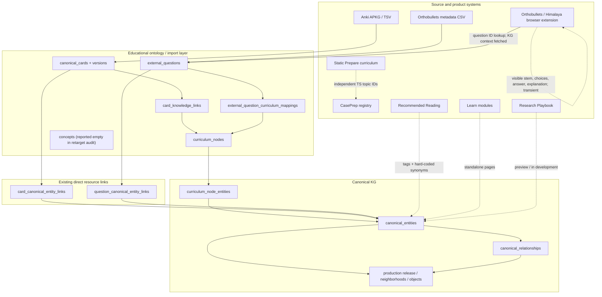
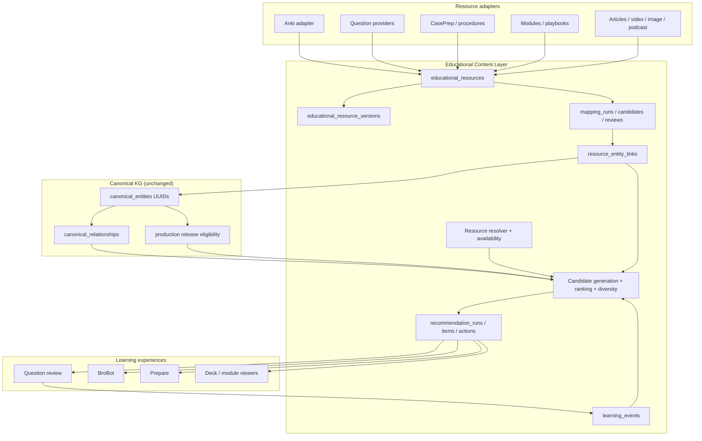
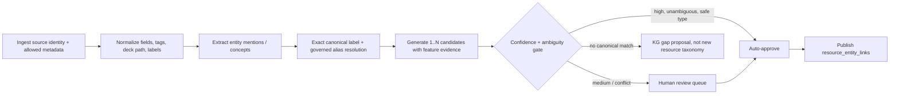

# Educational Content Layer Architecture Audit

Date: 2026-07-19  
Scope: repository and checked-in operational reports only  
Constraint: architecture/audit only; no production code or data was changed

## Executive decision

Build the Educational Content Layer as a **separate resource catalog and learner-state system whose only clinical taxonomy is `canonical_entities.id`**. Do not put resources into `canonical_relationships`, do not extend the legacy `concepts` graph, and do not create a new topic taxonomy.

The proposed sequence is almost right, but it should be reordered slightly:

1. Establish the generic resource contract and one stable card-opening contract.
2. Finish **Anki card -> canonical entity** mappings for a deliberately small production slice, not every card globally.
3. Finish **Orthobullets question -> canonical entity** mappings for the same slice.
4. Persist the answered/missed event from the browser extension.
5. Ship missed question -> directly shared entities -> 3 relevant Anki cards.
6. Measure and improve before expanding coverage and resource types.

This vertical-slice order reaches a user-visible outcome sooner than mapping all 5,095 imported cards before validating the loop. The existing repository-reported baseline is 5,095 canonical cards, 1,111 legacy card-to-curriculum mappings (21.8%), and 7,557 Orthobullets question records, of which 7,493 map to curriculum nodes. These are historical checked-in audit counts, not a fresh database measurement.

The key architectural rule is:

```text
resource -> resource_entity_links -> canonical_entities
```

and never:

```text
resource -> resource-specific topic taxonomy -> translation at request time
```

## Audit basis and confidence

Primary implementation evidence:

- `supabase/migrations/20260626_090000_educational_ontology_foundation.sql`
- `supabase/migrations/20260626_110000_orthobullets_external_questions_phase2.sql`
- `supabase/migrations/20260627_100000_anki_import_tables.sql`
- `supabase/migrations/20260627_130000_anki_kg_mapping_v1_support.sql`
- `supabase/migrations/20260628_090000_anki_kg_review_workflow_v1.sql`
- `supabase/migrations/20260628_120000_next_generation_kg_foundation.sql`
- `supabase/migrations/20260628_160000_legacy_ontology_retargeting.sql`
- `supabase/migrations/20260716_040000_kg_beta_production_release.sql`
- `supabase/migrations/20260716_150000_brobot_kg_shadow_retrieval.sql`
- `scripts/lib/education/anki-import/*`
- `scripts/lib/education/anki-kg-mapper.ts`
- `scripts/lib/education/orthobullets-import.ts`
- `src/lib/brobot/kg/*`
- `src/lib/brobot/orthobullets/*`
- `extensions/orthobullets-brobot/src/*`
- `src/lib/student-curriculum/*`
- `src/lib/brobot/reading/*`
- `reports/kg-production/full-beta-apply-report.md`
- `reports/kg-production/full-beta-release-manifest.json`

The active checked-in release report says `kg-beta-20260716-002` activated 83 neighborhoods and 3,236 unique overlay objects: 1,023 entity references, 2,187 relationship references, and 26 curriculum bridges. Nineteen neighborhoods are full, 64 partial, one excluded. Claims and decision points are both zero in that production overlay. A deployment report verifies the data-plane RPC but says deployed BroBot application traffic and runtime configuration were not verified.

## 1. Current architecture



There are therefore three overlapping identity layers today:

1. Static/product identifiers such as Prepare `topicId` and CasePrep slug.
2. Legacy educational ontology identifiers (`curriculum_nodes.id`, mostly source-topic level).
3. The intended canonical domain identifiers (`canonical_entities.id`).

The canonical entity UUID is the correct attachment point. `curriculum_nodes` should remain a curriculum overlay and migration bridge, not the permanent identifier for new resources.

## 2. Knowledge Graph audit

### Canonical entity model and identifiers

`canonical_entities` supplies UUID identity, typed entity class, preferred and normalized labels, optional stable slug, description, lifecycle/review state, replacement lineage, provenance origin, and metadata. Entity types include condition, procedure, anatomy structure, classification system, complication, diagnostic test, imaging finding, implant, treatment principle, biomechanics concept, exam maneuver, and later vocabulary additions such as surgical approach/positioning.

Use `canonical_entities.id` as the immutable foreign key. Slugs and labels are lookup/display values, not foreign keys. A rename must not break resource links; a merge or replacement must be resolved through governance lineage and a link-reconciliation job.

### Aliases and normalization

Normalization is spread across:

- `source_aliases`, which can target `canonical_entity`;
- legacy `concept_aliases` and `curriculum_node_aliases`;
- entity `normalized_label` and slug;
- source-specific normalization code and reviewed overrides;
- product-local synonym maps, especially Recommended Reading.

This is usable but fragmented. The mapping service should expose one canonical resolver that reads accepted entity labels/aliases plus source-scoped aliases. Product-local synonym lists should migrate into governed aliases, not become another graph.

### Relationships and neighborhoods

`canonical_relationships` is a typed edge table with confidence, review status, provenance status, lifecycle, and source metadata. Its vocabulary covers clinical relations (for example treatment, anatomy, classification, complications, imaging, prerequisite, confusion/differential) and resource-like predicates inherited from the early design.

Production publication is an immutable overlay: releases contain neighborhoods and object memberships, with review tier, risk tier, provenance status, exclusions, and verification hashes. This is a strong publication boundary.

Educational assets should **not** be added as canonical entities or ordinary graph edges. The graph models clinical knowledge; the new link table models resource coverage. A recommendation query may traverse canonical relationships after resolving direct resource links, but resource inventory must stay independently deployable.

### Retrieval

Two relevant paths exist:

- `get_kg_production_neighborhood` / `find_kg_production_topics` expose release-aware production reads.
- `retrieve_brobot_kg_shadow` performs bounded, mode-aware candidate and relationship retrieval with a 1,200-token ceiling, cache, fail-open behavior, and a pinned release.

BroBot's current KG path is explicitly shadow-only: `answerInfluenced` is false and the packet is not injected into generation. Orthobullets `kg-lookup.ts` fetches curriculum and canonical IDs by source question ID; the canonical IDs are context metadata, not a resource recommender.

The Educational Content Layer should be independent of this generative retrieval path. It needs a deterministic database query optimized for entity IDs and resource links. It may reuse neighborhood traversal policy, production eligibility, aliases, and release identity; it should not invoke LLM retrieval or depend on an answer prompt.

### Telemetry

The KG already records retrieval decisions, candidates, selected entity/relationship IDs, timings, cache state, gaps, and later outcomes in `brobot_kg_retrieval_events`. KG feedback events/signals and a growth queue also exist. This telemetry is about graph retrieval quality, not learner mastery or resource recommendations.

Keep it. Add separate learning/recommendation events and correlate them with `request_id`, `retrieval_id`, question resource ID, and KG release ID where applicable.

## 3. Anki infrastructure audit

### What exists

The import subsystem is mature enough to reuse:

- APKG and TSV parsers.
- Import batch hashes/version/status/warnings.
- Deck hierarchy with source-native IDs and paths.
- Note models, field definitions, templates, CSS, and LaTeX.
- Notes with source key, native ID/GUID, exact field snapshots, raw HTML, tags, content hash, and identity hash.
- Cards with native IDs, ordinals, deck, content hash, and read-only Anki scheduling fields.
- Media-reference extraction.
- Canonical card registry and immutable versions.
- Quality review and training-level review tables.
- Duplicate views based on hashes/identity signals.
- Deterministic mapping runs, candidates, reviewer actions, review/coverage views, cleanup, and apply workflows.
- Direct `card_canonical_entity_links` created as an additive retarget from legacy node mappings.

Anki remains the scheduling authority. The import explicitly copies scheduling state for inspection and does not own review scheduling. That boundary should remain.

There is also a separate BroBot-Anki add-on workflow that creates prep requests and records local keyword/tag/hybrid matches and study sessions. Those API tables are referenced in application code but their DDL is not present in the checked-in Supabase migrations. More importantly, that flow identifies local cards using raw Anki IDs/previews and is not integrated with `canonical_cards` or canonical entity links. It is a separate operational silo and a migration/integrity risk.

### Duplicate detection

Import idempotency uses file SHA-256, source-native note/card keys, note GUIDs, source content hashes, identity hashes, unique source/card constraints, and version content hashes. Review views expose potential duplicates. This is sufficient for source ingest, but the generic resource layer also needs uniqueness on `(source_id, resource_type, external_key)` and immutable resource versions.

### Does current card metadata support automatic mapping?

Partially, not universally.

Strong signals:

- hierarchical deck path;
- source-native tags;
- model/field names;
- card title and field text;
- source provenance;
- existing curriculum aliases and source aliases.

The v1 mapper is deterministic and primarily matches normalized tag/deck labels to curriculum node labels/aliases, with specialty checks. Its thresholds are 0.90 high confidence and 0.75 medium confidence. Repository-reported coverage of 21.8% proves the metadata is valuable but not sufficient to map every card automatically. It also maps first to coarse curriculum topics, then retargets through a bridge, which can attach a card to a topic's anchor entity rather than every concept actually tested by the card.

Conclusion: metadata is sufficient for high-precision auto-acceptance on a subset. Full coverage requires field-content entity extraction, exact/alias resolution, candidate scoring, multi-entity support, and human review. Low-confidence cards must not be forced onto a generic topic entity merely to reach 100% coverage.

## 4. Orthobullets and question infrastructure audit

### Persisted metadata

`external_questions` stores one row per source ID with raw/normalized specialty and topic, topic slug, timestamps, and sanitized metadata. The unique identity is `(source_id, external_question_id)`. `external_question_curriculum_mappings` stores one conservative primary curriculum mapping with confidence, method, and review fields. `question_canonical_entity_links` supplies the direct canonical bridge.

The import is deliberately metadata-only. It does **not** persist stems, answer choices, explanations, or images. Therefore the database does not currently have persisted question anatomy, diagnosis, procedure, or answer-explanation annotations from which to perform rich offline entity extraction.

### Runtime extension context

The browser extension extracts, when visibly available:

- question ID;
- stem and answer choices;
- selected and correct answer state;
- explanation text;
- images and references;
- linked concepts/breadcrumbs/page sections;
- provider-specific state for Orthobullets, ROCK, and AAOS Himalaya.

It builds a robust session fingerprint from question ID (or stem fallback), stem hash, answer-choice hash, image hash, and page position. It also guards against stale async responses and hides correct-answer/explanation data before the page exposes review state.

This creates the exact trigger needed for the MVP, but it is transient. There is no canonical persisted `question_attempt`/miss event connected to `external_questions`, no normalized cross-provider question resource contract, and no evidence that extracted explanation-derived entities are reviewed and saved.

### Attachment strategy

For known Orthobullets IDs, resolve `external_questions`, then direct approved `question_canonical_entity_links`. For unknown/provider questions, upsert a resource identity using provider + native question ID/fingerprint, extract entity candidates only after answer review is visible, and queue review. Do not persist protected content unless source rights and policy explicitly allow it; mappings can be derived transiently and saved as entity IDs plus evidence hashes/features.

The extension already supports Himalaya extraction, but the database registry is Orthobullets-specific in practice. Provider normalization is required before Phase 2 expansion.

## 5. Educational resource inventory

| Resource/surface | Current identity/taxonomy | KG participation | Main gap |
|---|---|---|---|
| Anki import | Native note/card IDs, GUIDs, deck paths/tags; `canonical_cards` | Partial legacy and direct entity links | Coverage; product open-card contract; add-on silo |
| Orthobullets questions | Source question ID + topic/specialty | Curriculum mapping and partial direct entity links; lookup used in extension | Metadata-only; no durable attempt/miss event |
| AAOS Himalaya | Runtime provider extraction + fingerprint | No durable source/resource mapping found | Provider registry, rights policy, mappings |
| Question Tutor / Explain | Runtime question session/fingerprint and prompt-generated response | Fetches question KG lookup; KG IDs do not drive recommendations | Persist outcome and invoke resource recommender |
| Prepare / Case Readiness / Study Guides | Large static TypeScript curriculum with local `topicId`, aliases, prerequisites, related IDs, tags | No canonical entity bridge in product path | Independent taxonomy; generated guide is not a registered/versioned resource |
| CasePrep | Procedure registry slugs; nine hard-coded Prepare mappings | Used as ranked prompt context, not generic KG-linked content | Register modules/sections as resources and map to entities |
| Procedures | CasePrep registry plus unrelated program scheduling `ap_procedures` | Canonical KG has procedure entities, but content objects are not linked generically | Separate scheduling vs educational meanings; no resource contract |
| OITE | BroBot mode/rubrics plus static curriculum fields | Can use shadow KG normalization, but no OITE question bank registry found | No first-class OITE item corpus or attempt history |
| Recommended Reading | `brobot_reading_resources`, tags, modes, local synonym map, ranking scores | No entity link; keyword/tag retrieval | Map resources to canonical IDs and retain editorial scores as ranking features |
| Research mode | Prompt templates, submode routing, PubMed/citation/trusted-web retrieval | KG can normalize in shadow; returned articles not durable educational resources | Resource registration/versioning and entity mapping |
| Research Playbook | UI preview marked in development | None | No module/content model or KG link |
| Shared playbooks / MyCases | Share records and user-authored playbook data | None found | Decide whether private user content belongs in this layer; likely separate visibility scope |
| Learn modules | Standalone trauma/oncology pages and UI content | None found | Stable module/section identities and entity links |
| Images/video/podcasts/PRS Review | No unified registry found | None | Ingest adapters, rights metadata, canonical links |

These systems do not currently share one identifier. Some share slugs or text by convention; that is not referential integrity.

## 6. Gap analysis

### Must exist for MVP

1. A generic resource registry and resource version/status contract.
2. A single approved resource-to-canonical-entity link table.
3. A compatibility/backfill path from `canonical_cards` and `external_questions` without duplicating their content.
4. Sufficient direct entity-link coverage for one launch cohort.
5. A durable question-attempt event containing provider identity, correctness, entity IDs used, and timestamp.
6. A deterministic recommendation query/service.
7. A stable deep link or add-on command to open/show selected Anki cards.
8. Impression/click/open/dismiss/complete telemetry and an offline evaluation set.
9. RLS/rights/visibility policy for user-owned decks and licensed external material.

### Important but not launch-blocking

- Generic ingestion and mapping run/candidate/review tables.
- Learner mastery/spacing summaries by entity.
- Neighborhood expansion and prerequisite sequencing.
- Resource diversity and cross-type ranking.
- Resource availability/entitlement resolution.
- Mapping reconciliation after entity merge/split/replacement.
- Editorial tooling and coverage dashboards.

### Existing assets that should not be rebuilt

- Anki parsers, identity hashes, versioning, and review workflow.
- External question registry/importer.
- Canonical entity UUIDs and governance.
- Production KG release/eligibility overlay.
- Shadow retrieval telemetry and graph feedback loop.
- CasePrep registry and current reading catalog/ranking features.

## 7. Proposed future architecture



Clinical retrieval and educational recommendation share canonical IDs but remain separate services and tables. The KG answers what is related; the content layer answers what can be learned, by whom, where, under what rights, and with what observed benefit.

## 8. Recommended database schema

Names are illustrative but intentionally concrete.

### `educational_resources`

Canonical registry row for every addressable learning asset.

```text
id uuid PK
source_id uuid FK external_sources
resource_type text FK educational_resource_types.code
external_key text not null
title text not null
canonical_url text null
native_locator jsonb not null default {}
visibility text            -- public, entitled, organization, user_private
rights_status text         -- owned, licensed, metadata_only, linked, unknown
editorial_status text      -- draft, review, published, retired
difficulty numeric null
estimated_minutes integer null
training_level_min/max text null
language text default 'en'
metadata jsonb
current_version_id uuid null
is_active boolean
created_at / updated_at
UNIQUE(source_id, resource_type, external_key)
```

`native_locator` holds pointers, not duplicated payloads: e.g. `canonical_card_id`, `external_question_id`, CasePrep slug/section key, route, DOI, PubMed ID, or provider URL. For first-party objects, add nullable typed FK columns or subtype binding tables where referential integrity matters; do not rely forever on an unchecked polymorphic UUID.

### `educational_resource_types`

Controlled vocabulary and behavior: `anki_card`, `question`, `caseprep_module`, `caseprep_section`, `procedure_page`, `study_guide`, `research_module`, `article`, `guideline`, `video`, `image`, `podcast`, `external_reference`. Include capabilities such as `launch_mode`, `supports_completion`, and default ranking/diversity policy.

### `educational_resource_versions`

Immutable content/metadata snapshots: resource FK, version, content hash, source revision, extracted text hash, metadata snapshot, availability/verification timestamp, and supersession. Store content only when rights permit.

### `resource_entity_links`

```text
id uuid PK
resource_id uuid FK educational_resources
canonical_entity_id uuid FK canonical_entities
link_role text              -- primary, teaches, tests, demonstrates, prerequisite, contrasts
scope text                  -- whole_resource, section, question_explanation, image_region
scope_locator jsonb
mapping_method text         -- source_exact, deterministic, model_suggested, manual, migrated
mapping_confidence numeric(4,3)
review_status text          -- proposed, needs_review, approved, rejected, superseded
evidence jsonb              -- matched aliases/tags/hashes, no protected body required
mapper_version text
reviewed_by / reviewed_at
valid_from / valid_to
is_active boolean
UNIQUE(resource_id, canonical_entity_id, link_role, scope_fingerprint) WHERE active
INDEX(canonical_entity_id, review_status, resource_id)
```

Only approved links are eligible for production recommendations. Multiple links per resource are expected.

### Mapping operations

- `resource_ingestion_runs`: adapter/version/input hash/counts/status.
- `resource_mapping_runs`: resolver/model versions, thresholds, KG release, counts.
- `resource_mapping_candidates`: resource/entity/rank/score/features/status.
- `resource_mapping_review_actions`: append-only reviewer audit trail.

Existing Anki mapping tables can feed these initially; do not delete them during MVP.

### Learner and recommendation state

`learning_events` should be append-only with user, resource, canonical entity IDs (snapshot), event type, correctness/score, source attempt key, occurred time, context, and idempotency key. Event types include question answered/missed, resource viewed/opened/completed, card reviewed, recommendation dismissed, and confidence self-rating. Avoid treating imported Anki scheduling columns as current learner state.

`recommendation_runs` records trigger, user/context, anchor resource, direct and expanded entity IDs, KG release, ranker version, feature snapshot, and latency.

`recommendation_items` records run, resource, rank, score, reason codes, entity overlap, and availability decision. `recommendation_actions` records impression/open/dismiss/complete/helpful outcomes. A materialized `learner_entity_state` can later summarize misses, mastery, last exposure, and next review time; it should be derived, not the event source of truth.

### Compatibility views

During transition, create views/adapters that project:

- `canonical_cards` + `card_canonical_entity_links` as Anki resources;
- `external_questions` + `question_canonical_entity_links` as question resources;
- `brobot_reading_resources` as article/external-reference resources.

Backfill generic rows idempotently. Keep existing specialized tables as authoritative payload stores until each product surface is migrated.

## 9. Mapping strategy and pipeline



Candidate features should include exact preferred-label match, accepted alias match, source-scoped alias, deck path/tag agreement, title/field mention, source topic bridge, entity-type compatibility, neighborhood coherence among multiple candidates, and negative/conflict evidence.

Recommended policy:

- Auto-approve exact stable source-ID mappings and reviewed alias matches.
- Auto-approve deterministic multi-signal mappings only above a calibrated threshold and margin over runner-up.
- Require review for anatomy ambiguity, broad topic-to-specific entity inference, multi-entity cards with unclear primary concept, and anything derived only from an LLM.
- Never auto-create canonical entities from resource text. Emit a KG proposal through the existing review-gated automation system.
- Record mapper version, KG release, evidence features, and review lineage so every mapping is reproducible.
- Re-evaluate affected links when a canonical entity is merged, split, replaced, or deprecated.

For tens of thousands of cards, batch by deck branch and normalized tag family, reuse candidate results for identical evidence signatures, bulk upsert, and review clusters rather than individual cards where the evidence is truly shared. Still retain card-level decisions.

## 10. Recommendation architecture

### Candidate generation

For a missed question:

1. Resolve the canonical question resource from provider + question ID/fingerprint.
2. Load its approved direct entity links.
3. Fetch published, available Anki resources with approved links to the same entities.
4. If direct candidates are fewer than the display minimum, traverse at most one bounded KG hop using an allowlist such as `prerequisite_for`, `commonly_confused_with`, anatomy involvement, classification, and closely related diagnosis/procedure predicates.
5. Exclude the triggering resource, unavailable/private resources, retired versions, rejected mappings, and resources the learner cannot launch.
6. Score, diversify, and return reason codes plus shared entity IDs.

Direct overlap should dominate. Neighborhood expansion is a fallback and must be labeled as related/prerequisite rather than directly relevant.

### Extensible ranking model

Start deterministic and log every feature:

```text
score =
  0.30 * entity_match
+ 0.15 * mapping_confidence
+ 0.12 * trigger_relevance
+ 0.10 * learner_need
+ 0.08 * spacing_urgency
+ 0.08 * training_level_fit
+ 0.06 * resource_quality
+ 0.05 * difficulty_fit
+ 0.04 * source/context_fit
+ 0.02 * freshness_or_verification
- penalties
```

Where:

- `entity_match`: 1.0 for primary direct overlap; lower for secondary link or one-hop relation.
- `trigger_relevance`: boosts a card testing the missed concept rather than merely mentioning it.
- `learner_need`: recent/repeated misses and low entity mastery.
- `spacing_urgency`: due/overdue only when reliable current scheduling data is available from the user's Anki client.
- `training_level_fit`: reviewed card levels and learner PGY/medical-student level.
- `resource_quality`: card quality review and editorial/published state.
- penalties: recent repetition, already mastered, low availability, weak mapping, duplicate/sibling cloze redundancy, and too many results of one type.

For the MVP, omit unavailable features rather than inventing values. Use direct entity overlap, mapping confidence, card quality if present, source/deck priority, and repetition suppression. Store ranker/version and feature JSON so weights can later be learned from opens/completions without changing the API.

### API contract

One service endpoint should accept `triggerResourceId` or `(provider, externalQuestionId)`, `eventType=question_missed`, user/training context, and desired resource types. It should return groups:

- `relevant`: direct shared entities;
- `related_concepts`: selected canonical neighbors;
- `recommended_review`: related/prerequisite resources.

Every item needs resource ID, type, title, launch action, score, reason codes, shared entity IDs/labels, and mapping/review provenance suitable for debugging.

## 11. MVP implementation plan

### Milestone 0 — Measure and choose the slice (1–2 days)

- Run read-only production counts for cards, questions, direct approved links, overlap by entity/neighborhood, and launchable card IDs.
- Choose 3–5 high-traffic, production-published neighborhoods with both question and card coverage; carpal tunnel is a sensible candidate but must pass counts.
- Build a 50–100-question offline truth set with curator-selected relevant cards.

Exit: a measured cohort capable of demonstrating the end-to-end experience.

### Milestone 1 — Resource contract and compatibility backfill (2–4 days)

- Add resource type/registry/version/link schema and RLS.
- Backfill Anki and Orthobullets registry rows from existing tables; do not copy protected question content.
- Backfill approved direct links from `card_canonical_entity_links` and `question_canonical_entity_links`.
- Add integrity/coverage views and idempotent migrations.

Exit: one entity-ID query returns launchable card resources for a known question.

### Milestone 2 — Close mapping gaps in launch slice (3–7 days, review-dependent)

- Enhance candidate generation with card field text plus canonical labels/accepted aliases.
- Run dry-run, cluster review, approve mappings, and measure precision/recall.
- Set a product eligibility rule: only published KG entities and approved resource links.

Exit: agreed coverage and precision thresholds on the offline set (suggest >=95% precision for displayed direct matches).

### Milestone 3 — Capture the miss trigger (2–4 days)

- Normalize Orthobullets/Himalaya question identity.
- Persist idempotent `question_answered` / `question_missed` learning events after visible review state.
- Store IDs, correctness, hashes, and mapping snapshot; keep protected text transient unless permitted.
- Add privacy, retention, and provider-rights tests.

Exit: one durable miss event reliably identifies a canonical question and entity set.

### Milestone 4 — Recommendation service (2–4 days)

- Implement direct-overlap candidates first; one-hop fallback behind a flag.
- Add deterministic scorer, reason codes, availability filtering, deduplication, and max-three result limit.
- Persist recommendation run/items asynchronously.
- Add latency budget and cache by `(question resource, entity-link version, learner bucket)` where safe.

Exit: p95 database/service latency target under 150 ms for the direct path and offline precision gate passing.

### Milestone 5 — Question Review UI and Anki handoff (2–5 days)

- Render after an incorrect submitted answer: “Relevant Anki Cards” with at most three cards.
- Provide open/reveal/add-to-session action through a versioned add-on/deep-link contract.
- Log impressions, opens, failures, dismissals, and completion acknowledgements.
- Fail silently to existing Explain/Question Tutor if mapping or add-on launch is unavailable.

Exit: end-to-end missed question -> relevant card opens immediately.

### Milestone 6 — Controlled rollout and evaluation (1–2 weeks of traffic)

- Shadow recommendation generation first, then small beta.
- Monitor mapping precision, no-result rate, open rate, launch failure, repeat suppression, latency, and negative feedback.
- Review false positives weekly and feed only approved alias/entity changes into the KG governance path.

Exit: evidence supports expansion to more neighborhoods and resource types.

### Next phases

1. Expand card/question coverage together by neighborhood.
2. Register CasePrep modules/sections and replace the nine hard-coded mappings.
3. Migrate Recommended Reading from synonym/tag matching to entity links.
4. Register Prepare study guides and Learn modules with stable IDs/versions.
5. Add OITE/AAOS question providers under the same question identity contract.
6. Add procedures, research modules, articles, video, image, podcast, and external references.
7. Introduce learner-entity mastery, prerequisites, and cross-resource sequencing.

## 12. Risks and controls

| Risk | Consequence | Control |
|---|---|---|
| Coarse legacy topic retargeting | Irrelevant cards appear because all cards inherit one anchor entity | Direct card-content extraction; multi-entity links; precision gate |
| Mapping to slugs/labels | Renames break recommendations | UUID FKs only; slugs for lookup/display |
| Duplicate taxonomy | Resource types recreate clinical concepts | Governed aliases and KG gap proposals; no resource-owned concepts |
| Entity merge/split | Stale resource links | Governance-triggered reconciliation and validity windows |
| User-owned Anki privacy | Cross-user leakage | Explicit ownership/visibility; RLS; separate global curated vs private resources |
| Copyright/licensing | Protected question/card content copied into DB | Metadata-only default, hashes/evidence, rights status, retention policy |
| Stale Anki scheduling | Incorrect spacing rank | Anki remains authority; use only fresh client-provided state |
| Extension identity drift | Recommendation attaches to wrong question | Provider + native ID + fingerprint; generation/stale-response guards; idempotency |
| Partial beta KG | False confidence or no results | Production eligibility, coverage labels, direct-only MVP, graceful no-result |
| JSONB overuse | Weak integrity and slow filtering | Typed indexed columns for identity/status/ranking; JSONB only for adapter-specific metadata |
| Polymorphic native references | Orphaned registry rows | Typed bindings/FKs for first-party types; validation jobs for external locators |
| Ranking feedback loops | Popular resources crowd out better learning | Exploration cap, diversity, offline truth set, outcome metrics beyond clicks |
| Recommendation latency | Interrupts question review | Indexed entity-first query, bounded results, cache, asynchronous event writes |
| Review burden | Tens of thousands of cards stall | Cluster review, calibrated auto-accept, prioritize launch neighborhoods |
| Two Anki systems | Imported canonical cards and add-on local matches diverge | Explicit identity bridge and one launch contract before rollout |
| Silent source taxonomies | Static Prepare/Reading aliases keep drifting | Migration dashboard and ban new hard-coded clinical synonym maps |

## 13. Long-term vision

Once every educational resource is connected to canonical entities, BroBot becomes a learning orchestration system rather than a collection of content surfaces. A learner's question attempts, cases, card reviews, reading, and module progress update a shared entity-level learning state. The KG supplies semantic structure and prerequisites; the Educational Content Layer supplies teachable assets, access rules, quality, difficulty, and format; the recommendation engine selects the next useful action for that learner and context.

A single median nerve entity can then support a missed-question review, a three-card Anki set, relevant anatomy images, a carpal tunnel CasePrep section, a procedure page, a short video, and a later journal review without duplicating “median nerve” in six taxonomies. New resources become useful as soon as their mappings are approved, and new learning experiences can consume the same resource API without altering the KG.

The durable product loop is:

```text
learner event
  -> canonical entities demonstrated or missed
  -> direct resources plus bounded semantic neighbors
  -> availability + learner-fit ranking
  -> explainable recommendation
  -> learner outcome
  -> mapping/ranking/coverage feedback
```

## Final recommendation

Approve a narrow, direct-entity Anki/Orthobullets vertical slice. Do not make “map every Anki card” the gate for first production. The repo already has most ingestion and KG primitives; the highest-value work is to unify resource identity, close mappings in one launch cohort, persist misses, and make card launch reliable. After the loop proves useful, expand horizontally by neighborhood and resource type while preserving the same canonical entity IDs and recommendation contract.
