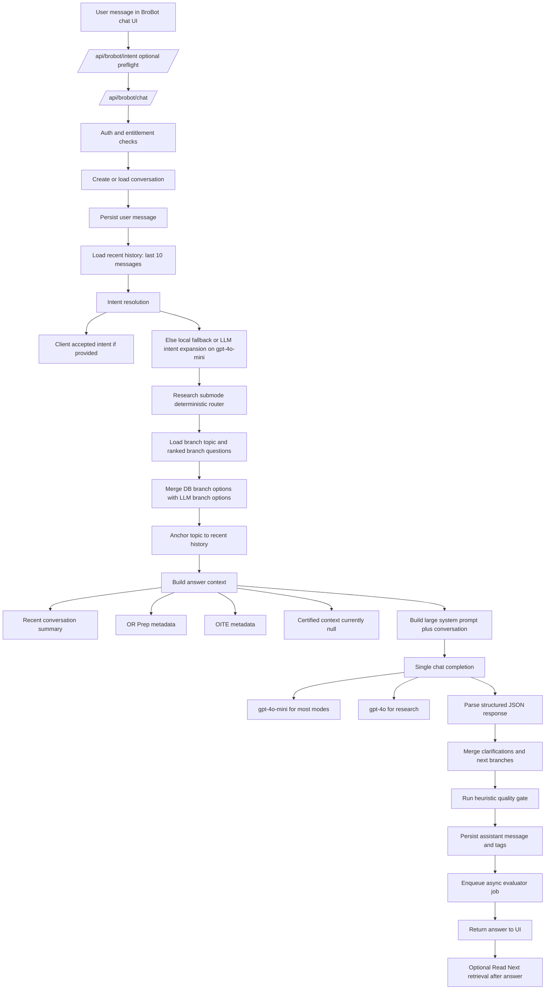

# BroBot Chat Quality Audit And Frontier Improvement Plan

Date: 2026-06-26

## Executive Summary

BroBot does not primarily lose to ChatGPT because of one bad prompt. It loses because the current system is still a mostly single-pass chat architecture wrapped in strong product scaffolding.

The current stack already has several good foundations:

- explicit mode routing
- branch generation and ranking
- structured outputs
- training-level controls
- async quality evaluation
- consult-specific safety framing
- a separate reading recommendation engine

The main problem is that the answer path itself is still shallow:

1. The core answer is usually generated in one pass on `gpt-4o-mini`.
2. Main chat answers are not grounded by live retrieval or certified educational context.
3. The quality gate is post hoc and non-blocking, so bad answers are logged, not fixed.
4. Memory is short-window only and there is no real longitudinal conversation state.
5. Prompting is ambitious but overcrowded, so the model is asked to route, personalize, structure, clarify, teach, and branch all in one JSON response.

The result is a system that often feels organized, but not frontier. ChatGPT often feels better because its base model quality, reasoning coherence, answer polish, and conversational continuity are stronger even before additional product logic is added.

## Bottom Line

If the goal is for users to consistently prefer BroBot over ChatGPT for orthopaedic questions, the highest-leverage change is:

Move BroBot from a single-pass prompt system to a staged answer engine:

- classify
- plan
- retrieve or assemble context when needed
- draft
- critique
- revise
- then render into the product schema

Without that shift, prompt tuning alone will only produce incremental gains.

## Root Causes Ranked By Expected Impact

| Rank | Problem | Why It Hurts |
| --- | --- | --- |
| 1 | Main answer generation defaults to `gpt-4o-mini` | The core user-visible answer is being produced by a smaller model than the quality bar requires. |
| 2 | No retrieval in the primary chat answer path | BroBot often answers from model memory plus prompt instructions instead of grounded orthopaedic source context. |
| 3 | No internal planning, critique, or revision loop | Difficult questions get one shot instead of a frontier-style reasoning pipeline. |
| 4 | Prompt stack is too dense and multitasks too much | Instruction collision and schema pressure reduce answer sharpness and naturalness. |
| 5 | Memory is shallow | Only the last 10 messages are loaded, and only the last 6 are summarized into prompt context. |
| 6 | Quality gate does not repair output | Heuristic warnings are logged after generation but do not trigger regeneration or escalation. |
| 7 | Certified context integration is effectively unimplemented | `getCasePrepCertifiedContext()` is still a stub returning `null`. |
| 8 | Branching UX is more mature than the answer engine | BroBot is optimized to suggest next clicks more than to maximize the first answer. |
| 9 | Evaluation exists, but no permanent benchmark suite gates changes | Quality can drift because the system measures responses after the fact instead of before release. |
| 10 | Reading retrieval is siloed from the answer | Stronger evidence tooling exists nearby, but not in the main answer loop. |

## Current Architecture Audit

### Endpoints

- `src/app/api/brobot/intent/route.ts`
  - preflight intent expansion
  - combines local deterministic routing with optional LLM intent expansion
- `src/app/api/brobot/chat/route.ts`
  - main chat pipeline
  - guest and authenticated flows
  - intent expansion, branch ranking, answer generation, persistence, analytics, optional streaming
- `src/app/api/brobot/reading-recommendations/route.ts`
  - post-answer "Read Next" retrieval
- `src/app/api/brobot/branch-events/route.ts`
  - branch exposure and click tracking
- `src/app/api/cron/brobot-evaluate/route.ts`
  - async evaluation processor
- `src/app/api/brobot/ask/route.ts`
  - legacy secure proxy to external CasePrep endpoint, separate from the main chat stack

### Current Chat Pipeline

### Model Calls In Production Path

- Intent expansion: `BROBOT_INTENT_MODEL`, default `gpt-4o-mini`
- Main chat answer: `BROBOT_CHAT_MODEL`, default `gpt-4o-mini`
- Research answer: `BROBOT_RESEARCH_MODEL`, default `gpt-4o`
- Async evaluator: `BROBOT_EVAL_MODEL`, default `gpt-4o`

### What The Main Answer Actually Gets

The answer model receives:

- a large monolithic system prompt
- recent conversation turns
- intent metadata
- branch metadata
- training-level and depth instructions
- lightweight OR Prep or OITE metadata
- no true certified educational retrieval context in normal chat
- no live evidence retrieval in normal chat

### Memory And Context Management

Current state:

- recent history load: last 10 messages
- prompt summary context: last 6 messages
- no persistent conversation summary object
- no topic graph memory
- no long-horizon user learning memory in the answer prompt
- some learning fingerprint data is used for branch ranking, not for answer generation

This is enough for shallow follow-ups, but not enough for sustained tutor-quality continuity.

### Retrieval Audit

Main answer path:

- no Pinecone
- no vector retrieval
- no hybrid retrieval
- no reranking over evidence snippets
- no uncertainty-triggered retrieval
- no iterative retrieval
- no textbook grounding
- no knowledge graph traversal

What does exist:

- a separate reading recommendation system using PubMed, OpenAlex citation counts, and trusted web filtering
- this system is invoked after the answer, not before it

This is one of the clearest reasons BroBot can feel weaker than ChatGPT. It is trying to outperform a frontier general assistant in a specialist domain without consistently grounding its own answer generation.

### Quality Gates And Evaluation

Current strengths:

- heuristic quality gate checks specificity, OR Prep anatomy, consult structure, OITE trap language, level-shape, and rubric coverage
- async evaluator scores completed answers with an LLM

Current limitations:

- quality gate does not block or repair answers
- evaluator is asynchronous and cannot improve the same turn
- no candidate ranking
- no retry-on-failure
- no answer critique loop
- no benchmark suite gating deploys

### Streaming

Streaming is implemented, but the system streams partial JSON-derived answer text from a response that still must satisfy a structured contract. That is better than waiting for the full response, but it still couples streaming quality to JSON serialization quality.

That makes the answer engine do two hard things at once:

- think well
- serialize perfectly under streaming constraints

Frontier systems usually reduce this tension with more deliberate staged generation.

## Why Users Still Prefer ChatGPT

Even when BroBot is technically correct, ChatGPT will often feel better because:

- the first paragraph or first bullets are usually stronger
- reasoning is often more coherent before product structure kicks in
- it sounds less constrained by internal schema mechanics
- it handles ambiguity more gracefully
- follow-up continuity is usually smoother
- it is less likely to produce an answer that feels over-routed or over-templated

BroBot currently behaves like a well-instrumented product shell around a mid-depth answer engine. ChatGPT behaves like a stronger default answer engine.

## Frontier Gap Analysis

### 1. Planning Gap

BroBot usually:

- classifies
- answers

Frontier behavior should be:

- classify
- decide whether retrieval is needed
- plan the answer shape internally
- draft
- critique against a rubric
- revise

This matters most for:

- OR Prep
- consults
- research
- comparison questions
- nuance-heavy operative decision-making

### 2. Decomposition Gap

BroBot does not decompose hard problems into smaller tasks before answering. It asks one model to do everything at once:

- understand intent
- infer ambiguity
- tailor to level
- decide educational framing
- generate answer
- generate next branches
- emit product JSON

That is too much cognitive multiplexing for one pass, especially on `gpt-4o-mini`.

### 3. Context Assembly Gap

The answer prompt is rich in instructions but poor in external facts.

Current context assembly overweights:

- prompt rules
- mode templates
- branch metadata

It underweights:

- verified orthopaedic source snippets
- textbook or CasePrep summaries
- high-yield procedure-specific facts
- prior demonstrated user knowledge gaps

### 4. Retrieval Gap

BroBot has retrieval-like infrastructure for reading recommendations, but not for core answer generation.

The missing frontier features are:

- uncertainty-aware retrieval
- multi-query retrieval
- semantic reranking
- source snippet grounding
- citation-linked answer claims
- retrieval only for the sections that need evidence
- hybrid graph and vector retrieval

### 5. Prompt Layering Gap

The prompt architecture is thoughtful, but it is too long and too centralized.

Symptoms:

- system prompt tries to encode product UX, medical teaching, mode behavior, ambiguity policy, output contract, and answer style all in one layer
- answer model must satisfy both educational quality and UI field generation simultaneously
- many instructions are broad, repeated, or competing

This increases the chance that the model obeys the shape while missing the substance.

### 6. Memory Gap

Current memory is mostly recent-chat continuity, not tutor memory.

Missing frontier memory layers:

- durable topic summary across long threads
- user knowledge state
- prior weaknesses
- preferred teaching format
- prior attending-preference context
- unresolved questions from earlier turns

### 7. Answer Synthesis Gap

There is no explicit answer refinement stage.

Frontier systems often improve quality with:

- critique pass
- self-consistency
- fact check pass
- citation validation pass
- style polish pass

BroBot currently stops after parse plus heuristics.

## Prompt Audit

### What Is Good

- mode-specific instructions are directionally strong
- OR Prep and OITE rubrics are much better than generic med-ed prompting
- ambiguity handling is explicit
- the system tries to protect against generic filler

### What Is Weak

1. The prompt is too long for the importance of the core task.
2. The answer model is asked to produce both product state and educational content in the same act.
3. Too many rules are negative constraints instead of a minimal high-authority policy.
4. Branching and chip-generation instructions consume prompt attention that should go to the answer.
5. "Teach like a chief resident" is strong, but it is not reinforced by grounded examples.

### Highest-Value Prompt Changes

- split answer generation from UI-branch generation
- move branch suggestion to a second cheaper pass
- shrink the main answer system prompt by 35% to 50%
- add high-quality mode-specific exemplars
- add a hidden planning schema before the final answer schema
- use a stricter retrieval-grounded prompt when source context exists

## Retrieval Audit And Recommendation

### Current Answer Retrieval Score

For main chat answer quality, retrieval maturity is low.

### What Should Change

Build a modern orthopaedic RAG layer for main answers:

1. Query planning
   - detect whether the question is answerable from stable internal knowledge
   - trigger retrieval for uncertainty, evidence questions, procedures, complication thresholds, and nuanced comparisons
2. Multi-source retrieval
   - CasePrep certified content
   - Orthobullets mappings
   - trusted internal orthopaedic educational summaries
   - future knowledge graph traversals
   - research evidence only when needed
3. Reranking
   - rerank by mode, topic, training level, and subintent
4. Context packaging
   - inject only the 3 to 8 most relevant snippets
   - keep snippet provenance attached
5. Answer grounding
   - require the model to separate source-backed statements from expert-teaching heuristics

### Important Product Principle

Do not make every answer citation-heavy. Most OR Prep and OITE answers should feel clinically sharp first, with grounding used to increase specificity and reduce hallucination risk rather than to turn every response into a literature review.

## Knowledge Graph Integration Plan

The upcoming knowledge graph can become BroBot's biggest defensible advantage if used as a reasoning substrate, not just a lookup table.

Use graph traversal for:

- procedure to anatomy relationships
- AO/OTA to injury mapping
- procedure to implant options
- complications by approach or construct
- OITE concept prerequisites
- "what residents usually miss next" sequencing
- related Orthobullets or CasePrep links
- progression by learner stage

### Where Graph Beats Vector Retrieval

Use graph first for:

- exact topic relationships
- classification systems
- prerequisite learning paths
- complication networks
- ontology-backed branch generation

Use vector retrieval first for:

- free-text conceptual questions
- fuzzy phrasing
- cross-topic comparisons
- evidence summaries

Best future state:

- graph for structure
- vector for semantics
- reranker for turn-specific relevance

## UX Quality Audit

The current UI is organized and better than a plain chat box, but several choices may still make answers feel worse than ChatGPT:

1. BroBot visually fragments the answer into many product sections.
2. The "Direct Answer" may be weaker than the surrounding scaffolding.
3. Confidence percentages can reduce trust if the answer itself is not clearly strong.
4. Clarification and next-branch mechanisms can make the system feel hesitant.
5. "Common Next Questions" is strong product design, but it should follow an excellent answer, not compensate for a mediocre one.

### UX Improvements With High Value

- make the first 120 to 180 words dramatically better before anything else
- add mode-specific visual callouts only when they improve comprehension
- hide confidence unless confidence is operationally meaningful
- collapse secondary sections by default on mobile when the answer is already long
- add "Clinical Pearl", "Pitfall", and "Attending May Ask" callouts for OR Prep and consult modes

## Educational Quality Audit

BroBot is oriented toward teaching, but it still often risks sounding like:

- a good prompt
- wrapped around a generic answer

To feel like a superior orthopaedic tutor, answers should more consistently include:

- why the recommendation matters
- what changes management
- what changes operative planning
- what juniors miss
- what seniors debate
- what a board stem is really testing
- what an attending is actually worried about

The system already has fields like `whatMostResidentsMiss`. The gap is that the first answer still does not reliably feel expert enough before those fields are displayed.

## Recommended Frontier Architecture

### Stage 1: Intent And Risk Router

Keep:

- local pre-router
- branch taxonomy
- research submode router

Change:

- upgrade low-confidence or high-risk turns to a stronger reasoning model
- add a retrieval-needed decision

### Stage 2: Context Assembly

Build a context broker that can assemble:

- conversation summary
- user knowledge profile
- certified teaching snippets
- graph facts
- evidence snippets when needed

### Stage 3: Hidden Answer Plan

Before final answer generation, create a hidden plan object:

- user goal
- answer thesis
- must-cover concepts
- missing information
- safety concerns
- likely attending question
- likely board trap
- whether retrieval confidence is adequate

### Stage 4: Draft Answer

Generate the educational answer only.

Do not ask this pass to also generate branches, tags, and all product metadata.

### Stage 5: Critique And Revise

Run a second pass that checks:

- did it answer the actual question
- is it specific enough
- is anatomy or decision-making missing
- is it too generic
- is it wrong for level or mode
- is there unsupported certainty

If it fails, revise once before showing the user.

### Stage 6: Product Structuring

After the answer is good, derive:

- tags
- suggested questions
- next branches
- confidence
- UI fields

This lets the best model spend its reasoning budget on the answer, not on UI bookkeeping.

## Permanent Evaluation Framework

### Benchmark Categories

- OR Prep
- OITE
- fractures
- trauma consults
- sports
- arthroplasty
- spine
- hand
- pediatrics
- tumor
- clinic workup
- research
- general orthopaedics

### For Each Benchmark Case

Store:

- prompt
- mode
- training level
- ideal answer traits
- required concepts
- unacceptable failures
- whether retrieval should trigger
- expected answer shape

### Grading Rubric

Score each test on:

- correctness
- specificity
- educational value
- clinical usefulness
- mode fit
- level fit
- structure
- safety
- grounding
- follow-up usefulness

### Release Gates

Do not ship meaningful prompt or orchestration changes without:

- benchmark delta report
- failure-case review
- regression check on emergency consult prompts
- regression check on generic-answer rate

## Prioritized Improvement Roadmap

### Quick Wins

| Recommendation | Why It Matters | Quality Gain | Complexity | Time | Cost | Risk | Priority |
| --- | --- | --- | --- | --- | --- | --- | --- |
| Upgrade main answer model from `gpt-4o-mini` to a frontier chat or reasoning model for at least OR Prep, consult, and difficult turns | Biggest immediate answer-quality lift | Very high | Low | 1-2 days | Higher inference cost | Moderate cost risk | P0 |
| Split answer generation from branch/tag generation | Frees the best model to focus on the answer | High | Medium | 3-5 days | Small | Low | P0 |
| Turn quality-gate failures into one automatic revise pass | Converts logging into visible quality improvement | High | Medium | 3-5 days | Moderate | Low | P0 |
| Shrink the main system prompt and remove repeated branch/UI instructions | Reduces prompt dilution | Medium-high | Low | 1-2 days | None | Low | P0 |
| Add mode-specific exemplars for OR Prep, consult, and OITE | Improves answer texture and specificity fast | Medium-high | Low | 1-3 days | Small | Low | P0 |
| Hide or de-emphasize confidence until calibration is stronger | Avoids signaling doubt without helping users | Medium | Low | 1 day | None | Low | P1 |

### Medium Projects

| Recommendation | Why It Matters | Quality Gain | Complexity | Time | Cost | Risk | Priority |
| --- | --- | --- | --- | --- | --- | --- | --- |
| Build main-answer retrieval from CasePrep and verified orthopaedic content | Grounds answers in domain knowledge | Very high | Medium-high | 2-4 weeks | Moderate | Medium | P0 |
| Add hidden planning object before final answer generation | Improves reasoning coherence | High | Medium | 1-2 weeks | Moderate | Low | P0 |
| Add critique and revision stage with failure-specific instructions | Reduces generic answers and missed details | High | Medium | 1-2 weeks | Moderate | Low | P0 |
| Introduce conversation summary memory and user knowledge memory | Improves continuity and tutoring feel | Medium-high | Medium | 1-2 weeks | Small | Medium | P1 |
| Route only easy low-risk turns to cheaper models | Preserves quality while controlling cost | Medium-high | Medium | 1 week | Cost-saving net | Medium | P1 |
| Move "Read Next" retrieval assets into answer-time context broker | Reuses existing retrieval work | Medium | Medium | 1-2 weeks | Small | Low | P1 |

### Large Projects

| Recommendation | Why It Matters | Quality Gain | Complexity | Time | Cost | Risk | Priority |
| --- | --- | --- | --- | --- | --- | --- | --- |
| Build a graph plus vector context broker for orthopaedic tutoring | Creates durable product moat | Very high | High | 4-8+ weeks | High | Medium-high | P1 |
| Create a true multi-agent pipeline for research and high-complexity OR Prep | Frontier-quality decomposition for difficult questions | High | High | 3-6 weeks | High | Medium | P1 |
| Build benchmark-driven release gating with admin dashboards | Makes quality compounding and measurable | High | High | 2-4 weeks | Moderate | Low | P1 |
| Add personalization based on knowledge gaps, training stage, and recurrent weak topics | Makes BroBot feel uniquely educational | High | High | 3-6 weeks | Moderate | Medium | P2 |

## Recommended Model Orchestration

As of 2026-06-26, BroBot should not use the same model quality tier for all tasks.

Recommended split:

- Cheap model
  - branch suggestion
  - tag extraction
  - simple classifier tasks
  - summarization
- Strong frontier model
  - final answer generation for OR Prep, consult, research, and ambiguity-heavy questions
  - critique and revision
  - evidence synthesis
- Optional reasoning-focused model
  - multi-step consult reasoning
  - controversy comparison
  - surgical decision tradeoff analysis

The current architecture already separates model constants. The missing step is to actually route the user-visible answer to a stronger tier more often.

## The Single Most Important Product Reframe

BroBot should stop thinking of itself as:

"a chat response plus educational branches"

and start thinking of itself as:

"an orthopaedic reasoning engine that produces a teachable answer, then productizes it"

That is the difference between a polished chatbot and a frontier specialist assistant.

## Suggested Implementation Order

1. Upgrade answer model tier for the main answer path.
2. Separate answer generation from branch generation.
3. Add one critique-and-revise pass triggered by quality-gate warnings.
4. Integrate certified retrieval into the answer path.
5. Add hidden planning and conversation summary memory.
6. Build graph plus vector context assembly.
7. Launch benchmark gating and continuous quality dashboards.

## Final Assessment

BroBot is not far from being impressive, but it is still optimizing the outer product loop more than the inner cognition loop.

Right now it is:

- well-structured
- mode-aware
- analytics-aware
- branch-aware

It is not yet:

- strongly grounded
- deeply planned
- self-correcting
- memory-rich
- model-tiered in a way that maximizes user-perceived answer quality

If the team executes the P0 changes above, BroBot should improve noticeably. If the team also adds answer-time retrieval, critique-revision, and graph-aware context assembly, BroBot can plausibly feel better than general chat assistants for orthopaedic training instead of merely more specialized.
