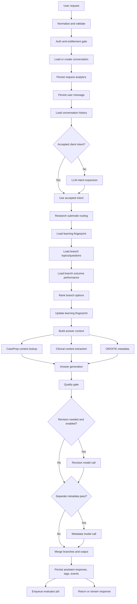
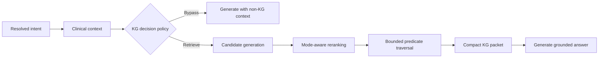
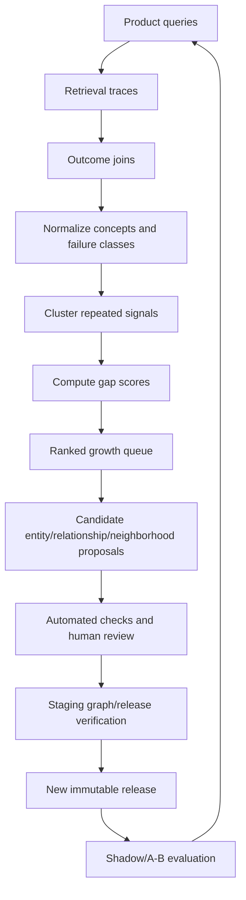

# BroBot Knowledge Graph Integration Architecture Audit

Date: 2026-07-16  
Production KG release: `kg-beta-20260716-002`  
Constraint: read-only audit. No production code, records, releases, or graph content were modified.

## Executive recommendation

BroBot should use a **conditional, post-intent, multi-stage hybrid retrieval pipeline**:

1. Perform the existing local/accepted intent resolution.
2. Decide whether the turn is graph-eligible.
3. Resolve 1–3 candidate entities/neighborhoods using exact/alias search first and semantic retrieval only when lexical resolution is weak.
4. Rerank candidates using mode, subintent, conversation topic, entity type, review/risk tier, and graph coverage.
5. Fetch a **small, relationship-filtered subgraph**, not the complete production neighborhood.
6. Compress it into a mode-specific evidence packet with stable object IDs.
7. Generate the answer using the packet.
8. Record retrieval usefulness and missing-knowledge signals asynchronously.

The KG should not run before intent routing, should not run for every conversation, and should not inject complete neighborhoods. The current production RPC returns complete neighborhoods and is appropriate for inspection, but it is too coarse for the BroBot hot path.

The target hot-path packet should normally contain:

- 1 anchor entity
- 2–6 supporting entities
- 3–10 relationships
- no more than 2 neighborhoods
- 350–900 tokens depending on mode/depth
- a hard maximum of 1,200 tokens

With a release-aware cache and one batched retrieval RPC, expected KG overhead is approximately **20–80 ms at cache hit**, **70–150 ms at cache miss**, and **under 300 ms p95 additional latency**. More importantly, the packet should reduce generation prompt ambiguity and revision frequency, which can make end-to-end responses faster even after adding retrieval.

## Audit basis and limitations

This audit is grounded in the repository as of 2026-07-16, especially:

- `src/app/api/brobot/chat/route.ts`
- `src/lib/brobot/chat/*`
- `src/lib/brobot/orthobullets/kg-lookup.ts`
- `src/lib/education/kg-production.ts`
- `src/lib/education/kg-feedback.ts`
- `src/app/api/knowledge-graph/*`
- `supabase/migrations/20260716_040000_kg_beta_production_release.sql`
- BroBot persistence, usage, branch, and evaluator migrations

The repository records end-to-end request latency, but it does not yet record reliable per-stage spans for auth, intent, context, retrieval, generation, revision, metadata, persistence, and streaming. Therefore, current stage latency values below are engineering estimates derived from the number and ordering of network/database/model calls, not production measurements.

## 1. Current BroBot architecture map

### Authenticated open-ended chat path



### Current strengths

- Local and LLM intent routing already expose mode, subintent, topic, ambiguity, and procedure category.
- `BroBotClinicalContext` already derives entities, case slots, task facets, missing critical slots, and mode-specific coverage requirements.
- Mode contracts and the quality gate already create a natural place to consume KG evidence.
- CasePrep context is now implemented as a read-only, section-ranked grounding source.
- BroBot already records end-to-end latency, model usage, quality warnings, branch behavior, and evaluator jobs.
- The production KG has release-aware read RPCs and immutable object-level identifiers.
- Privacy-minimized KG feedback tables and an authenticated feedback API already exist.
- Orthobullets flows demonstrate a non-fatal KG lookup pattern.

### Current gaps

- General BroBot chat does not call `findProductionKgTopics()` or `getProductionKgNeighborhood()`.
- The current production topic search is only exact slug or substring label matching. It does not search aliases, descriptions, entity types, embeddings, or conversation context.
- The current neighborhood RPC returns every active entity and relationship in a neighborhood. It cannot apply mode-specific predicate filters, limits, traversal depth, or scoring.
- KG provenance IDs are not part of `BroBotAnswerContext`, response metadata, evaluator snapshots, or `brobot_usage_events`.
- End-to-end latency is recorded, but stage timings are not.
- Existing authenticated KG feedback is user-submitted; automatic retrieval telemetry and gap events are not connected to chat.
- Thumbs/regeneration/correction behavior is not unified for the open-ended chat surface.
- The pipeline performs several sequential persistence and branch-ranking calls before generation. Adding multiple sequential KG calls would compound latency.

## 2. Where KG retrieval should occur

### Options evaluated

| Placement | Benefits | Costs | Verdict |
|---|---|---|---|
| Before intent routing | Could help classify unknown clinical terms | Wastes retrieval on administrative/emotional/meta turns; query is unstructured; risks anchoring intent to a bad match | Do not use as the normal path |
| After intent routing | Mode/subintent/topic can shape retrieval and bypass logic | Depends on intent quality | Primary insertion point |
| Inside mode handlers | Strong mode-specific ranking and budgets | Duplicates retrieval orchestration across modes | Use mode policies, not separate implementations |
| After context extraction | Best access to entities, case slots, task facets, selected branch | Adds a small step after routing | Combine with post-intent retrieval |
| During generation | Supports tool-calling follow-up retrieval | Unpredictable latency and harder explainability | Reserve for rare deep/research follow-ups |
| Multi-stage retrieval | Controls recall, reranking, traversal, and token use | More implementation work | Recommended |
| Hybrid lexical/vector/graph | Best paraphrase handling and graph reasoning | Requires embeddings/indexing and careful fallback | Recommended incrementally |

### Optimal placement

KG retrieval should begin **after intent routing and clinical context extraction, before answer generation**. It should run in parallel with independent context sources and branch-related reads where possible.



The orchestration belongs in one shared adapter, conceptually:

```text
BroBotKnowledgeContextProvider
  input:
    query, intent, clinicalContext, selectedBranch, historyTopic, depth
  output:
    packet, trace, status, latency, cache metadata
```

`buildBroBotAnswerContext()` should consume the provider result, while prompt and quality-gate code should consume a normalized packet rather than raw database rows.

## 3. Retrieval trigger policy

### Mandatory retrieval

Retrieve when all of the following are true:

- the turn is answerable now, or an answer with a stated assumption is allowed;
- a clinical/educational entity is detected or can be resolved with moderate confidence;
- the mode/subintent benefits from structured domain knowledge;
- the turn is not a pure user-specific patient-data interpretation that the graph cannot safely answer.

Mandatory categories:

- named orthopaedic diagnosis or injury
- anatomy or anatomy at risk
- surgical approach, interval, exposure, landmarks
- fracture/dislocation classification
- procedure steps, indications, contraindications
- implant or fixation construct
- imaging finding or named diagnostic test
- biomechanics concept
- treatment algorithm or operative threshold
- complications, pitfalls, or failure modes
- rehabilitation restrictions/progression when represented
- OITE topic, trap, distractor, or classification
- curriculum concept tied to a recognized entity

### Optional retrieval

Retrieve only if candidate confidence and expected utility exceed a threshold:

- broad “teach me” questions with a recoverable orthopaedic topic
- clinic differential/workup questions
- consult presentation support after critical data is present
- research questions about a disease, procedure, or implant where the KG can normalize concepts but not replace evidence retrieval
- follow-up turns using pronouns or shorthand, when the session has a stable KG anchor
- attending-preference questions, but only to supply canonical facts; preferences must come from a separate user/program context source
- rehabilitation or postoperative advice when graph coverage is partial and the answer clearly distinguishes general educational content

### Retrieval bypass

Bypass for:

- emotional support, stress, burnout, confidence, communication coaching
- scheduling, calendar, rotations, administrative workflow
- subscription, billing, account, quota, app usage
- personal statement, CV, email, or writing review
- generic study planning with no clinical topic
- product feedback or feature requests
- greetings and social conversation
- clarification-only turns that do not yet have a resolvable topic
- requests requiring current literature evidence when KG normalization would add no value
- unsupported non-orthopaedic topics
- patient-specific emergency decisions when the graph has no appropriate validated decision-point content; use safety/consult logic instead

### Decision score

Use a deterministic policy before any model-based retrieval decision:

```text
retrieval_utility =
  clinical_entity_confidence
  × mode_kg_value
  × subintent_kg_value
  × graph_coverage_prior
  × answerability
  - latency_cost
  - ambiguity_risk
  - patient_specificity_risk
```

Suggested action:

- `>= 0.55`: retrieve
- `0.35–0.54`: optional lightweight entity resolution; retrieve only on strong candidate
- `< 0.35`: bypass

The thresholds should be tuned from shadow-mode outcomes rather than treated as permanent constants.

## 4. Mode-specific retrieval behavior

| Mode | Primary entity/relationship priorities | Default depth | Packet budget | Notes |
|---|---|---:|---:|---|
| OR prep | procedure, approach, anatomy, implant, complication, diagnostic imaging/check, treatment principle | 1 hop; selective 2nd hop | 700–1,000 tokens | Highest KG value. Prefer operative sequence and structures at risk. |
| OITE | condition, classification, biomechanics, imaging finding, treatment principle, complication | 1 hop; selective classification/treatment 2nd hop | 550–850 tokens | Prefer discriminators, thresholds, relationships that explain distractors. |
| Clinic | condition, exam maneuver, diagnostic test, imaging finding, treatment principle, complication | 1 hop | 450–700 tokens | Rank differential/workup and escalation relationships. |
| Consult | condition/injury, imaging, anatomy, complication, treatment principle | 1 hop | 400–650 tokens | Retrieval follows safety/clarification checks; do not let graph completeness imply patient-specific certainty. |
| Research | canonical entities for query normalization; relationships for search expansion | 0–1 hop | 250–500 tokens | KG should improve PubMed/search terms, not act as the evidence base. |
| General | recognized topic with subintent-specific relationships | 0–1 hop | 300–600 tokens | Bypass aggressively when topic is not clinical. |

### Relationship ranking by mode

The exact predicate vocabulary should be read from the active graph, but the ranking policy should map predicates into semantic families:

- OR prep: `uses_approach`, `involves_anatomy`, `uses_implant`, `has_complication`, `indicated_for`, operative checks
- OITE: `has_classification`, `associated_with`, `involves_biomechanics`, `diagnosed_by`, `treated_by`, `has_complication`
- Clinic: `presents_with`, `tested_by`, `diagnosed_by`, `has_imaging_finding`, `treated_by`, `has_complication`
- Consult: `has_red_flag`, `diagnosed_by`, `requires_temporizing_care`, `treated_by`, `has_complication`
- Research: aliases, broader/narrower concepts, related procedures/conditions, controlled search terms

If a relationship family does not yet exist, telemetry should mark the missing relation type rather than silently compensating with a broad neighborhood dump.

## 5. Recommended graph context limits

### Default packet

| Component | Quick | Standard | Deep |
|---|---:|---:|---:|
| Anchor entities | 1 | 1–2 | 1–3 |
| Supporting entities | 2–4 | 3–6 | 5–8 |
| Relationships | 3–6 | 5–10 | 8–14 |
| Neighborhoods | 1 | 1–2 | 1–2 |
| KG tokens | 250–450 | 450–800 | 700–1,200 |

Hard limits:

- 3 candidate neighborhoods before reranking
- 2 neighborhoods in the final packet
- 8 entities for standard responses
- 14 relationships for deep responses
- traversal depth 2 only when the second edge satisfies an explicit mode/subintent allowlist
- stop before 1,200 tokens regardless of depth

### Packet shape

```json
{
  "releaseId": "kg-beta-20260716-002",
  "retrievalId": "uuid",
  "status": "hit",
  "anchor": {
    "entityId": "uuid",
    "label": "Distal radius fracture",
    "entityType": "condition",
    "score": 0.93
  },
  "facts": [
    {
      "subjectId": "uuid",
      "subjectLabel": "Distal radius fracture",
      "predicate": "has_classification",
      "objectId": "uuid",
      "objectLabel": "AO/OTA distal radius classification",
      "relationshipId": "uuid",
      "score": 0.84,
      "reviewTier": "automated_beta",
      "riskTier": "moderate"
    }
  ],
  "neighborhoodSlugs": ["distal-radius-fracture-neighborhood"],
  "coverage": "full",
  "limitations": ["No active decision points in this release"],
  "tokenEstimate": 612
}
```

The prompt should receive labels, descriptions, typed relationships, review/risk qualifiers, and explicit limitations. It should not receive verification hashes or source record arrays unless a debugging/evaluation path requests them.

## 6. One-stage versus multi-stage retrieval

### Architecture comparison

| Architecture | Quality | Latency | Explainability | Main problem |
|---|---:|---:|---:|---|
| A: intent → neighborhood → answer | Medium | Good | Medium | Dumps irrelevant nodes and depends on perfect neighborhood match |
| B: intent → neighborhood → entities → answer | Medium-high | Medium | High | Still starts from a coarse neighborhood |
| C: candidates → rerank → expand → answer | High | Good with batching/cache | High | Requires purpose-built retrieval RPC |
| D: hybrid vector + graph | Highest recall | Medium | High if scores remain separate | More infrastructure and tuning |

### Recommendation

Implement **C first, then add D as a fallback candidate generator**.

The final architecture is:

```text
lexical/alias candidates
  + optional vector candidates
  + session anchor candidates
→ candidate union
→ mode/subintent/entity-type reranking
→ choose anchor(s)
→ bounded graph expansion
→ evidence packet compression
→ answer
```

Do not blend all scores into an opaque “AI confidence.” Preserve component scores:

- lexical score
- alias score
- semantic score
- session continuity score
- mode/entity-type score
- graph coverage score
- review/risk adjustment
- final rank score

This makes retrieval debuggable and lets product analytics identify whether failures came from candidate generation, ranking, traversal, or graph content.

## 7. Traversal strategy

### Default

- Start at one anchor entity.
- Fetch direct edges in both directions.
- Keep only mode/subintent-approved predicate families.
- Score edges before expansion.
- Add a second hop only for a narrow set of reasoning chains.

### Useful two-hop chains

- condition → classification → treatment principle
- condition → anatomy → exam/imaging relevance
- procedure → approach → anatomy at risk
- procedure → implant → complication/failure mode
- imaging finding → condition → treatment pivot
- condition → biomechanics → classification or treatment implication

### Disallowed/default-stopped chains

- curriculum-node traversal in clinical answer generation unless the question is explicitly about curriculum
- generic “associated with” chains beyond one hop
- traversal through broad anatomy hubs unless the anatomy subintent requests it
- crossing more than two neighborhoods
- expanding from high-degree entities without a predicate allowlist
- expanding through excluded, inactive, disputed, missing-provenance, or non-production objects

### Edge score

```text
edge_score =
  predicate_mode_weight
  × subintent_weight
  × anchor_relevance
  × object_type_weight
  × review_tier_weight
  × provenance_weight
  × coverage_weight
  × novelty_weight
  - risk_penalty
  - redundancy_penalty
  - hop_penalty
```

Suggested multipliers:

- direct anchor edge: `1.0`
- second hop: `0.55`
- reviewed active: `1.0`
- automated beta: `0.85`
- complete provenance: `1.0`
- partial provenance: `0.75`
- moderate risk: `0.85`
- high risk without stronger review: exclude from answer grounding or include only as a limitation

### Stopping rules

Stop when any condition is met:

- token budget reached
- entity/relationship limit reached
- marginal edge score below threshold
- requested task facets are covered
- two neighborhoods have been selected
- hop depth is 2
- remaining candidates are redundant
- latency deadline is reached

Coverage-based stopping is preferable to count-only stopping. For OR prep, for example, stop once the packet covers approach/exposure, named anatomy, operative checks, and pitfalls—or once the budget is exhausted.

## 8. Fallback and failure behavior

KG must remain an optional dependency.

| Failure | Behavior | Retry |
|---|---|---|
| No candidate entity | Continue with current CasePrep/clinical context path; record `no_match` | No synchronous retry |
| Weak match | Do not inject uncertain graph facts; optionally retain candidate IDs for analytics | No retry |
| Neighborhood missing | Try direct entity-edge RPC if available; otherwise continue without KG | No retry |
| Empty filtered subgraph | Continue without KG and record `empty_after_filter` | No retry |
| RPC timeout | Abort retrieval at deadline and continue generation | One hedged/cache fallback, not a second DB query |
| RPC 5xx/network failure | Use stale release-aware cache if available; otherwise bypass | Background health retry only |
| Excluded/high-risk content | Omit object and record exclusion count/reason class | Never retry into excluded data |
| Release changes during request | Use one release ID for the full retrieval trace | No mixed-release retry |
| Prompt packet exceeds budget | Deterministically trim lowest-score facts | No model-based compression in Phase 1 |

User experience:

- Do not expose a generic “knowledge graph unavailable” error.
- Do not delay generation beyond the retrieval deadline.
- Do not claim graph grounding when the status is miss/fallback.
- Internally label each answer `kg_hit`, `kg_partial`, `kg_miss`, `kg_bypass`, or `kg_error`.

## 9. Performance and latency budget

### Current estimated pipeline

The current authenticated route performs multiple sequential database writes/reads before generation and may perform up to four model calls: intent, answer, revision, metadata.

| Stage | Current estimated typical | Current estimated p95 | Evidence |
|---|---:|---:|---|
| Parse/auth/quota | 40–120 ms | 250 ms | Auth and entitlement network/database work |
| Conversation/message persistence | 50–180 ms | 350 ms | Conversation lookup/create, analytics, message insert |
| History | 20–80 ms | 180 ms | Supabase read |
| Intent | 0–40 ms accepted/local; 250–900 ms LLM | 1,500 ms | Conditional model call |
| Branch/fingerprint reads | 60–220 ms | 450 ms | Multiple sequential reads |
| Context/CasePrep | 20–200 ms | 500 ms | Registry lookup may require index + procedure fetch |
| Answer generation | 900–4,000 ms | 8,000+ ms | Model and output length dependent |
| Revision | 0 or 700–3,000 ms | 6,000 ms | Conditional second answer call |
| Metadata | 0 or 250–1,200 ms | 2,500 ms | Conditional model call |
| Final persistence | 80–300 ms | 700 ms | Message, tags, events, conversation update |

These estimates must be replaced with stage spans before rollout.

### KG latency budget

| KG stage | Target p50 | Target p95 | Hard deadline |
|---|---:|---:|---:|
| Decision policy | <1 ms | <2 ms | 5 ms |
| Candidate cache lookup | <2 ms | <5 ms | 10 ms |
| Candidate DB/vector retrieval on miss | 20–60 ms | 120 ms | 150 ms |
| Reranking | <3 ms | <8 ms | 15 ms |
| Bounded subgraph fetch | 15–50 ms | 100 ms | 130 ms |
| Packet assembly | <3 ms | <10 ms | 15 ms |
| Total warm | 10–50 ms | 100 ms | 150 ms |
| Total cold | 50–120 ms | 250 ms | 300 ms |

### Integration rules for meeting the budget

- Use one server-side RPC that performs candidate resolution, ranking inputs, and bounded edge retrieval where possible.
- Run KG and CasePrep retrieval concurrently after intent/context resolution.
- Run fingerprint and branch reads concurrently where data dependencies allow.
- Do not fetch a full neighborhood and then filter it in Next.js.
- Add `AbortSignal` deadlines around retrieval.
- Keep telemetry writes fire-and-forget after the answer is safe to return.
- Preserve streaming: retrieval must complete before answer model invocation, but should not delay post-generation persistence.
- Cache by release ID so invalidation is a key change, not a purge scan.

### Expected end-to-end impact

- Cache hit: `+20–80 ms`
- Cold retrieval: `+70–150 ms`
- p95 additional: `<300 ms`
- Potential savings:
  - smaller, more targeted prompts than full contextual descriptions
  - fewer quality-gate revisions
  - fewer clarification/regeneration loops
  - better answer-model routing confidence

Net response time should be evaluated as **time to useful answer**, not retrieval overhead alone.

## 10. Caching strategy

### Cache layers

| Cache | Key | Value | TTL | Purpose |
|---|---|---|---:|---|
| Release pointer | `kg:active-release` | release ID/status | 30–60 s | Avoid repeated release discovery |
| Entity resolution | release + normalized query + mode | candidate entities/neighborhoods/scores | 15–60 min | Highest repeat benefit |
| Subgraph packet | release + anchor IDs + policy version + mode/subintent/depth | compact packet | 15–60 min | Avoid repeated traversal |
| Neighborhood manifest | release + neighborhood slug | object IDs and metadata | 1–6 h | Fast internal assembly/admin use |
| Session anchor | conversation + release | recent successful anchor IDs | session lifetime / 30 min idle | Resolve pronouns/follow-ups |
| Popular topics | release + policy version | precomputed top packets | 6–24 h | Warm common fractures/procedures |
| Semantic candidate cache | release + query embedding hash | vector candidates | 1–6 h | Avoid repeated vector searches |

### Release-aware invalidation

Every key must include:

- `release_id`
- retrieval policy version
- packet schema version

Activating a new release naturally produces new keys. Old keys can expire without a synchronous purge. If a release is rolled back, the active-release pointer changes and old known-good keys become usable again.

### Memory estimate

At the current graph size, the active entity/alias resolution index is small enough for process memory:

- 1,023 entities with labels, aliases, types, and neighborhood pointers: likely under 5–15 MB serialized, depending on alias/provenance payload
- 83 compact neighborhood manifests: likely under 10–30 MB if descriptions and full relationships are excluded
- 1,000–10,000 cached packets: approximately 5–50 MB depending on packet size

A process-local LRU is sufficient for Phase 1, but serverless instance churn limits hit rates. A shared cache should be introduced if production measurements show low warm-cache reuse or high DB retrieval volume.

### Stale behavior

- Permit stale-while-revalidate only for the same active release.
- Permit last-known-good stale packets during short KG RPC outages if the release is still active.
- Never serve packets from a different active release without labeling the trace and explicitly allowing it.

## 11. Telemetry and feedback-event schema

### Recommendation

Keep `kg_graph_feedback_events` for normalized product feedback, but add a dedicated, high-volume retrieval event table. Do not overload human feedback rows with every request.

Conceptual schema:

```sql
create table brobot_kg_retrieval_events (
  id uuid primary key,
  request_id uuid not null,
  conversation_id uuid null,
  user_id uuid null,
  user_query_hash text not null,
  sanitized_query text null,
  mode text not null,
  subintent text null,
  release_id text null,
  retrieval_status text not null,
  trigger_reason text not null,
  bypass_reason text null,
  fallback_used boolean not null default false,
  candidate_count integer not null default 0,
  selected_neighborhood_slugs text[] not null default '{}',
  selected_entity_ids uuid[] not null default '{}',
  selected_relationship_ids uuid[] not null default '{}',
  candidate_scores jsonb not null default '[]',
  cache_status text null,
  retrieval_latency_ms integer null,
  packet_token_estimate integer null,
  packet_schema_version text not null,
  retrieval_policy_version text not null,
  quality_gate_warnings text[] not null default '{}',
  regeneration_within_10m boolean null,
  feedback_value smallint null,
  correction_detected boolean null,
  evaluator_score numeric null,
  created_at timestamptz not null default now()
);
```

### Required internal trace

Every KG-assisted answer must retain:

- request/retrieval ID
- release ID
- neighborhood slugs
- entity IDs
- relationship IDs
- component and final retrieval scores
- cache status
- retrieval stage timings
- fallback/bypass/error status
- packet token estimate
- graph limitations, including absent claims/decision points

Store the full trace server-side. Expose only a minimal response marker to the client unless a debug/admin mode requests more.

### Product outcome joins

Join retrieval events to:

- `brobot_messages`
- `brobot_usage_events`
- branch click/outcome events
- evaluator results
- future thumbs up/down
- regeneration events
- correction signals
- follow-up continuation

This supports causal comparisons such as:

- KG hit versus bypass quality score
- cache hit versus cold latency
- neighborhood usage versus regeneration rate
- retrieval confidence versus evaluator hallucination risk
- relationship family coverage versus follow-up depth

### Privacy and retention

- Default to a stable query hash plus derived topic/entity IDs.
- Store sanitized query text only when needed for gap review.
- Reuse and strengthen the current sanitization rules for email, phone, identifiers, and forbidden patient-context keys.
- Add detection/redaction for dates, initials, ages paired with specific dates, room numbers, accession numbers, and institution-specific identifiers.
- Do not store complete conversation history in retrieval events.
- Suggested retention:
  - raw sanitized query text: 30 days
  - pseudonymous retrieval traces: 13 months
  - aggregated metrics: indefinite
  - critical safety/correction events: according to clinical quality policy, access-controlled
- Restrict raw query review to authorized quality/admin roles.

## 12. Gap-detection architecture

### Gap classes

- missing neighborhood
- missing entity
- missing alias
- missing relationship
- missing relationship type/predicate
- weak candidate ranking
- irrelevant traversal
- insufficient description/detail
- missing provenance
- missing claim
- missing decision point
- review-tier limitation

### Signal sources

- no match on a graph-eligible query
- low selected-candidate confidence
- candidate rejected by session/topic consistency
- empty packet after predicate filtering
- answer quality warnings mapped to missing graph facets
- evaluator `retrieval_failure`, `unsupported_claim`, `missing_key_anatomy`, etc.
- user correction or thumbs down
- regeneration within a short window
- repeated follow-up asking for a facet the packet lacked
- frequent fallback to model memory or CasePrep for the same concept

### Gap score

The proposed simple product is useful but needs confidence and redundancy controls:

```text
gap_score =
  log1p(query_frequency_30d)
  × retrieval_failure_rate
  × downstream_product_impact
  × graph_centrality_or_bridge_value
  × mode_priority
  × confidence_of_gap_detection
  × persistence_factor
  ÷ estimated_resolution_cost
```

Suggested normalized components:

- `query_frequency_30d`: unique users and total requests, capped to prevent one user dominating
- `retrieval_failure_rate`: miss/weak/empty rate for the normalized concept
- `downstream_product_impact`: evaluator loss, thumbs-down lift, regeneration lift, high-stakes mode weight
- `centrality_or_bridge_value`: how many neighborhoods/products benefit
- `mode_priority`: OR prep/consult safety gaps > general enrichment gaps
- `confidence`: exact repeated phrase and evaluator corroboration > one ambiguous query
- `persistence`: observed across multiple weeks/releases
- `resolution_cost`: alias < relationship < entity < neighborhood/source acquisition

### Growth queue

Each queue item should include:

- normalized concept label
- gap type
- example sanitized queries
- affected modes/subintents
- release ID(s)
- candidate existing entities/neighborhoods
- frequency and unique-user counts
- failure and outcome deltas
- proposed change type
- estimated impact/cost
- risk tier
- evidence links
- status and reviewer

The queue creates proposals; it must not mutate canonical content directly.

## 13. Growth loop design



### Was the KG useful?

Define useful as a combination, not simply a hit:

```text
kg_useful =
  retrieval_hit
  AND packet_used_by_prompt
  AND no retrieval-specific evaluator failure
  AND (
    positive feedback
    OR no regeneration
    OR quality score lift
    OR useful follow-up continuation
  )
```

Attribution should be experimental:

- shadow mode compares retrieved packet quality without injecting it
- holdout traffic generates without KG
- packet ablations remove one relationship family
- release-level comparisons track new graph content

### Candidate generation

- Missing aliases can be automatically proposed at low risk.
- Missing entity/relationship/neighborhood proposals require evidence packets.
- High-risk clinical changes require curator/attending review.
- Automated beta content should not auto-promote based only on engagement.

## 14. Analytics dashboard specification

### Coverage

- graph-eligible query percentage
- KG trigger, bypass, hit, partial, miss, and error rates
- KG utilization by mode/subintent/depth/training level
- unique neighborhoods/entities/relationships used
- percentage of answers using one versus two neighborhoods
- graph coverage of top 100/500 normalized user topics

### Quality

- evaluator score by KG status
- specificity, completeness, hallucination-risk subscores
- quality-gate warning rate
- revision-trigger rate
- thumbs up/down
- regeneration rate
- correction rate
- follow-up continuation
- unsupported answer/retrieval failure rate

### Performance

- retrieval p50/p95/p99
- additional time to first token
- end-to-end latency by KG status
- candidate, graph fetch, and packet assembly timing
- cache hit rate by layer
- packet token distribution
- timeout/stale/error rates

### Growth

- top missing neighborhoods/entities/relationships/aliases
- gap score and score components
- affected unique users
- high-demand partial neighborhoods
- low-value/unused neighborhoods
- proposals created, reviewed, accepted, rejected
- time from detected gap to active release

### Explainability/debugging

- request → release → candidate scores → selected anchors → traversed edges
- reason each object was included/excluded
- packet presented to the model
- quality/evaluator result
- fallback path

### Recommended dashboard cuts

- mode
- subintent
- response depth
- training level
- release ID
- review tier
- risk tier
- cache status
- retrieval policy version
- app/client surface
- new versus returning user

## 15. Rollout plan

### Phase 0: instrumentation and contracts

- Add stage timing spans to the current pipeline.
- Define retrieval decision, packet, trace, and failure enums.
- Add retrieval event storage.
- Establish holdout and shadow assignment.
- Benchmark current answer quality/latency on a fixed prompt set and real traffic aggregates.

Exit gate:

- at least 95% of requests have valid stage spans
- no raw PHI in telemetry sample review
- baseline metrics agreed

### Phase 1: shadow retrieval

- Run deterministic trigger/bypass policy.
- Use existing topic RPC plus a new bounded retrieval RPC.
- Build packets but do not inject them.
- Compare selected objects against intent, evaluator missing topics, and human audit samples.
- Warm release/entity caches.

Exit gate:

- retrieval overhead p95 <300 ms
- top-1 entity precision target ≥90% on mandatory cases
- bypass precision target ≥95% on non-clinical cases
- no production availability regression

### Phase 2: limited answer injection

- Enable KG packet injection for low-risk, high-confidence OITE and OR-prep topics.
- Start with 5–10% of eligible traffic and a persistent holdout.
- Exclude high-risk graph objects and patient-specific decision paths.
- Monitor revision, regeneration, evaluator, and latency deltas.

Exit gate:

- statistically credible specificity/completeness lift
- no hallucination/safety regression
- p95 additional latency <300 ms
- prompt token increase within budget

### Phase 3: mode expansion

- Add clinic, general clinical, and selected consult use cases.
- Add session anchors and two-hop allowlisted traversal.
- Integrate KG normalization into research search expansion.
- Add vector candidate fallback if lexical miss rate remains material.

### Phase 4: growth automation

- Cluster retrieval and feedback events.
- Generate scored growth queue and proposal packets.
- Connect approved proposals to existing KG governance/release workflow.
- Add release-level quality regression testing.

## 16. Migration plan

This is an additive migration, not a replacement of BroBot’s existing context system.

### Preserve

- intent routing
- clinical context extraction
- mode contracts
- CasePrep provider
- branch learning system
- quality gate and evaluator
- graceful non-KG operation

### Add

- a normalized source-context interface
- KG decision policy
- bounded retrieval RPC
- packet and trace types
- release-aware cache
- retrieval telemetry
- outcome joins and growth queue

### Deprecate over time

- direct full-neighborhood use in latency-sensitive product paths
- exact/substring-only topic resolution as the sole resolver
- end-to-end-only latency measurement
- generic fallback branches when missing graph facets can produce targeted branches

### Data migration

No canonical graph data migration is required for Phase 1. New additive tables/indexes/functions should include:

- retrieval event table
- optional aggregated daily metrics table/materialized view
- alias/search index or vector column when introduced
- bounded retrieval RPC
- growth queue table or view

Existing `kg_graph_feedback_events` and `kg_graph_feedback_signals` should remain the normalized feedback/proposal bridge.

## 17. Risk assessment

| Risk | Impact | Mitigation |
|---|---|---|
| Wrong entity anchoring | Confidently specific but wrong answer | High precision threshold, session consistency, preserve scores, no injection on weak match |
| Context dumping | Larger prompts, slower/worse answers | Hard packet limits, facet coverage stopping, predicate allowlists |
| Automated-beta overtrust | Unsupported clinical certainty | Review/risk weights, limitations in packet, high-risk exclusion |
| Latency regression | Slower first token | One bounded RPC, cache, concurrency, deadlines, bypass |
| Graph outage affects chat | Availability regression | Optional provider, stale cache, fail open to current path |
| Telemetry contains PHI | Privacy/compliance risk | Hash by default, sanitizer, short raw retention, access controls, audits |
| Feedback loop amplifies popularity | Common topics crowd out important rare gaps | Product-impact and risk weights, unique-user caps, expert queue |
| Engagement mistaken for correctness | Unsafe graph growth | Evaluator/expert evidence and release validation required |
| Mixed releases in one answer | Irreproducible debugging | Pin one release per retrieval trace |
| Duplicate knowledge sources conflict | Inconsistent grounding | Source precedence policy and conflict telemetry |
| Claims/decision points are empty | KG cannot yet ground nuanced decisions | Explicit limitation; prioritize these gaps without fabricating them |
| Serverless cache churn | Low hit rate | Measure, then add shared cache/prewarming |
| Vector retrieval opacity | Harder debugging | Keep lexical/vector scores separate and retain candidate explanations |

### Source precedence

Recommended default:

1. safety policy and explicit product constraints
2. attending/curator-reviewed graph facts
3. certified CasePrep sections
4. automated-beta graph facts with complete provenance
5. draft CasePrep context
6. model latent knowledge

Conflicts should not be silently blended. Record and surface them to evaluation/growth telemetry.

## 18. Implementation roadmap

### Top implementation priorities

1. Add per-stage telemetry and retrieval outcome schema.
2. Build one bounded, mode-aware production retrieval RPC.
3. Add the shared source-context/packet interface to `BroBotAnswerContext`.
4. Implement trigger/bypass policy with shadow mode.
5. Add release-aware entity and packet caches.
6. Inject packets for high-confidence OR-prep/OITE cohorts.
7. Join retrieval traces to evaluator, regeneration, and feedback outcomes.
8. Build gap clustering/scoring and a reviewable growth queue.
9. Add semantic candidate generation only after lexical miss data justifies it.
10. Expand claims and decision points based on observed product gaps.

### Phase 1 implementation

Expected scope: 2–4 engineering weeks, depending on database review and evaluation harness maturity.

- `BroBotKgDecision`
- `BroBotKgPacket`
- `BroBotKgTrace`
- `BroBotKgProvider`
- stage timer helper
- retrieval event migration
- bounded lexical/alias retrieval RPC
- process-local release/entity/subgraph LRU
- shadow-mode execution
- admin trace viewer or query
- fixed evaluation set by mode

No prompt injection in the first shadow milestone.

### Phase 2 implementation

Expected scope: 3–6 engineering weeks.

- packet injection for high-confidence OR prep and OITE
- mode/subintent predicate policies
- quality-gate awareness of packet facets
- session anchor cache
- user thumbs/regeneration event unification
- A/B holdout dashboards
- stale cache and circuit breaker
- targeted follow-up chips from missing packet facets

### Phase 3 implementation

Expected scope: 4–8 engineering weeks, staged.

- clinic/consult/general expansion
- research query expansion
- vector candidate generation with `pgvector` if justified
- two-hop traversal allowlists
- automatic feedback normalization and clustering
- gap score materialization
- proposal packet generation
- release regression suite
- graph-growth dashboard and SLA

## Final recommendations

### Recommended retrieval architecture

Conditional post-intent retrieval with deterministic bypass, multi-source candidate generation, explicit reranking, bounded graph expansion, and compact packet injection. Begin with lexical/alias/session candidates and add vector retrieval only as a measured fallback.

### Recommended traversal strategy

One anchor, one hop by default, selective two-hop chains, mode/subintent predicate allowlists, no more than two neighborhoods, and facet-coverage/token/latency stopping rules.

### Recommended caching strategy

Release-aware multi-layer caching keyed by release, policy, and packet schema. Start with process-local LRU and popular-topic prewarming; add shared caching only if production hit-rate data requires it.

### Recommended telemetry schema

A dedicated high-volume retrieval trace table joined to BroBot messages, usage events, evaluator results, regeneration, corrections, and human feedback. Preserve exact graph IDs and component scores while hashing/redacting user text by default.

### Recommended growth loop

Product query → retrieval trace → outcome join → normalized gap cluster → scored growth queue → governed proposal → staged verification → immutable release → holdout evaluation.

### Estimated latency impact

- warm: +20–80 ms
- cold: +70–150 ms
- p95 additional: under 300 ms
- expected end-to-end benefit if revision/regeneration rates decrease

### Estimated answer quality impact

Targets for eligible high-confidence turns:

- 10–20% relative reduction in `too_generic`/specificity failures
- 10–25% reduction in missing anatomy/classification/decision-facet warnings
- 5–15% reduction in regeneration
- measurable hallucination-risk reduction where the graph has relevant supported relationships

These are rollout hypotheses, not guarantees. They require holdout testing.

### Risks

The dominant risks are wrong anchoring, context bloat, automated-beta overtrust, PHI leakage into telemetry, and latency from sequential calls. All are manageable if the KG remains optional, bounded, release-pinned, and fully traced.

### Product conclusion

The active graph is now large enough to justify product integration, but not complete enough to justify universal traversal. With 0 active claims and 0 active decision points, it is strongest today as a **structured entity/relationship grounding and query-normalization layer**, especially for OR prep and OITE. The best strategy is to use it narrowly where it adds information, measure every retrieval outcome, and let real BroBot usage determine which entities, relationships, claims, decision points, and neighborhoods should be built next.
