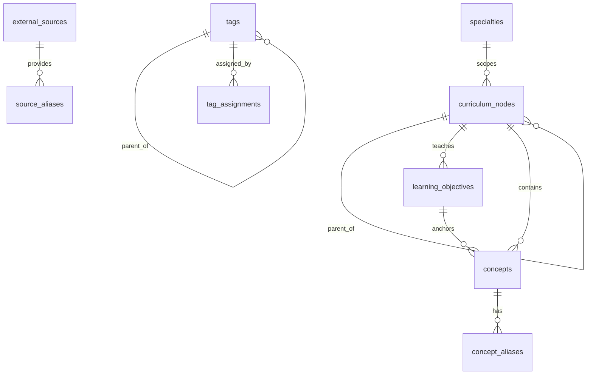

# Educational Ontology Foundation

## Phase 0 Alignment Note

This document describes the original Phase 1 foundation.

After the 2026-06-28 next-generation knowledge graph audit, SnapOrtho should no
longer treat `curriculum_nodes` as the primary canonical domain entity.

Current interpretation going forward:

- `curriculum_nodes` are curriculum overlay objects
- `learning_objectives` remain curriculum-facing teaching anchors
- `concepts` remain part of the domain layer for now, but are no longer assumed
  to be the only long-term canonical entity type
- source-native objects, canonical educational objects, typed canonical entities,
  and provenance/governance records should evolve as distinct layers

The original Phase 1 schema remains valid and supported, but its role is now:

- preserve the working ingestion and mapping pipeline
- provide curriculum overlay structure
- bridge toward the next-generation typed canonical entity model

## Purpose

This Phase 1 schema creates SnapOrtho's canonical educational ontology.

It is not:

- an Orthobullets clone
- an Anki deck schema
- a question bank
- a study-plan engine

It is the long-lived foundation that later products will map into:

- Anki
- BroBot
- CasePrep
- OITE prep
- student workspace
- resident workspace
- adaptive remediation
- analytics
- future AI tutoring

The original core rule was:

`Specialty -> Curriculum Node -> Learning Objective -> Concept`

That rule is now best understood as a Phase 1 simplification, not the permanent
semantic backbone of the SnapOrtho knowledge graph.

In Phase 1, external integrations primarily attach to `concepts` and
curriculum-facing structures. In the next-generation architecture, they should
progressively attach to typed canonical entities, educational objects, and
curriculum overlays as appropriate.

## Why These Tables Exist

- `specialties`: stable top-level orthopaedic domains.
- `curriculum_nodes`: the canonical hierarchy beneath specialties. This is intentionally sparse at first.
- `learning_objectives`: broad learner outcomes that explain what a node is trying to teach.
- `concepts`: atomic, teachable ideas that can later map to cards, questions, references, and AI tutoring.
- `concept_aliases`: prevents duplicate concepts when the same idea appears under different names.
- `external_sources`: registry of source systems such as Orthobullets, ROCK, AAOS, or BroBot.
- `source_aliases`: preserves source-specific names and IDs without letting outside systems control the ontology.
- `tags`: orthogonal metadata for filtering and workflow.
- `tag_assignments`: polymorphic tag links that do not distort the canonical hierarchy.

## Design Principles

- Keep the canonical tree minimal and logical.
- Make concepts small enough to split later.
- Preserve source-specific labels as metadata, not truth.
- Use tags for orthogonal filters, not hierarchy.
- Optimize for evolution: split, merge, move, refine, and extend without redesigning the schema.

## ERD

## Phase 1 Seed Shape

The seed data is intentionally small:

- 11 specialties
- 10 external sources
- a small tag taxonomy
- one proof-of-concept path:
  `Trauma -> Hip -> Intertrochanteric Fracture -> Objectives -> Concepts`

This validates the architecture without pretending the curriculum is complete.

## Future Phases

### Phase 2: Anki Import

- import Anki notes/cards into source-specific tables
- preserve Anki GUIDs
- map notes/cards to `concepts`

### Phase 3: Orthobullets Metadata Import

- import question IDs, topic labels, and public metadata only
- store source-native identifiers in source-specific tables plus `source_aliases`
- never store protected stems, explanations, or answer choices

### Phase 4: Mapping Layer

- add explicit concept-to-card and concept-to-question mapping tables
- keep AI suggestions separate from reviewed truth

### Phase 5: Reviewer Workflow

- add review queues, statuses, and provenance
- support concept splits, merges, and canonical replacements

### Phase 6: Adaptive Learning

- add user attempts and performance models
- drive remediation from missed questions to weak concepts to linked resources

### Phase 7: Multi-Product Delivery

- BroBot, CasePrep, study plans, and analytics all read from the same concept graph
- one concept correction can propagate everywhere downstream

## Constraints

- Do not store copyrighted question stems or explanations from external sources.
- Do not let external topic names define the ontology.
- Do not replace hierarchy with tags.
- Do not overbuild Phase 1 with importers, AI mapping, or learner analytics.
