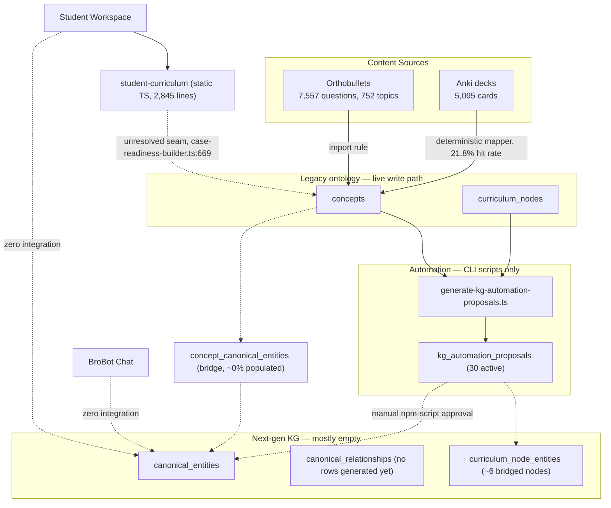
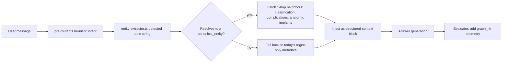

# SnapOrtho Knowledge Graph & Automation System — Staff Architecture Review

**Date:** 2026-06-28
**Scope:** Full-system audit of the ontology, automation pipeline, and integration surface, evaluated against the long-term vision of the KG as the canonical model powering every SnapOrtho product surface.
**Posture:** No prior decision is treated as sacred, including conclusions in the same-day docs already in `docs/`. Findings below are grounded directly in the schema, scripts, and product code as of this commit, not in the prose of prior audits.

## Verdict

The team has built a lot of *infrastructure for governing a graph* and almost no *graph*. Today's live state: zero meaningful population of `canonical_relationships` (no relationship proposals have ever been generated by automation, and the proof-seed entities meant to seed the first handful of edges had not yet been applied to the database as of the last coverage run), a concept→canonical-entity bridge table that exists but is essentially empty, and true "next-generation" coverage of existing educational content somewhere under 2% once you follow the bridge chain through to real data (78 of 1,000 sampled cards with legacy mappings show *any* inferred canonical coverage — and that 1,000 is drawn from the ~22% of cards that have a legacy mapping at all). Meanwhile, the system has accumulated 11 new tables, a 5-layer ontology classification scheme, a merge/split/rename/deprecate/replace/restore governance-lineage model, and a polymorphic provenance-record system — none of which has enough real content underneath it yet to need governing.

The two products this is supposed to power have **zero lines of code** that reference the KG. BroBot's designated retrieval hook (`getCasePrepCertifiedContext`) is a stub that always returns `null`. Student Workspace's case-readiness feature runs against a hand-written 2,845-line static TypeScript file, not the database. There are, as of today, **three independent notions of "curriculum"** in this codebase (the DB-backed `concepts`/`curriculum_nodes`, the new `canonical_entities`/`canonical_relationships`, and the static `student-curriculum` module), plus a fourth adjacent one (CasePrep's own types). This was already self-diagnosed in this morning's docs and is the single most expensive piece of debt in the system — every week it persists, more product code gets written against one of the three, raising the eventual reconciliation cost.

None of this means start over. The schema decisions are mostly reasonable; the deterministic-matching automation is a sound, cheap v1. The problem is sequencing and proportion: the team has been building the meta-layer (governance, lineage, provenance, layer taxonomy) faster than the content layer underneath it, and faster than the integration layer on top of it. Recommendation in one sentence: **stop adding ontology sophistication, start populating edges and wiring BroBot/Student Workspace to read the entities that already exist** — the graph doesn't need more governance machinery, it needs to become a graph.

---

## Part 1 — Current Architecture

### The four parallel knowledge systems

| System | Storage | Populated? | Who writes to it |
|---|---|---|---|
| **Legacy ontology** (`concepts`, `curriculum_nodes`, `learning_objectives`) | Postgres | Yes — real content, live write path | Anki importer, Orthobullets importer, manual review |
| **Next-gen KG** (`canonical_entities`, `canonical_relationships`, `curriculum_node_entities`) | Postgres | Barely — 0 relationship rows generated, ~6 curriculum-node bridges, proof-seed entities not yet applied | `kg_automation_proposals` pipeline (manual approval) |
| **Concept↔entity bridge** (`concept_canonical_entities`) | Postgres | ~0% — table exists, essentially empty | Same automation pipeline |
| **Static student curriculum** (`src/lib/student-curriculum/curriculum-data.ts`) | Hardcoded TS, 2,845 lines | Yes, but fully disconnected from the DB | Hand-edited by developers |

A fifth, adjacent system — `src/lib/caseprep-review/types.ts` — defines its own content model for case review, also disconnected from the above.

### Data flow today

### Ontology / canonical entities

`canonical_entities` ([supabase/migrations/20260628_120000_next_generation_kg_foundation.sql](supabase/migrations/20260628_120000_next_generation_kg_foundation.sql)) is a single typed table: `entity_type` constrained to 11 values (`condition, procedure, anatomy_structure, classification_system, complication, diagnostic_test, imaging_finding, implant, treatment_principle, biomechanics_concept, exam_maneuver`), with `status` (proposed→draft→reviewed→canonical→deprecated/replaced/merged/split) and `review_status` (unreviewed→in_review→approved/rejected) tracked separately. `source_concept_id` optionally points back at a legacy `concepts` row.

### Relationships

`canonical_relationships` is one generic polymorphic edge table: `subject_entity_type` + `subject_entity_id` → `predicate` → `object_entity_type` + `object_entity_id`, where the type/id pairs are **not foreign-key enforced** — the type column tells the application which table to look the ID up in; the database cannot check it. 22 predicates are defined (`treats, treated_by, indicated_for, contraindicated_for, involves_anatomy, uses_implant, uses_approach, has_classification, has_complication, requires_imaging, tested_by, examines, prerequisite_for, commonly_confused_with, differential_for, supported_by_card, supported_by_question, supported_by_article, exemplified_by_case, covered_by_module, covered_by_curriculum_node, taught_by_learning_objective, expected_at_training_level`). Both endpoint type-enums include `canonical_entity, concept, canonical_card, canonical_question_item, article, case_module, curriculum_node, learning_objective, training_level` — three of those (`canonical_question_item`, `article`, `case_module`) have no backing table anywhere in the schema; they're forward-declared.

### Bridges and curriculum mapping

Two bridge mechanisms exist: `curriculum_node_entities` (curriculum node → canonical entity OR concept, XOR-enforced) and `concept_canonical_entities` (concept → canonical entity, typed `equivalent_to/narrower_than/broader_than/related_to/replaced_by`). The latter's own migration comment calls it "additive and read-path only" — i.e., by design, nothing currently re-points existing card/question mappings at the new entity layer; they keep writing to `concepts` as before, and the bridge is a side-channel.

### Automation proposals, lifecycle, confidence scoring, entity matching

`generate-kg-automation-proposals.ts` (56KB, the core engine, logic inline rather than factored into `src/lib`) scans curriculum nodes, concepts, aliases, and Anki tag/deck labels, and proposes one of 10 proposal types. Matching is **pure deterministic string/alias lookup** — no embeddings, no LLM calls anywhere in generation. Confidence is additive fixed-weight arithmetic (exact label match contributes 0.55, alias match 0.24–0.32, slug match 0.2, a support-count step function up to 0.15, a generic-label penalty of −0.18), bucketed into `high/medium/low` tiers at fixed thresholds (≥0.85/≥0.65). Despite the `numeric(4,3)` schema type and "confidence" naming, this is not a calibrated probability — it's a transparent, debuggable heuristic score, which is fine as a v1, but the naming oversells the rigor to anyone who didn't read the code.

Lifecycle: `generated`/`needs_review` → `approved` → `applied`, with `rejected`/`superseded` as terminal states that no current script ever writes (there's no reject path in the automation scripts — presumably manual DB edits). Approval is fully CLI-scriptable (`approve-kg-automation-batch.ts`, `approve-kg-automation-packet.ts`) with no UI, no auth check beyond the service-role key, and `reviewed_by` left `null` on every script-driven approval — there's no human identity attached to "who approved this," which will matter the moment more than one person touches it. Idempotency works via a plain-string fingerprint (not a hash) with a partial-unique DB index; re-running generation preserves any proposal already in a terminal/approved state rather than overwriting human decisions — this part is well-designed.

### Coverage calculation and review process

`report-kg-canonical-coverage.ts` samples up to 1,000 cards/questions with legacy mappings and checks, via the bridge tables, whether each has inferred canonical-entity coverage. Last run: 78/1,000 cards, 61/1,000 questions, 6 curriculum nodes, 0 concepts bridged. The review process for `kg_automation_proposals` is: read a generated markdown packet file, run an `npm` script to approve it. The review process for the **older** Anki-mapping system (`anki_kg_mapping_candidates` → `card_knowledge_links`) is a real admin dashboard (`/admin/anki-kg-review`) with filters, bulk actions, and an append-only audit table (`anki_kg_review_actions`). The newer, strategically more important system has a worse review UX than the older one it's meant to eventually succeed.

---

## Part 2 — Ontology Audit

**Conditions, procedures, anatomy, implants, complications, classification systems, imaging findings, exam maneuvers as entities** — yes, and this is right. These are real-world clinical things with stable identities; they belong in `canonical_entities`, and they're already there.

**Surgical approaches as entities** — not yet, and this is a real, immediate gap, not a future one. The predicate `uses_approach` already exists in the schema, anticipating a `surgical_approach` entity type that the `entity_type` CHECK constraint doesn't actually include. The edge vocabulary is ahead of the entity vocabulary. Fix this before generating more `uses_approach`-shaped proposals, or they'll have nowhere valid to point.

**Biomechanics concepts** — yes, already an entity type (`biomechanics_concept`). Reasonable.

**Medications** — correctly deferred (V1.5+ per the existing blueprint). Low current content volume; no rush.

**Should nerves, vessels, muscles, ligaments each become their own canonical entity type?** No — don't fragment `entity_type` by anatomical category, that's the wrong axis and invites an unbounded enum. The actual gap isn't the type, it's that everything anatomical collapses into one undifferentiated `anatomy_structure` bucket with no way to ask "what does this nerve innervate" or "where does this muscle insert," because the predicate vocabulary has no `has_motor_function`, `has_sensory_distribution`, `has_origin`, `has_insertion`, or `has_action` — only the generic `involves_anatomy`. The fix is an `anatomy_subtype` field (nerve/muscle/artery/vein/ligament/tendon/bone) plus four or five new anatomy-specific predicates, not new entity types.

**Should there be separate educational-concept entities? Should concept and entity be merged?** Keep them separate, but the boundary needs to be a rule enforced going forward, not inertia. The rule should be: if a row names something with a real-world clinical/anatomic/procedural referent, it is a `canonical_entity` — never a `concept`. `concepts` should be redefined by exclusion: it's for pedagogical-only groupings with no single real-world referent (e.g., "OITE test-taking strategy," "high-yield boards topics," cross-cutting safety/legal topics). Today nothing enforces this — `canonical_relationships` itself permits `concept` as a legal endpoint type for clinical predicates like `treats`, which means the schema actively permits the exact ambiguity the team's own prior docs warn about in prose. Don't just write the rule down again; tighten the predicate/entity-type-pair validation so the database can't represent the ambiguous case (see Part 3).

**Multiple ontology layers?** Yes, and the 5-layer classification already drafted this morning (source-native / canonical educational object / domain ontology / curriculum overlay / mapping-review-workflow) is sound thinking. But it exists only in a markdown file — nothing in the schema encodes it. Add `COMMENT ON TABLE` annotations (the migrations already use table comments elsewhere) tagging each table with its layer. Cheap, makes the model discoverable to the next engineer without requiring them to find the right doc.

**Missing entity types**: `surgical_approach` (predicate already expects it), and the three forward-declared-but-tableless types already baked into `canonical_relationships`'s endpoint enum — `canonical_question_item`, `article`, `case_module`. These aren't hypothetical future needs; they're already half-built (a relationship can claim to point at one) without anywhere to actually point.

---

## Part 3 — Relationship Audit

### The biggest finding in this entire audit

`canonical_relationships` has no rows of consequence and the automation pipeline has never generated a single relationship proposal in any run to date. Strip away the terminology: **there is no graph yet.** What exists is a typed entity list plus a two-level curriculum bridge. Every item in the project vision — adaptive learning, complication reasoning, clinical reasoning, learning paths — requires traversable edges. Nothing currently produces them at any volume. This needs to move from "Phase 3, after governance stabilizes" to one of the first things that gets real investment, because everything downstream is blocked on it, not just the AI-readiness items at the end of the roadmap.

### Concrete missing predicates, found by cross-referencing the schema against BroBot's own product surface

- **`classification → treatment`.** Missing entirely. `has_classification` connects condition→classification_system; nothing connects a classification_system (or its grades/types) to the `treatment_principle` it implies (e.g., Garden III/IV → arthroplasty, Garden I/II → fixation). This is arguably *the* core clinical-reasoning pattern in orthopedic surgery — classification-driven treatment algorithms — and it's the one piece of clinical reasoning most reducible to a clean graph edge. It's also not hypothetical: `treatment_algorithm` is already a live subintent string in BroBot's own type system (`src/lib/brobot/chat/types.ts`), meaning the product already has a UI/prompt pathway that *wants* this edge and has nothing to retrieve.
- **`procedure → positioning`.** Missing entirely, no predicate and no entity for OR positioning (supine/lateral/beach-chair/prone, traction setup, etc.). BroBot's OR-Prep mode already hand-codes a *regex-based* approximation of procedure-family classification in `or-prep-context.ts` instead of reading structured data, precisely because there's no structured data to read. This is a named, real BroBot mode with zero graph backing for one of the things residents most want before scrubbing in.
- **`procedure → approach`.** The predicate `uses_approach` exists but has no valid target (see Part 2 — `surgical_approach` entity type doesn't exist).
- **Anatomy-specific edges** (`nerve → motor`, `nerve → sensory`, `muscle → insertion`, `muscle → action`) — missing, as discussed in Part 2.

### What relationships should never exist

The schema currently has no guardrail preventing nonsensical triples. `canonical_relationships`'s predicate CHECK constrains the *vocabulary*, but nothing constrains *which entity-type pairs a given predicate may legally connect* — the only place that logic lives is three hardcoded rules (`relationRules`) inside the 56KB automation script, which means any other write path (a future admin UI, a manual SQL fix, a different script) has zero protection against writing, say, a `has_classification` edge between two procedures, or a `treats` edge with `curriculum_node` as the subject. The more specific rule worth stating: **clinical/domain predicates (`treats`, `has_complication`, `has_classification`, `involves_anatomy`, `uses_implant`, `uses_approach`) should never take `curriculum_node`, `learning_objective`, `training_level`, or `canonical_card`/`canonical_question_item` as subject or object** — those entity types exist to be taught-by/covered-by/supported-by something, not to clinically treat or complicate something. Today the schema permits exactly this confusion. Build a small predicate→valid-entity-type-pairs registry (even a static lookup table with a trigger, or at minimum one shared validation function imported everywhere a relationship gets written) before generation volume grows past what a human glancing at packet markdown can sanity-check.

### Relationships already adequately covered

`condition → anatomy` (`involves_anatomy`), `procedure → indications` (`indicated_for`), `procedure → implants` (`uses_implant`), `fracture → classification` (`has_classification`), `implant → complications` (`has_complication`) are all modeled and reasonable as defined. `question/card → concepts` exist via the legacy mapping tables (not yet via canonical entities in any real volume). `case → concepts` and `reading → concepts` don't exist — there's no `case_module` table yet, and the Reading Recommendations subsystem (a real, working PubMed-backed retrieval engine at `src/lib/brobot/reading/`) is completely decoupled from both the KG and the chat pipeline. `resident → mastery` doesn't exist anywhere in the schema — correctly out of scope until the entity/relationship layer underneath it is real, but it should be the first thing built once it is (see Part 9).

---

## Part 4 — Automation Audit

**How scalable is this?** The mechanics (not the architecture) will not survive 10x growth unmodified. Every coverage/generation query (22 of them across the snapshot loader and the generator) is unpaginated and relies on Supabase's default 1,000-row page cap — today that's invisible because no table is near that size; at 10,000 entities or 100,000 cards it becomes silent data truncation, not an error. `generate-kg-automation-proposals.ts` hardcodes `--limit 50` curriculum nodes per run. The fingerprint-reconciliation and stale-approval-reconciliation loops issue one `UPDATE` per row inside a `for` loop rather than batching — fine at 30 proposals, a real bottleneck at thousands. None of this is architecturally hard to fix (pagination loops and batched updates are mechanical), but it should be fixed before the next order-of-magnitude content import, not after something silently truncates.

**Where will humans remain in the loop?** Permanently, for anything that creates or merges canonical entities and for any relationship proposal — that's the right call and matches what the team has already (correctly) gated behind manual `--allow-*` flags. Where humans should be removed from the loop sooner than currently planned: routine curriculum-node→entity bridging once the matcher's precision is empirically validated (it already auto-approves two proposal types by default — extending that allowlist should be a measured, metrics-driven decision, not a policy one).

**Can confidence improve?** Yes, in two ways that don't require replacing the deterministic core. First, treat the current heuristic score as a *first signal*, not the only one — add an embedding-similarity score as a second, independent signal for candidate matching (especially for cards/questions whose phrasing doesn't share substrings with any existing alias), surfaced as a separate labeled channel rather than blended into the same number, so reviewers can tell "matched by exact alias" apart from "matched by semantic similarity." Second, once enough approve/reject history exists in `kg_automation_proposals.review_status`, that history is a free, already-collected labeled dataset for calibrating the existing heuristic weights (e.g., is 0.72-confidence `link_curriculum_node_to_entity` actually right 90% of the time, or 60%?) — nobody is using it for that yet.

**Should proposals become probabilistic?** Not in the sense of replacing the deterministic matcher — that matcher's transparency (a human can read exactly why a 0.72 fired) is valuable and shouldn't be discarded for an opaque model. But the *confidence number* should stop pretending to be a probability until it's actually validated against the approve/reject outcomes mentioned above. Rename or document it honestly as a heuristic score in the meantime.

**Should there be reviewer scoring?** Worth adding once more than one person reviews regularly — right now `reviewed_by` isn't even populated on script-driven approvals, so there's no data to score against yet. Sequence: first attach real reviewer identity to every approval/rejection (cheap, immediate), then consider scoring later.

**Can proposal fingerprints improve?** They work for their actual purpose (stable dedup key across regenerations) and don't need to become cryptographic hashes — a template string is fine as long as it's unique per logical proposal, which it currently is. Lower priority than the reconciliation-loop batching issue above.

**Should automation become incremental?** It already mostly is, via the fingerprint-preserves-human-decisions mechanism — that's a genuinely well-designed piece of this system. What's missing is incremental in a different sense: each run re-scans *all* signal tables from scratch rather than processing only what changed since the last run. Not urgent at current volume; will matter once Anki/Orthobullets imports run on a recurring cadence rather than as one-off batches.

**Should packets become hierarchical?** Not yet — 26 packets across a handful of specialties doesn't need a hierarchy. Revisit if/when packet count reaches the hundreds and "Trauma" alone has dozens of sub-packets that need grouping for review.

**Should there be automatic rollback?** Yes, and this is a real near-term risk, not a someday concern. `apply-approved-kg-automation-proposals.ts` is not transactional: each proposal does sequential select-then-insert-then-update calls with no DB transaction wrapper, and if proposal N of M throws, proposals 1 through N-1 are already durably committed with no way to undo them as a batch. At 30 proposals this is a minor inconvenience; at the proposal volumes implied by 10,000 entities, a bad batch apply could leave the graph in a partially-mutated, hard-to-reason-about state with no automated way back. Minimum fix: wrap each proposal's writes in a single Postgres function/RPC call so a failure rolls back that one proposal atomically (not necessarily the whole batch) instead of leaving a half-written row.

---

## Part 5 — Scalability Audit

Evaluated against the stated target: 100,000 Anki cards, 50,000 questions, 10,000 canonical entities, 500,000 edges, 50 programs, millions of chat requests.

**Database/indexes.** The indexing that exists is generally sensible for the access patterns the current scripts use (composite indexes on `(entity_type, normalized_label, is_active)`, `(subject_entity_type, subject_entity_id, predicate, review_status)`, etc.). The real risk isn't missing indexes on the tables that exist — it's the unenforced polymorphic identity columns (Part 1, Part 3). At 500,000 edges, "find every edge that references entity X" works fine via the existing `canonical_relationships_subject_idx`/`_object_idx`; "find every edge that references an entity that no longer exists" has no query path at all, because there's no FK to violate and no audit job that checks. That's the orphan-edge problem this audit keeps returning to, and it gets strictly worse with scale, never better on its own.

**Query performance / graph traversal.** Everything observed today is single-hop (look up an entity, look up its direct neighbors). Nothing in the codebase does multi-hop traversal yet. A recursive CTE over `canonical_relationships` will work for 2–3 hop queries at 500,000 rows *if* the relevant predicate/status columns stay selective and indexed — it will not work well for open-ended "explore the neighborhood" queries without a hop limit and a predicate allowlist baked into the query. Decide the traversal depth and predicate scope per use case (e.g., BroBot's 1-hop "classification + complications + key anatomy" lookup, described in Part 7, never needs more than 1–2 hops) rather than building a generic graph-walk function — generic graph walks over a relational polymorphic edge table are where this kind of system gets slow first.

**Materialized views / caching.** None exist today. The coverage and proposal reports recompute everything live, on demand, via multi-table joins — acceptable at current volume because nobody runs them more than a few times a day. That stops being acceptable once coverage reporting needs to run nightly across 100,000 cards, and especially once any of this logic needs to run inside a request path (BroBot). The concrete near-term need: a materialized view (or simple rollup table refreshed on a schedule) for "entity → direct neighbor count / coverage stats," refreshed nightly, so the chat path never computes coverage live. There is currently no caching layer anywhere in the stack (no Redis, no in-memory cache for entity lookups) — every BroBot request already makes several sequential Supabase round trips before any KG work is added; adding even a single uncached "resolve topic string → canonical_entity" lookup per chat turn at "millions of requests" scale means millions of extra DB round trips unless that lookup is cached (a simple in-memory LRU keyed by normalized label, refreshed on a TTL, would cover the vast majority of repeat lookups cheaply).

**RAG integration / embedding strategy.** Zero vector infrastructure exists anywhere in the stack today — no `pgvector` extension, no embedding columns, no vector index. Given the rest of the stack is already Supabase/Postgres, `pgvector` is the natural choice (avoids standing up a separate vector store) and should be the default unless a specific retrieval-latency requirement rules it out. This should be introduced deliberately and scoped narrowly at first — embedding `canonical_entities.preferred_label` (+ aliases) to catch paraphrased queries the deterministic matcher misses, not embedding free-text card/question bodies as a first step. Don't build this before the deterministic-match coverage numbers in Part 1 improve; embeddings over a near-empty graph just embed noise.

**Search.** No full-text or trigram search index exists on `canonical_entities` today; entity resolution is exact/alias lookups against an in-memory `Map` built from a full table scan inside batch scripts. That's fine at 10,000 rows processed offline; it is not the right strategy for a request-latency-sensitive lookup inside the BroBot hot path. Add a `pg_trgm` (trigram) index on `preferred_label`/`normalized_label` before wiring any live, per-request entity resolution — cheap, well within Postgres's existing capabilities, no new infrastructure required.

**Batch jobs / background workers / event queues.** The only scheduled job in the entire system is the BroBot evaluator cron (every 2 minutes, claims 5 jobs). The KG automation pipeline is currently 100% manually triggered CLI scripts — there is no cron wrapper around proposal generation. That's appropriate while a human is reading every packet by hand, but becomes a real gap once content import volume grows past what a person remembers to re-run; promoting `kg:automation:generate` + `kg:coverage:report` to a nightly cron job is a small, low-risk change once the pagination and batched-update fixes from Part 4 land first (running an unpaginated, N+1-update script nightly against a much larger table is worse than not automating it at all).

---

## Part 6 — Educational Audit

**Does the graph represent how orthopedic surgeons think, or how Orthobullets organizes content?** Today, structurally, the latter — and not by any failure of intent, but as a direct mechanical consequence of how the graph was bootstrapped. 752 of the curriculum nodes in the system came directly from an Orthobullets topic import; the Anki deck structure underneath the card-mapping pipeline itself mirrors common board-prep deck taxonomies, which themselves mirror Orthobullets/OITE chaptering. Bootstrapping from real content beats inventing a theoretical ontology with nothing in it, so this was a reasonable starting move — but it means the graph's current shape reflects "how board-exam content is organized into chapters," not "how a surgeon reasons through a patient," and those are genuinely different structures. A surgeon's reasoning chain runs presentation → differential → workup → diagnosis → classification → treatment options → decision → procedure → complications. A topic tree runs Specialty → Region → Topic → Subtopic. The existing same-day docs already note that curriculum nodes are carrying too much semantic weight; the sharper version of that finding is that the fix isn't only separating curriculum from domain ontology (already planned) — it's that nothing yet *assembles* the individual predicate pieces (`indicated_for`, `has_classification`, `has_complication`, the missing `classification → treatment` edge from Part 3) into the actual decision-path structure a clinician or a learner actually follows. The predicate vocabulary has the pieces; nothing composes them into a path yet, and no query or UI exists to walk one even if the data were there.

**Progression, prerequisites, cognitive load.** `prerequisite_for` exists as a predicate and has zero rows using it anywhere in the system. Training-level expectations exist only at the individual flashcard level (`card_training_level_links`), not at the entity or concept level — so "does a resident need to understand femoral neck anatomy before learning the Garden classification" is unanswerable today at the domain-knowledge layer, only at the flashcard layer. The existing roadmap docs bucket prerequisite modeling under "Phase 6, AI readiness" — I'd push back on that placement. Prerequisite structure isn't just an AI nice-to-have; it's curriculum-design-critical on its own, useful the moment it exists even with zero AI behind it (ordering a study plan, sequencing a rotation's daily prep). It should move earlier in the roadmap than "AI readiness" framing implies (see Part 9).

**Missing educational structures**, beyond what's already covered in Parts 2–3: there is no representation anywhere of a *misconception* (a commonly wrong belief learners hold, distinct from a correct concept) or a *pearl/pitfall* (a clinically important nuance attached to an entity, distinct from its core definition) — both are named explicitly in orthopedic board-prep pedagogy (OITE "traps" is already a literal subintent string in BroBot's type system) and neither has anywhere to live in the current schema. These are cheap to add later as either new predicate types pointing at free-text annotation rows, or a lightweight `entity_annotations` table — not urgent now, but worth flagging as a concrete "missing concept" the user's brief specifically asked for, since it maps directly onto product surface that already exists (BroBot's `oite_traps` subintent has no structured data to draw on today either, the same gap pattern as OR-Prep positioning in Part 3).

---

## Part 7 — BroBot Integration

### Where this stands today

BroBot Chat has zero references to any KG/ontology table anywhere in its code (`src/lib/brobot/chat/**`, `src/app/api/brobot/**`) — confirmed by direct search, not inferred. Its one designated grounding hook, `getCasePrepCertifiedContext()` in `src/lib/brobot/chat/caseprep-context.ts`, is an explicit no-op that always returns `null`; the prompt literally renders the line "Certified context: none available for this turn" on every single request. Every BroBot answer today is generated from the model's own training knowledge plus hand-written prompt scaffolding (mode instructions, exemplars, rubrics) and zero retrieved SnapOrtho content. This matches what a separate, earlier same-day audit (`docs/brobot-chat-quality-audit-frontier-improvement-plan.md`) already concluded — that document explicitly names the KG as BroBot's "biggest defensible advantage if used as a reasoning substrate" — but the work actually shipped from that audit (model-tier routing, a revision pass) addressed answer quality mechanics, not retrieval. The single highest-leverage integration point in the entire codebase has been identified in writing twice today and wired into code zero times.

### The good news: the first integration step is small and mostly already built

`src/lib/brobot/chat/entity-extractor.ts` already extracts a "detected ortho topic" string from the user's free text and injects it into the prompt as an instruction ("stay anchored to this topic"). That extracted string is never looked up against anything — it's used purely as a steering instruction to the LLM. Meanwhile, `generate-kg-automation-proposals.ts` already contains a working normalized-label/alias matching function (`findEntityMatches`) that does exactly the lookup this string needs. Wiring the entity-extractor's output through that same matching logic against `canonical_entities` — reusing existing matching code rather than building new infrastructure — is the actual first integration milestone, not a generic "build a retrieval architecture" project.

### Should every answer traverse the graph? Should retrieval precede generation?

No to the first question, yes to the second, conditionally. Not every BroBot turn needs a graph traversal — a quick clarifying follow-up or a meta question about the app doesn't benefit from it, and forcing a lookup on every turn adds latency and DB load for no return. But whenever a turn resolves to a recognizable clinical entity, that lookup should happen *before* generation, not after, so the result can actually shape the prompt rather than just get appended as an afterthought. Proposed tiering:

- **Tier 0 (every turn, cheap):** resolve the extracted topic string against `canonical_entities` using the existing matching logic. This alone, with zero new infrastructure, tells you in production exactly how often BroBot's traffic actually maps onto current graph coverage — a number nobody currently has.
- **Tier 1 (on resolution):** pull the entity's direct neighbors (classification, complications, key anatomy, implants, approach once it exists) via `canonical_relationships` — one query, small payload, inject as a structured fact block alongside (not replacing) the existing hand-written mode instructions.
- **Tier 2 (OR-Prep/consult/deep-dive modes only, gated on bridge coverage actually improving):** also pull curriculum/concept linkage to surface related card/question performance signals. Gate this explicitly on coverage numbers from Part 1 improving past single digits — building this now would retrieve almost nothing, most of the time.
- **Tier 3 (later):** wire in the already-working, currently-disconnected Reading Recommendations engine (`src/lib/brobot/reading/`) as a citation source once entity resolution is reliable, and case modules once that table exists.

Add one field to the existing evaluator pipeline now, before building Tier 1: a `graph_hit` boolean on each evaluation row. The evaluator already scores accuracy/specificity/hallucination-risk on every production turn — splitting those scores by graph-hit vs. no-hit, even before any retrieval is wired in, would establish a baseline and make the eventual "did this help" question answerable with real data instead of intuition.

---

## Part 8 — Student Workspace Integration

Student Workspace and the KG are, today, fully independent code trees with no shared tables, types, or imports. That's correct for roughly half of what Student Workspace does and a real gap for the other half — these shouldn't be treated as one integration problem.

**Should stay separate permanently:** rotation planning, weekly scheduling, daily checklists, and the flat task list are pure calendar/logistics data with no clinical content dimension. Forcing a KG dependency into `student_workspace_rotations` or `student_workspace_schedule_entries` would be integration for its own sake. Leave this half alone.

**Should integrate, and is currently blocked mostly by content coverage, not by missing schema:** case-readiness and daily-prep content. `case-readiness-builder.ts` already has a self-authored comment flagging this exact seam as unresolved (line 669: a future-facing note that the builder "mixes curriculum metadata with product workflow assembly" and may need to move under `student-workspace` or reconcile with the graph). The `STUDENT_WORKSPACE_BROBOT_ACTIONS` enum (`src/lib/student-workspace/types.ts`) already defines schedule-entry actions like "Review anatomy," "Quiz me," and "Generate study plan" that launch into BroBot — meaning Student Workspace already has named, structured hooks for *what kind* of help a resident wants on a given day, with no connection yet to *what entity* that help should be about. Once BroBot's Tier 0/1 entity resolution (Part 7) exists, the same resolution logic is what would let "Review anatomy" on a rotation day resolve to the actual anatomy entities relevant to that rotation's case mix, rather than the static topic list it reads today.

**Where mastery/weakness tracking fits:** nowhere yet, on either side. `resident → mastery` doesn't exist in the schema (Part 3), and Student Workspace has no concept of per-topic performance at all today — only schedule/task/checklist completion. This is squarely blocked on the entity and relationship layer existing first; don't start building weakness-tracking UI before there's graph data underneath it to track weakness against.

---

## Part 9 — Automation Roadmap

This roadmap differs from the existing same-day blueprint mainly in sequencing: it pushes real coverage growth and BroBot wiring earlier, and governance/lineage sophistication later, because the evidence in Part 1 shows the team has been building the meta-system faster than the content underneath it.

### Phase 0 — Stop adding ontology sophistication (days, no new tables)
- **Goals:** close the gaps already found rather than build new layers.
- **Schema changes:** none additive. Add `surgical_approach` to the `canonical_entities.entity_type` CHECK (Part 2). Add a predicate→valid-entity-type-pair validation function or lookup table (Part 3) — this is the one schema-adjacent change in this phase, and it's a constraint, not a new concept.
- **Automation:** add the `classification → treatment` and `procedure → positioning` predicates and backfill them for the one or two specialties already closest to bridged (Trauma). Port the Anki-KG-review dashboard pattern to `kg_automation_proposals` so review stops requiring someone to read markdown files and run npm commands.
- **Expected coverage / entity count:** no material change — this phase is about closing structural gaps, not growing volume.
- **Risks:** none of consequence; this is cleanup.
- **Exit criteria:** predicate-pair validation exists and is enforced somewhere other than a 56KB script's hardcoded array; a reviewer can approve/reject a `kg_automation_proposals` row without a terminal.

### Phase 1 — Grow real coverage (weeks)
- **Goals:** move the bridge-coverage numbers in Part 1 (78/1,000 cards, 61/1,000 questions, 6 curriculum nodes, 0 concepts) from token to real.
- **Schema changes:** add `anatomy_subtype` to `canonical_entities` plus the anatomy-specific predicates from Part 2/3. Add the `surgical_approach`-typed entities now that the type exists.
- **Automation:** fix the pagination/N+1 issues from Part 4 first (cheap, mechanical), then run generation against the full curriculum-node backlog, not just the top 50/run, across the highest-traffic specialties.
- **Expected coverage:** bridge coverage above 50% for the top five specialties' curriculum nodes (Trauma, Recon, Sports, Spine, Shoulder & Elbow, based on current proposal-volume distribution).
- **Expected entity count:** low hundreds of canonical entities — this is still a small-graph phase, deliberately.
- **Risks:** generating proposals faster than humans can review them; mitigate by extending the auto-approval allowlist only after Phase 0's validation guardrail exists, not before.
- **Exit criteria:** no enum value anywhere references a table that doesn't exist (closes the `educational_claim`/`canonical_question_item`/`article`/`case_module` forward-declarations from Part 1/2, either by building the table or removing the enum value).

### Phase 2 — First real BroBot graph integration (weeks–months, can overlap Phase 1)
- **Goals:** ship the Tier 0/Tier 1 retrieval from Part 7 — entity resolution plus 1-hop neighbor injection.
- **Schema changes:** none required beyond what Phase 1 produces.
- **Automation:** add `graph_hit` telemetry to the BroBot evaluator (cheap, immediate, no dependency on retrieval being built yet — do this first).
- **Expected coverage:** irrelevant to this phase's success metric — the point is measuring whether the coverage that exists already moves answer quality.
- **Expected entity count:** unchanged from Phase 1.
- **Risks:** latency regression if entity lookups aren't cached (Part 5); mitigate with the in-memory LRU lookup before shipping to all traffic.
- **Exit criteria:** a measurable difference (even small) in accuracy/specificity/hallucination-risk scores between graph-hit and non-hit turns in the existing evaluator data — this is the signal that justifies further KG investment in BroBot, or tells you to redirect effort if it doesn't show up.

### Phase 3 — Scale-proofing (months)
- **Goals:** make the mechanics in Part 5 survive 10x–100x current volume.
- **Schema changes:** none required; this is operational hardening.
- **Automation:** promote proposal generation to a scheduled job (Part 5) now that pagination/batching is fixed; add the edge-integrity audit job from Part 3/10 (detect orphaned polymorphic references); make `ontology_governance_actions.downstream_mappings_migrated` actually do something instead of sitting as an unset boolean.
- **Expected coverage:** continued growth, not the focus metric of this phase.
- **Expected entity count:** approaching low thousands.
- **Risks:** this is the phase most likely to get skipped under feature pressure because nothing visibly breaks until it does — flag it explicitly as planned work, not opportunistic cleanup.
- **Exit criteria:** scripts handle 10,000+ row tables without silent truncation; a scheduled job runs generation without a human kicking it off; an orphan-edge audit runs and reports zero (or a known, tracked, non-zero baseline).

### Phase 4 — Reasoning structures (months–quarters)
- **Goals:** populate `prerequisite_for` for at least the bridged specialties; assemble the first true clinical-reasoning chain (presentation → classification → treatment) for one pilot specialty; begin a first-pass mastery signal.
- **Schema changes:** a lightweight rollup for per-resident, per-entity exposure/accuracy — doesn't need to be a sophisticated IRT model to start, a simple count/accuracy table is enough for v1.
- **Automation:** none new beyond what Phase 3 already scheduled.
- **Expected coverage:** the reasoning-chain and prerequisite work should be deep (one full chain, end to end, traversable) rather than broad across every specialty — breadth comes later.
- **Expected entity count:** low thousands, similar to Phase 3; this phase is about edges and structure, not entity count growth.
- **Risks:** scope creep into a full adaptive-learning system before the simple version is validated — resist building IRT/knowledge-tracing sophistication before the simple exposure/accuracy rollup proves useful.
- **Exit criteria:** one full clinical-reasoning chain is graph-traversable end to end for a pilot specialty; a first-pass mastery signal exists per resident per bridged entity, however simple.

### Phase 5+ — Everything else in the existing blueprint
Full educational-object normalization (questions/articles/case modules as first-class entities), multi-program analytics, claim-level evidence graphs, and the rest of the existing blueprint's later phases remain valid long-term direction. Nothing in this audit changes that destination — only the order in which the team gets there.

---

## Part 10 — Technical Debt

**Rewrite now (cheap, compounds if delayed):**
- Predicate→entity-type-pair validation (Part 3) — currently three hardcoded rules buried in a 56KB script with no schema-level backing.
- Dedupe `normalizeLabel`/`slugify`/`toConfidenceTier`/`defaultReviewStatus`, which exist in at least two places with identical bodies (`kg-automation-common.ts` and reimplemented inline in `generate-kg-automation-proposals.ts`), and `loadEnvFile`/`resolveEnv`/`serializeError`/`ensureOutDir`, duplicated verbatim in `report-kg-canonical-coverage.ts` and `report-next-gen-kg-proof-set.ts` instead of imported from the shared module. Every one of these duplications is a place a future fix to confidence-tier thresholds or env-loading behavior can be applied in one copy and silently not the other.
- `concept_canonical_entities.created_by` is free text while the structurally identical `canonical_relationships.created_by_source` is CHECK-constrained — pick one pattern (the constrained one) and apply it to both. One-line fix, not a redesign.

**Wait (real future needs, premature now):** more governance/lineage UI sophistication, deeper provenance granularity, the embeddings pipeline, reviewer scoring, hierarchical packets — all covered in Parts 4–5 with the reasoning for why each should wait.

**The compounding migration pain that deserves a date, not just acknowledgment:** `student-curriculum/curriculum-data.ts` is a 2,845-line hand-authored static file with zero database connection, and it grows every time someone adds study content the ordinary way. The same is true of CasePrep's separate type system. Every week either keeps growing before a reconciliation path exists, the eventual migration gets more expensive. This is the most expensive line item in this entire audit and the one most likely to be deprioritized indefinitely because nothing forces the issue — recommend picking an explicit date to either freeze further growth of `student-curriculum` pending KG migration, or commit to migrating it incrementally starting now rather than after it doubles again.

**Schema risk worth naming precisely:** five different tables (`canonical_entities`, `concept_canonical_entities`, `kg_automation_proposals`, `card_knowledge_links`, `anki_kg_mapping_candidates`) each define their own `review_status` enum for what is conceptually the same generate→review→approve/reject→apply workflow, and the value sets don't agree (some use `unreviewed`/`in_review`, others use `generated`/`needs_review`, one mixes both vocabularies in a single column). Not worth a backfill migration today, but worth fixing in code review going forward: the next table that needs a review-status column should reuse an explicitly documented canonical set rather than inventing a sixth variant.

**Coupling problem worth naming precisely:** the proposal-generation algorithm — the single most algorithmically important piece of code in the KG system — lives entirely inline in a script file rather than factored into `src/lib/education/`, unlike its sibling, the Anki-mapping algorithm (`anki-kg-mapper.ts`), which is properly factored out. The practical consequence, not just a style complaint: this code has zero unit tests today, and it cannot easily get any while it lives inside a CLI script rather than an importable module.

**Naming problem worth a one-line fix:** "packet" and "batch" are genuinely different groupings (fine-grained branch cluster vs. coarse cross-cutting type grouping) with similar enough names that a new engineer will guess wrong about which one to use. A one-line comment at the top of `kg-automation-common.ts` distinguishing them would save real confusion later.

---

## Part 11 — Frontier Ideas

Responding to the user's list with what's actually cheap given what already exists in this codebase, versus what's genuinely later-stage:

- **LLM reviewer — cheap, do this relatively soon.** The BroBot evaluator already runs a proven LLM-as-judge pattern (10 subscores, deterministic overrides for critical failure modes) on every production chat turn. The same pattern, the same prompt-engineering muscle, and the same infrastructure can become a first-pass automated reviewer for `kg_automation_proposals` — scoring plausibility and flagging concerns — running alongside human approval, not replacing it. This is "frontier" in label only; the hard part is already built and proven for a different feature.
- **Self-healing mappings — cheap, extends existing code.** The generation script already has a reconciliation pass that auto-marks stale approved-but-unapplied proposals as applied when the target entity already exists. Extending that same pass to detect (and flag, not silently fix) edges pointing at deprecated or merged entities closes a gap the team's own prior docs already named: governance actions don't currently cascade to dependent edges at all.
- **Semantic diffing / ontology evolution — the schema for this already exists, it's just not wired up.** `ontology_governance_actions` already models merge/split/rename/deprecate/replace/restore with a `downstream_mappings_migrated` boolean — nothing in the codebase ever sets that boolean to true. The "frontier idea" here isn't a new concept; it's finishing the one that's half-built.
- **Active learning — genuinely useful once reviewer identity exists (Part 4).** Once `reviewed_by` is populated on real approvals/rejections, that history becomes a labeled dataset for free. The valuable version of this isn't "show reviewers the lowest-confidence proposals" (least confident isn't the same as most informative) — it's identifying which heuristic signals best predict human disagreement, and surfacing those specifically.
- **Automatic prerequisite graphs — don't need ML for v1.** Existing `curriculum_nodes.sort_order` and parent hierarchy are a free weak prior for an initial `prerequisite_for` pass, refinable later with real mastery data once that exists.
- **Graph embeddings / KG completion — sequence after content density, not before.** Already covered in Part 5: embedding a near-empty graph embeds noise. When the time comes, embed entities and aliases first, not free-text card/question bodies.
- **Clinical reasoning graph / case simulation graph / learning state graph / educational reasoning engine — all real, all valid, all later.** Every one of these is, structurally, a composition built on top of the reasoning-chain primitive that doesn't exist yet (Part 6, Part 9 Phase 4). Don't start design work on any of them until one real chain — presentation through treatment, for one pilot specialty — is traversable end to end. Designing the composition before the primitive exists is how this kind of system accumulates more unused scaffolding, which is the core problem this entire audit is flagging.

---

## Closing — Prioritized Action List

In order of what to actually do next, synthesizing all eleven parts:

1. **Add predicate→entity-type-pair validation** before generating more relationship proposals (Part 3/4) — currently the only thing preventing nonsensical edges is three hardcoded rules in a script nobody else reads.
2. **Fix the `surgical_approach` entity-type gap and the three forward-declared-but-tableless types** (`canonical_question_item`, `article`, `case_module`) so the predicate vocabulary stops getting ahead of what the entity vocabulary can actually represent (Part 1/2).
3. **Add `classification → treatment` and `procedure → positioning` predicates** — the two highest-value missing edges, both directly blocking named, already-shipped BroBot subintents (`treatment_algorithm`, OR-Prep) (Part 3).
4. **Port the Anki-KG-review dashboard pattern to `kg_automation_proposals`** so the strategically more important system stops having a worse review UX than the one it's meant to succeed (Part 1/4).
5. **Wire BroBot's existing `entity-extractor.ts` output through the existing entity-matching logic for a Tier 0/1 lookup**, and add `graph_hit` telemetry to the evaluator now, before building anything else — this produces real data on whether KG integration helps before further investment (Part 7).
6. **Fix pagination and N+1 update patterns in the automation scripts** before the next order-of-magnitude content import, not after something silently truncates (Part 4/5).
7. **Stop the `student-curriculum` static-file and CasePrep-types divergence from growing further** without a committed reconciliation date — this is the single most expensive compounding cost in the system (Part 1/10).
8. **Attach real reviewer identity (`reviewed_by`) to every automation approval**, immediately — it's a one-line fix that today's scripts skip, and everything from audit trails to active-learning signal depends on it existing (Part 4/11).
9. **Build the edge-integrity audit job and make `downstream_mappings_migrated` actually do something**, before the polymorphic-reference orphan risk in Part 3/5 stops being theoretical.
10. **Populate `prerequisite_for` and assemble one real, end-to-end clinical-reasoning chain for a pilot specialty** — this is the one piece of work every later frontier idea (reasoning engines, case simulation, learning-state graphs) is actually waiting on (Part 6/9/11).
