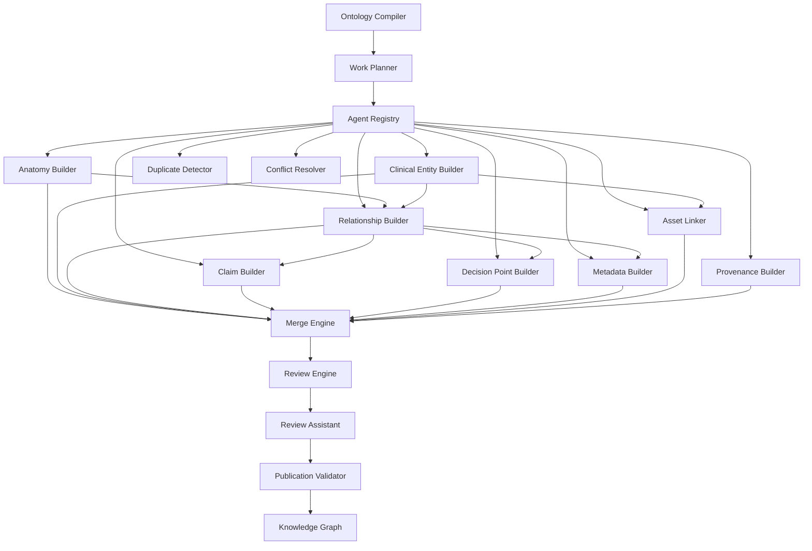

# Knowledge Factory Agent Overview

**Status:** Canonical architectural specification  
**Framework version:** 1.0.0  
**Ontology version:** 2026-07-05  
**Audience:** Engineers implementing Knowledge Factory agents

---

## Philosophy

The Knowledge Factory is a **multi-agent graph construction system**. Its purpose is not to generate topic pages or curriculum documents, but to transform bounded source evidence into **mature canonical neighborhoods** — traversable subgraphs of the orthopaedic knowledge graph that products (Prepare, BroBot, CasePrep, OITE, Adaptive) can consume without owning medical content.

Every agent in the factory adheres to three principles:

1. **Automation proposes; humans approve.** No agent writes verified clinical truth. All outputs are proposals (`generated_draft` or `needs_review`) until a qualified reviewer approves them.
2. **Relationships over pages.** Agents produce graph objects — entities, weighted relationships, claims, decision points, metadata, provenance, and asset links — not prose documents.
3. **Deterministic and explainable.** Confidence scores, review routes, and validation outcomes must be traceable to explicit rules. Opaque AI scores are prohibited in the default path.

Agents are **specialists**, not generalists. Each agent declares exactly which gap kinds, entity types, ontology rule prefixes, and proposal types it handles. The Ontology Compiler discovers agents by capability; it never hardcodes agent names.

---

## Responsibilities of Every Agent

Regardless of domain, every Knowledge Factory agent must:

| Responsibility | Description |
|----------------|-------------|
| **Declare capabilities** | Register `id`, `version`, `supportedOntologyVersion`, `handlesGapKinds`, `proposalTypes`, `requires`, safety limits, and escalation rules |
| **Accept work assignments** | Consume `WorkAssignment` objects produced by the compiler work planner |
| **Validate inputs** | Refuse execution when required inputs are absent |
| **Generate proposals** | Emit `ProposalRecord[]` wrapped in `ProposalEnvelope` |
| **Self-validate** | Run schema, ontology, relationship, metadata, safety, and publication checks before returning |
| **Score confidence** | Produce `ConfidenceBreakdown` with rule-derived dimensions |
| **Recommend review** | Emit `ReviewRecommendation` with route, scores, reason, and required reviewer role |
| **Report metrics** | Return execution time, proposal count, escalation count, acceptance rate |
| **Maintain audit trail** | Record lifecycle stages in immutable `AuditTrail` entries |

Agents must **not**:

- Apply proposals to the database
- Auto-publish content
- Mark claims or decision points as `verified`
- Bypass attending review for safety-gated content
- Mutate downstream agent outputs

---

## Lifecycle Summary

Every agent follows the standard lifecycle defined in `03-agent-lifecycle.md`:

```
Receive Work → Validate Inputs → Execute → Generate Proposals →
Self Validate → Compute Confidence → Return ProposalEnvelope
```

Post-agent pipeline (not agent responsibility):

```
Merge Engine → Review Engine → Publication Validator → Knowledge Graph (on human approval)
```

---

## Compiler Interaction

The Ontology Compiler (`kg-compiler`) orchestrates nine stages. Agents interact at **Stage 4 (Work Planning)** and **Stage 5 (Agent Orchestration)**:

| Stage | Agent role |
|-------|------------|
| 1–3 | None — neighborhood resolution, ontology expansion, gap analysis |
| 4 | **Work Planner** queries `AgentRegistry` to map gaps → `WorkAssignment` objects |
| 5 | **Agent Orchestration** — agents execute assignments (currently schedule-only in compile pass; full execution planned) |
| 6 | **Merge Engine** consumes agent proposal outputs |
| 7–9 | **Review Assistant** and **Publication Validator** run as post-processing agents |

Compiler outputs relevant to agents:

- `ontology-gap-report.json` — gaps agents must resolve
- `ontology-work-plan.json` — scheduled work items with dependencies
- `agent-assignment-plan.json` — capability-matched agent assignments
- `unmet-agent-capabilities.json` — gaps with no registered agent

Agents receive a `CompilerContext` in every `AgentInputBundle`:

```
topicKey, pilotKey, displayName, primaryEntitySlug,
targetMaturityLevel, compilerVersion, frameworkVersion,
ontologyVersion, generatedAt
```

---

## Review Interaction

Agents do not perform final review. They **recommend** review routes via `ReviewRecommendation` on each `ProposalEnvelope`. The Intelligent Curator (`intelligent-curator.ts`) and Review Engine (`review-engine.ts`) perform authoritative routing.

Agent review recommendations must align with curator routes:

| Agent `ReviewRoute` | Curator `CurationRoute` |
|---------------------|-------------------------|
| `AUTO_APPROVED_LOW_RISK` | `AUTO_APPROVED_LOW_RISK` |
| `AUTO_REVISED` | `AUTO_REVISED` |
| `HUMAN_REVIEW` | `HUMAN_REVIEW` |
| `ATTENDING_REVIEW` | `ATTENDING_REVIEW` |
| `REJECT` | `REJECTED` |
| `CONFLICTED` | Derived from `conflict_count >= 2` |

Agents must never recommend `AUTO_APPROVED_LOW_RISK` for:

- Decision points (`propose_decision_point`)
- High-risk predicates (`at_risk_structure`, `indicates_treatment`, `must_protect_during`, `treated_by`, `uses_fixation`, `explains_instability`)
- Claims with `claim_type` in `{ board_trap, cognitive_trap, red_flag }`
- Any proposal with `safetyLevel >= 0.7`

---

## Proposal Generation

Agents emit `ProposalRecord` objects that conform to `kg-automation-common.ts`. Each record is wrapped in a `ProposalEnvelope` before return.

**Proposal types by agent family:**

| Agent | Proposal types |
|-------|----------------|
| Anatomy Builder | `create_canonical_entity` |
| Clinical Entity Builder | `create_canonical_entity` |
| Relationship Builder | `add_canonical_relationship` |
| Claim Builder | `propose_educational_claim` |
| Decision Point Builder | `propose_decision_point` |
| Metadata Builder | `add_canonical_relationship` (metadata patches) |
| Asset Linker | `retarget_card_to_entity`, `retarget_question_to_entity` |
| Provenance Builder | `add_provenance_record` |
| Duplicate Detector | `flag_duplicate_entity`, `flag_possible_merge`, `flag_possible_split` |
| Conflict Resolver | (no new proposals — resolves or escalates existing) |

All educational claims and decision points must carry:

```
metadata.content_source = "generated_draft"
metadata.verified = false
```

---

## Validation

Every agent runs self-validation before returning. Validation categories:

```
schema | ontology | relationship | duplicate | metadata | provenance | safety | publication
```

Critical failures (`DRAFT_LEAK`, `ONTOLOGY_VIOLATION`, `DUPLICATE_FINGERPRINT`) cause `status: "partial"` or `"failed"`. Warnings (`MISSING_REL_METADATA`, `MISSING_PROVENANCE`) are recorded but do not block return.

See `07-validation-framework.md` for complete rules.

---

## Confidence Scoring

Confidence is computed from eight explainable dimensions in `ConfidenceBreakdown`:

```
evidenceQuantity, evidenceQuality, sourceAgreement, ontologyCompliance,
relationshipValidity, metadataCompleteness, conflictScore, safetyLevel
```

Composite confidence uses weighted combination (see `05-confidence-framework.md`). Agents must not emit confidence without a populated `rulesApplied` array explaining which rules fired.

---

## Publication Rules

Agents do not publish. The Publication Validator evaluates readiness after review. Agent outputs affect publication only when:

1. Proposals pass validation
2. Review route is `AUTO_APPROVED_LOW_RISK` (for auto-apply candidates)
3. `publicationEligible: true` on the envelope
4. Neighborhood maturity meets product gate (L5+ for Prepare, L7 for production)

**Hard blocks agents must respect:**

- Never set `content_source: "verified"` on generated claims or decision points
- Never auto-approve attending-gated proposal types
- Never emit proposals with `conflict_count > 0` without routing to `CONFLICTED` or `HUMAN_REVIEW`

---

## How Agents Fit Together



**Dependency ordering (default):**

1. Entity builders (Anatomy, Clinical) — parallel
2. Relationship Builder — depends on entity builders
3. Claim Builder, Decision Point Builder, Metadata Builder — depend on Relationship Builder
4. Asset Linker — depends on Clinical Entity Builder
5. Provenance Builder — independent
6. Duplicate Detector, Conflict Resolver — run on proposal batches
7. Review Assistant — depends on all gap-resolution agents
8. Publication Validator — depends on Review Assistant

---

## Maturity Alignment

Agents contribute to neighborhood maturity (Canonical Spec §12):

| Level | Agent contribution |
|-------|-------------------|
| L1 | Entity builders create identity |
| L2 | Relationship Builder creates core reviewed relationships |
| L3 | Claim Builder creates L1 claims; Asset Linker links cards |
| L4 | Decision Point Builder creates verified DPs |
| L5 | Metadata Builder completes edge weighting; connection pattern satisfied |
| L6 | Review Assistant confirms expert review complete |
| L7 | Publication Validator confirms production readiness |

---

## Open Architectural Questions

These are documented explicitly for resolution before full parallel agent deployment:

1. **Stage 5 execution model** — Should agents execute synchronously in compile pass, asynchronously via job queue, or only on explicit `kg:pilot:*` commands?
2. **Duplicate Detector timing** — Pre-merge (on raw proposals) or post-merge (on merged draft)?
3. **Conflict Resolver authority** — Can it auto-supersede lower-priority proposals, or only flag for human resolution?
4. **Quality Scorer agent** — Declared in `AgentFamily` but not registered; scope TBD (per-neighborhood vs per-proposal).
5. **LLM enhancement layer** — Optional LLM proposer sits above rule agents; contract for LLM-generated proposals not yet specified.

---

## Related Documents

- `02-agent-contract.md` — Complete type reference
- `03-agent-lifecycle.md` — Stage-by-stage lifecycle
- `04-agent-registry.md` — Discovery and matching
- `knowledge-factory-agent-architecture.md` — End-to-end architecture