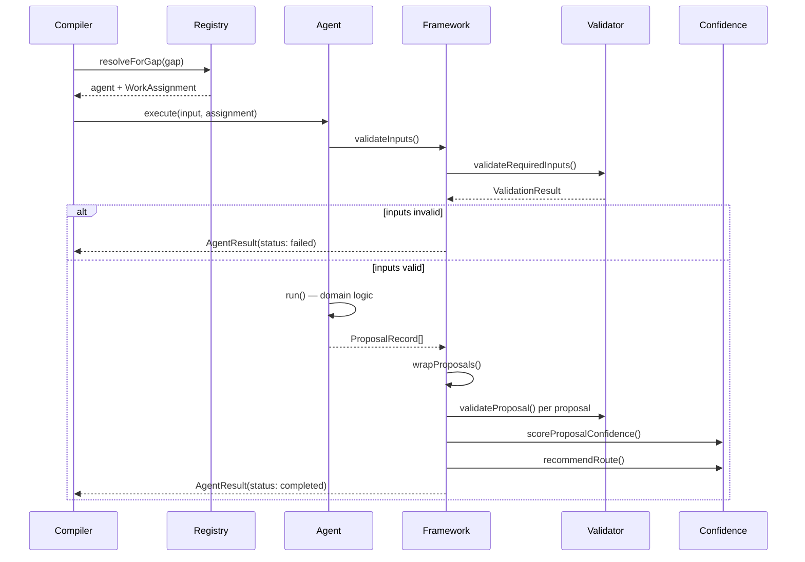
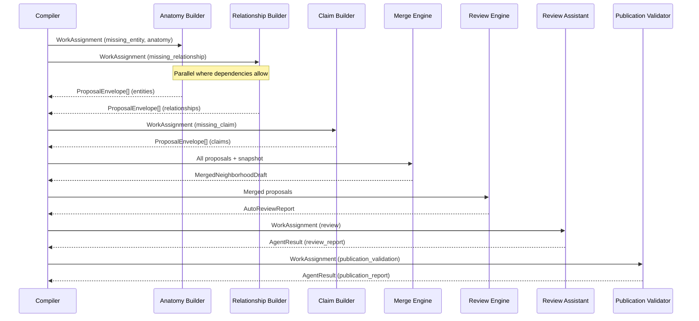

# Agent Lifecycle Specification

**Status:** Canonical architectural specification  
**Implementation:** `scripts/lib/education/kg-agent-framework/lifecycle.ts`

---

## Overview

Every Knowledge Factory agent follows an identical lifecycle. Domain logic lives in the `run()` method; the framework handles input validation, proposal wrapping, confidence scoring, audit logging, and structured output assembly.

---

## Lifecycle Stages

```
Receive Work
    ↓
Validate Inputs
    ↓
Execute (domain work)
    ↓
Generate Proposals
    ↓
Self Validation
    ↓
Confidence Scoring
    ↓
Review Recommendation
    ↓
Return ProposalEnvelope + AgentResult
    ↓
[Merge Engine — not agent responsibility]
```

---

## Stage 1: Receive Work

**Trigger:** Compiler Stage 5 assigns a `WorkAssignment` to an agent via `AgentRegistry`.

**Input:** `AgentInputBundle` + `WorkAssignment`

**Actions:**
1. Record `auditTrail` entry: `stage: "receive"`, `action: "assignment_received"`
2. Verify `assignment.assignedAgentId === agent.identity.id`
3. Verify `canHandle(assignment)` returns true

**Failure:** If agent cannot handle assignment, it must not be invoked. Registry matching prevents this at planning time.

---

## Stage 2: Validate Inputs

**Actions:**
1. Call `validateInputs(input, assignment)`
2. Check each `capabilities.consumes` entry against input presence map
3. Record audit entry: `inputs_valid` or `inputs_invalid`

**Input presence rules:**

| ConsumesCapability | Present when |
|--------------------|--------------|
| `neighborhood_snapshot` | `input.neighborhood` is truthy |
| `ontology_requirements` | `input.ontologyRequirements` is truthy |
| `evidence_packets` | `input.evidencePackets.length > 0` |
| `proposal_packets` | `input.existingProposals.length > 0` |
| `canonical_objects` | `input.neighborhood.entities.length > 0` |
| `work_assignment` | Always true (assignment provided) |
| `merged_neighborhood_draft` | Not yet wired (always false in v1) |
| `auto_review_report` | Not yet wired (always false in v1) |
| `gap_report` | `input.gaps.length > 0` |
| `quality_metrics` | Not yet wired (always false in v1) |

**Failure:** Return `status: "failed"` with `MISSING_INPUT` errors. Do not execute domain work.

---

## Stage 3: Load Neighborhood

**Responsibility:** Agent reads `input.neighborhood` (NeighborhoodSnapshot).

**Data available:**
- `entities[]` — slug, entityType, preferredLabel, metadata
- `relationships[]` — subjectSlug, predicate, objectSlug, metadata
- `claims[]` — draftId, claimType, claimText, importanceLevel
- `decisionPoints[]` — patternType, trigger, action, urgency
- `assets` — card/question mapping counts

Agents use the neighborhood to:
- Resolve entity slugs to types for relationship validation
- Detect what already exists vs what gaps require
- Avoid proposing duplicates

---

## Stage 4: Read Ontology Requirements

**Responsibility:** Agents that consume `ontology_requirements` read `OntologyRequirementsContext`.

**Data available:**
- `entityRequirements[]` — per-entity shape requirements from CKO spec §8
- `neighborhoodRequirementIds[]` — connection pattern requirement IDs

Used by entity and relationship builders to ensure proposals satisfy connection patterns (e.g. fracture pattern requires anatomy, classification, imaging, DPs).

---

## Stage 5: Analyze Evidence

**Responsibility:** Agents that consume `evidence_packets` evaluate source quality.

**Evidence hierarchy (conflict resolution):**
1. Expert-reviewed canonical
2. Static Prepare content
3. Anki cards
4. OrthoBullets metadata
5. LLM proposals (lowest)

Agents must cite `source_signal_ids` and populate `evidence_summary` on every proposal.

---

## Stage 6: Generate Proposals

**Responsibility:** Agent `run()` method produces `ProposalRecord[]`.

**Rules:**
- One proposal per gap (or batch per gap cluster, agent-specific)
- Every proposal must have a unique `proposal_fingerprint`
- `review_status` defaults to `generated`
- Claims and DPs: `metadata.content_source = "generated_draft"`, `metadata.verified = false`
- Relationships: include `metadata.subject_slug`, `metadata.object_slug`, entity types
- Entities: include `metadata.slug`, `proposed_entity_type`

**Output:** Raw `ProposalRecord[]` + optional `outputs` map + optional `warnings`

---

## Stage 7: Self Validation

**Responsibility:** Framework wraps proposals and runs per-proposal validation.

**Checks per proposal:**
- Schema: fingerprint present
- Ontology: relationship triple valid (if relationship)
- Metadata: relationship metadata present (warning if missing)
- Provenance: evidence summary or source IDs (warning if missing)
- Safety: attending flag on decision points (info)
- Publication: draft leak detection (critical if verified before review)
- Duplicate: fingerprint uniqueness within batch

**Audit entry:** `self_validate` with issue and escalation counts

---

## Stage 8: Confidence Scoring

**Responsibility:** Framework computes `ConfidenceBreakdown` per proposal and aggregate `ConfidenceResult`.

See `05-confidence-framework.md` for formulas.

**Aggregate confidence:** Uses first proposal or empty-template fallback with `assignment.estimatedConfidence`.

---

## Stage 9: Review Recommendation

**Responsibility:** Framework computes `ReviewRecommendation` per proposal via `buildReviewRecommendation()`.

Routes determined by `recommendRoute()` in confidence module, bridged to curator routes.

**Escalation count:** Proposals with route ∈ `{ ATTENDING_REVIEW, HUMAN_REVIEW, CONFLICTED }`.

---

## Stage 10: Return ProposalEnvelope

**Responsibility:** Framework assembles `AgentResult`.

| Field | Source |
|-------|--------|
| `proposals` | `wrapProposals(rawProposals)` |
| `status` | Derived from errors and validation severity |
| `metrics` | Computed from proposals and timing |
| `auditTrail` | Accumulated lifecycle entries |
| `outputs` | Agent-specific; immutable for downstream consumers |

**Audit entry:** `return` / `structured_output_ready`

---

## Post-Agent: Merge Engine

Not an agent responsibility. Merge Engine (`merge-engine.ts`) consumes agent outputs:

1. Merges snapshot entities with `create_canonical_entity` proposals
2. Merges relationships with `add_canonical_relationship` proposals
3. Merges claims and decision points from draft proposals
4. Detects `relationship_metadata_conflict` in merged draft
5. Produces `MergedNeighborhoodDraft` with stats and conflict list

---

## Sequence Diagram: Single Agent Execution



---

## Sequence Diagram: Full Pipeline



---

## Timing and Parallelism

| Execution model | Current state | Target state |
|-----------------|---------------|--------------|
| Entity builders | Parallel (no cross-deps) | Parallel |
| Relationship Builder | After entity builders | After entity builders |
| Claim/DP/Metadata builders | After Relationship Builder | Parallel among themselves |
| Review/Publication | Sequential post-merge | Sequential |

**Open question:** Whether Stage 5 executes agents in-process during compile or dispatches to async workers. Current implementation is schedule-only.

---

## Related Documents

- `02-agent-contract.md` — Type definitions
- `05-confidence-framework.md` — Scoring details
- `08-agent-interactions.md` — Inter-agent data flow