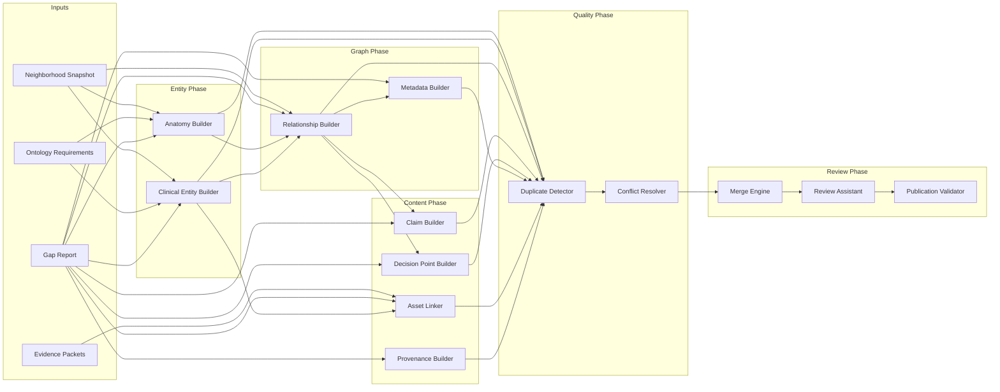

# Agent Interactions Specification

**Status:** Canonical architectural specification

---

## Purpose

This document defines how Knowledge Factory agents communicate — not via message queues or shared mutable state, but through **typed artifacts** passed by the compiler orchestrator.

Agents do not call each other directly. The compiler passes immutable outputs from upstream agents as inputs to downstream agents.

---

## Communication Model

```
Compiler Orchestrator
    │
    ├── passes AgentInputBundle + WorkAssignment to Agent A
    ├── collects AgentResult.outputs (immutable)
    ├── passes outputs as input.existingProposals / input.gaps to Agent B
    └── never mutates AgentResult after return
```

**Principle:** Downstream agents read upstream outputs; they never modify them.

---

## Primary Interaction Chain

```
Relationship Builder
        ↓
Metadata Builder
        ↓
Review Assistant
        ↓
Publication Validator
```

### Relationship Builder → Metadata Builder

| Artifact passed | Field |
|-----------------|-------|
| Relationship proposals | `input.existingProposals` (filtered `add_canonical_relationship`) |
| Neighborhood state | `input.neighborhood` |
| Metadata gaps | `assignment.gaps` (kind: `missing_metadata`) |

Metadata Builder patches `relationship_metadata` on existing relationship proposals or generates metadata-only relationship proposals.

### All gap agents → Review Assistant

| Artifact passed | Field |
|-----------------|-------|
| All proposals | `input.existingProposals` |
| Merged draft | `input.neighborhood` (snapshot + proposals) |

Review Assistant runs `runAutoReview()` and produces `review_report` in `outputs`.

### Review Assistant → Publication Validator

| Artifact passed | Field |
|-----------------|-------|
| Auto-review report | `outputs.autoReviewReport` (via re-run in current impl) |
| Gap report | `input.gaps` |
| Proposals | `input.existingProposals` |

Publication Validator produces `publication_report` with readiness, blockers, dimension scores.

---

## Entity Builder Interactions

```
Anatomy Builder ──────┐
                      ├──→ Relationship Builder
Clinical Entity Builder ──┘
        │
        └──→ Asset Linker
```

### Anatomy Builder → Relationship Builder

Anatomy Builder creates `anatomy_structure` entities. Relationship Builder requires these entities to exist (as slugs in neighborhood) before creating `involves_anatomy`, `part_of`, `injured_in` edges.

**Dependency:** `relationship-builder.requires: ["anatomy-builder", "clinical-entity-builder"]`

### Clinical Entity Builder → Asset Linker

Asset Linker retargets cards/questions to canonical entity IDs. Requires clinical entities to exist first.

**Dependency:** `asset-linker.requires: ["clinical-entity-builder"]`

---

## Claim and Decision Point Interactions

```
Relationship Builder
    ├──→ Claim Builder
    └──→ Decision Point Builder
```

Both require the relationship graph to be sufficiently complete before generating educational assertions and reasoning patterns. Claims reference anchor entities linked via relationships.

---

## Quality Agents (Specified, Not Yet Registered)

```
All proposals → Duplicate Detector → Conflict Resolver → Merge Engine
```

### Duplicate Detector

Runs on proposal batches before or after merge (timing TBD). Emits flag proposals; does not modify existing proposals.

### Conflict Resolver

Consumes merge engine conflicts and proposal `conflict_count` signals. Escalates or proposes resolutions.

---

## Data Flow Diagram



---

## Shared Artifacts

| Artifact | Producer | Consumers |
|----------|----------|-----------|
| `NeighborhoodSnapshot` | Compiler (Stage 1) | All gap agents |
| `OntologyGap[]` | Gap Analyzer (Stage 3) | Work Planner, all gap agents |
| `ProposalRecord[]` | Gap agents | Merge Engine, Review Assistant |
| `ProposalEnvelope[]` | Framework (wrap) | Review Engine, human review UI |
| `MergedNeighborhoodDraft` | Merge Engine (Stage 6) | Review Assistant (future) |
| `AutoReviewReport` | Review Engine (Stage 7) | Publication Validator, reports |
| `PublicationReadinessResult` | Publication Validator (Stage 9) | Compiler plan, reports |

---

## Parallelism Rules

| Agents | May run in parallel? | Condition |
|--------|---------------------|-----------|
| Anatomy Builder + Clinical Entity Builder | Yes | No cross-dependency |
| Claim Builder + Decision Point Builder + Metadata Builder | Yes | All depend only on Relationship Builder |
| Asset Linker + Provenance Builder | Yes | Independent deps |
| Review Assistant + gap agents | No | Review runs after all gap agents |
| Publication Validator + Review Assistant | No | Sequential |

---

## Error Propagation

| Upstream failure | Downstream behavior |
|------------------|---------------------|
| Entity builder fails | Relationship Builder should not execute (dependency failure) |
| Relationship Builder fails | Claim/DP/Metadata builders should not execute |
| Any gap agent partial | Merge uses available proposals; gaps remain for next pass |
| Review Assistant fails | Publication Validator uses fallback auto-review re-run |
| Duplicate Detector finds critical dupes | Proposals flagged; merge may exclude duplicates |

**Open question:** Formal dependency failure propagation in Stage 5 orchestration is not yet implemented.

---

## Related Documents

- `04-agent-registry.md` — Dependency declarations
- `03-agent-lifecycle.md` — Lifecycle stages
- `knowledge-factory-agent-architecture.md` — Full architecture