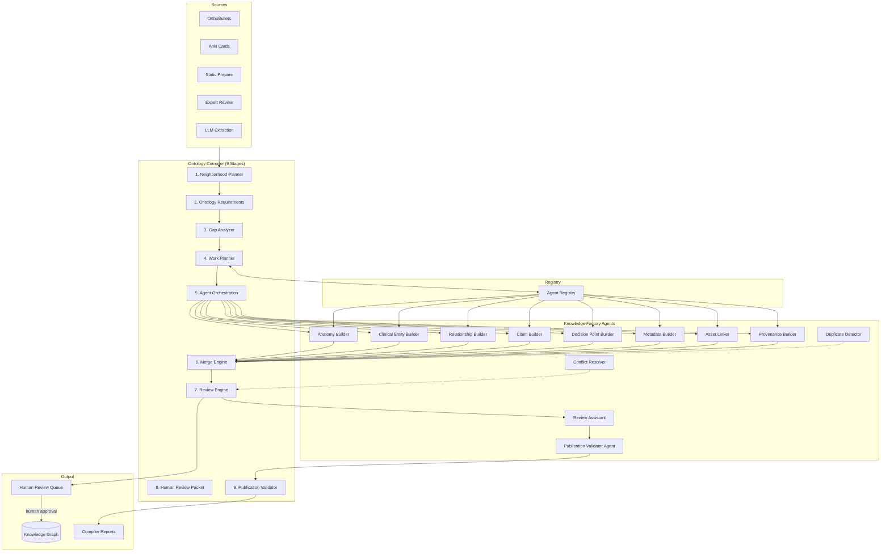
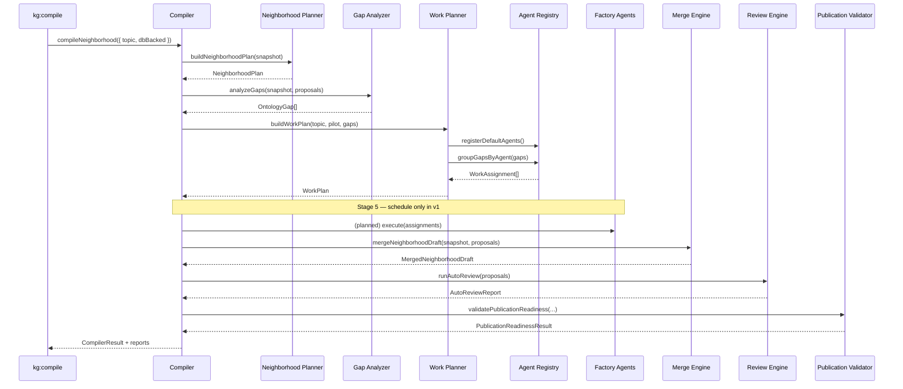
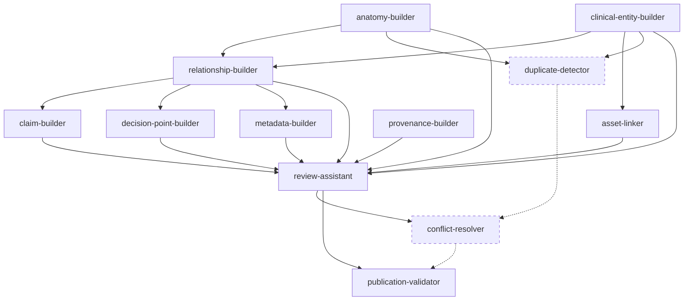
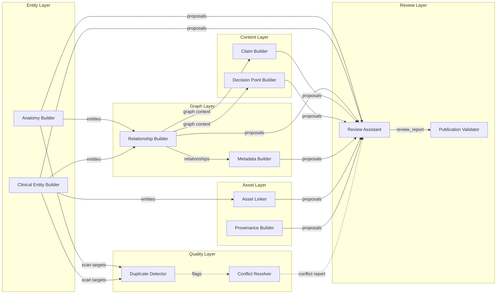
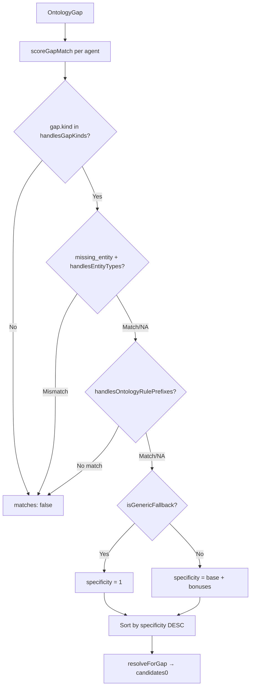
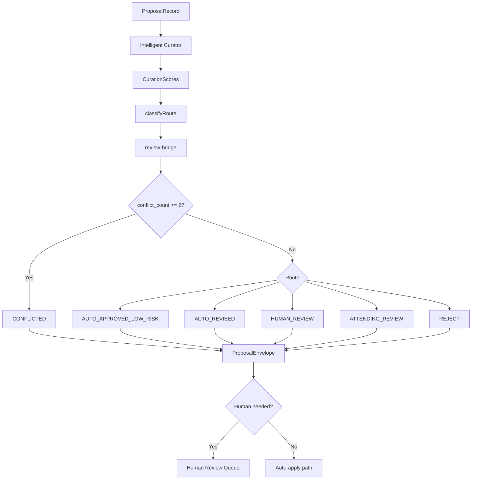
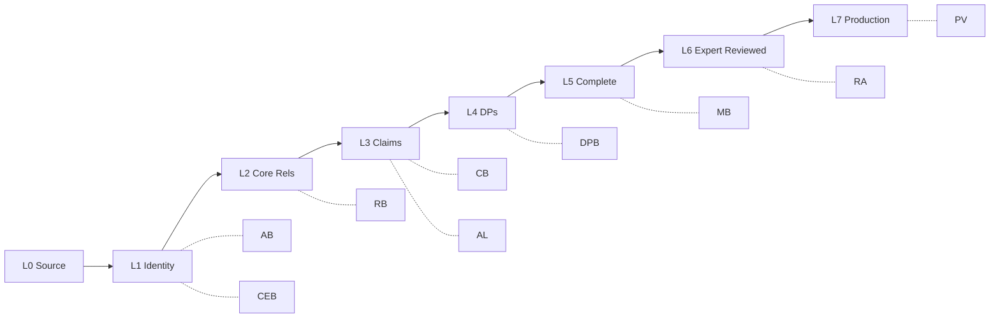

# Knowledge Factory Agent Architecture

**Status:** Canonical architectural specification  
**Framework version:** 1.0.0  
**Ontology version:** 2026-07-05  
**Pilot:** ankle-fracture

---

## Overview

The Knowledge Factory transforms bounded source evidence into mature canonical neighborhoods through a pipeline of specialized agents orchestrated by the Ontology Compiler. Agents never write to the database directly; they produce proposals that flow through merge, review, and publication gates before human-approved canonical apply.

---

## System Architecture

**Dotted lines:** Agents specified but not yet registered (Duplicate Detector, Conflict Resolver).

---

## Pipeline Stages

| Stage | Component | Status | Output |
|-------|-----------|--------|--------|
| 1 | Neighborhood Planner | Completed | `ontology-neighborhood-plan.json` |
| 2 | Ontology Requirement Expansion | Completed | Connection pattern rules applied |
| 3 | Gap Analyzer | Completed | `ontology-gap-report.json` |
| 4 | Work Planner + Agent Registry | Completed | `ontology-work-plan.json`, `agent-assignment-plan.json` |
| 5 | Agent Orchestration | **Planned** | Agent `AgentResult[]` (schedule-only in v1) |
| 6 | Merge Engine | Completed | `ontology-merged-draft.json` |
| 7 | Review Engine + Review Assistant | Completed | `ontology-auto-review.json` |
| 8 | Human Review Packet | Completed | `ontology-human-review-queue.json` |
| 9 | Publication Validator | Completed | `ontology-publication-readiness.json` |

**Constraints (always):** `databaseModified: false`, `autoPublished: false`.

---

## Sequence Diagram: End-to-End Compile Pass

---

## Agent Dependency Graph

**Parallel execution groups:**

| Group | Agents | Prerequisites |
|-------|--------|---------------|
| G1 | Anatomy Builder, Clinical Entity Builder, Provenance Builder | None |
| G2 | Relationship Builder | G1 entity builders |
| G3 | Claim Builder, Decision Point Builder, Metadata Builder, Asset Linker | G2 |
| G4 | Duplicate Detector | G1 (proposed) |
| G5 | Review Assistant | All gap agents |
| G6 | Conflict Resolver | G5 (proposed) |
| G7 | Publication Validator | G5 |

---

## Agent Interaction Graph

---

## Data Flow

| Stage | Input | Output | Storage |
|-------|-------|--------|---------|
| Gap Analysis | Snapshot + proposals | `OntologyGap[]` | Report JSON |
| Work Planning | Gaps + registry | `WorkAssignment[]` | Report JSON |
| Agent Execute | InputBundle + assignment | `AgentResult` | In-memory |
| Merge | Snapshot + proposals | `MergedNeighborhoodDraft` | Report JSON |
| Review | Proposals | `AutoReviewReport` | Report JSON |
| Publication | Gaps + review + proposals | `PublicationReadinessResult` | Report JSON |
| Human Apply | Approved proposals | Canonical objects | Database (staging) |

---

## Registry Matching Flow

---

## Review Flow

---

## Report Artifacts

| Report | Producer | Content |
|--------|----------|---------|
| `ontology-compiler-plan.json` | Compiler | Full 9-stage plan |
| `ontology-gap-report.json` | Gap Analyzer | All gaps |
| `ontology-work-plan.json` | Work Planner | Work items + execution order |
| `agent-assignment-plan.json` | Agent Reports | Capability-matched assignments |
| `unmet-agent-capabilities.json` | Agent Registry | Gaps with no agent |
| `reviewer-burden-estimate.md` | Agent Reports | Human review load |
| `agent-contract-summary.md` | Agent Reports | Factory status summary |
| `ontology-merged-draft.json` | Merge Engine | Merged neighborhood |
| `ontology-auto-review.json` | Review Engine | Per-proposal decisions |
| `ontology-publication-readiness.json` | Publication Validator | Maturity + blockers |
| `ontology-human-review-queue.json` | Review Packet Generator | Escalation items |

---

## Maturity Progression

---

## Safety Architecture

| Gate | Enforcer | Rule |
|------|----------|------|
| No auto-verify | All content agents | `verified: false` always |
| No draft leak | Validation framework | `DRAFT_LEAK` critical |
| Attending gate | Review framework | DPs → `ATTENDING_REVIEW` |
| High-risk predicates | Relationship Builder + Curator | Escalation patterns |
| No auto-publish | Compiler constraints | `autoPublished: false` |
| No DB writes in compile | Compiler constraints | `databaseModified: false` |
| Staging guard | kg-staging-guard | Production blocked |

---

## Implementation Status

| Agent | Registered | Full Implementation |
|-------|------------|---------------------|
| anatomy-builder | Yes | Stub (scheduling only) |
| clinical-entity-builder | Yes | Stub |
| relationship-builder | Yes | Reference (filters proposals) |
| claim-builder | Yes | Stub |
| decision-point-builder | Yes | Stub |
| metadata-builder | Yes | Reference (filters proposals) |
| asset-linker | Yes | Stub |
| provenance-builder | Yes | Stub |
| duplicate-detector | **No** | Specified only |
| conflict-resolver | **No** | Specified only |
| review-assistant | Yes | Reference (wraps curator) |
| publication-validator | Yes | Reference (wraps validator) |

---

## Architectural Gaps (Explicit)

1. **Stage 5 not wired** — Agents scheduled but `execute()` not called in compile pass
2. **Gap-stub agents** — 6 of 8 content agents filter existing proposals only
3. **Duplicate Detector unregistered** — No dedup in pipeline
4. **Conflict Resolver unregistered** — `CONFLICTED` route exists but no dedicated agent
5. **Quality Scorer undeclared** — `quality_scoring` work type has no agent
6. **LLM layer unspecified** — Optional enhancement mentioned in curator header only
7. **Single topic** — Only `ankle-fracture` registered in compiler
8. **Input wiring incomplete** — `merged_neighborhood_draft`, `auto_review_report` not passed to agents

---

## Related Documents

### Framework specifications
- `01-agent-overview.md` through `10-agent-versioning.md`

### Agent specifications
- `01-anatomy-builder.md` through `12-publication-validator.md`

### Planning documents
- `../kg-knowledge-factory-build-plan.md`
- `../kg-orthopaedic-education-ontology-plan-2026-07-05.md`
- `../canonical-knowledge-object-specification.md`
- `../anatomy-ontology-plan.md`
- `../kg-excellence-roadmap-2026-07-05.md`

### Implementation
- `scripts/lib/education/kg-agent-framework/`
- `scripts/lib/education/kg-compiler/`
- `scripts/lib/education/kg-factory/intelligent-curator.ts`