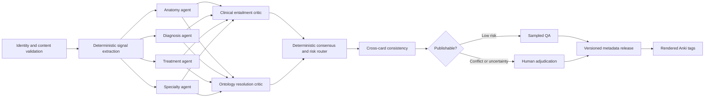

# SnapOrtho Master Deck Metadata and Tag Infrastructure Audit

Date: 2026-07-28

## Executive decision

The default enrichment path is a resumable Codex-operated packet workflow, not
an automated model API pipeline. Supabase leases small batches, Codex completes
bounded taxonomy assertions over time, and a deterministic importer validates
exact evidence before checkpointing proposals. This avoids direct model API
spending while preserving auditability and restartability.

Do not repair the master deck by generating more free-text Anki tags.

Preserve imported Anki tags as immutable source evidence, but make canonical metadata a versioned set of clinical assertions attached to `canonical_card_version_id`. Render accepted assertions back into Anki tags only as a release artifact.

The existing canonical entity graph and Anki mapping-factory schema should be extended and reused. The system does not need a second ontology or a second orchestration framework.

## Live Supabase baseline

This audit used the configured Supabase project through read-only queries.

| Measure | Current state |
|---|---:|
| Imported notes | 4,681 |
| Imported cards | 5,095 |
| Canonical cards/current versions | 5,095 |
| Deck nodes | 818 |
| Published current beta cards | 3,670 (72.0%) |
| Raw Anki tags | 637 |
| Raw note-tag links | 16,239 |
| Weakly tagged cards | 834 (16.4%) |
| Canonical clinical entities | 1,084 |
| Cards with an approved direct entity link | 377 (7.4%) |
| Version-pinned card/entity mappings | 0 |
| Governed tags | 767 |
| Governed tag assignments | 40,612 |
| Governed tag assignments to cards/notes | 0 |

The governed tag registry is:

- 752 `Topic`
- 11 `Specialty`
- 3 `Status`
- 1 `Source`
- 0 `Anatomy`
- 0 `Diagnosis`
- 0 `Treatment`

All 767 governed tags are flat despite the presence of `parent_tag_id`.

The 40,612 governed assignments target external questions and curriculum nodes, not master-deck cards. The tag system therefore looks populated but does not provide governed card metadata.

## Current quality failures

### Raw source tags mix incompatible meanings

The same namespace contains:

- clinical concepts
- deck navigation
- source provenance
- study collections
- workflow/session artifacts
- capitalization variants

High-frequency examples include `SnapOrtho::CasePrep`, a distal-radius ORIF CasePrep path applied far beyond a single clinical topic, `PocketPimped`, and `NettersConciseOrthopaedicAnatomy`.

There are 22 normalized collision groups. Examples include `Trauma` versus `trauma` and duplicated nested variants.

### The canonical Topic namespace is overloaded

`Topic` mixes anatomy, diagnoses, procedures, complications, tests, and source-derived strings. Contaminated merged topics are present, demonstrating that normalization alone cannot create canonical truth.

### Existing semantic assets are underused

The live graph already includes:

- 197 anatomy structures
- 127 conditions
- 133 treatment principles
- 79 procedures
- 58 surgical approaches
- 19 fixation methods
- 80 implants
- 128 complications
- 74 imaging findings
- 40 classification systems
- 29 diagnostic tests
- 28 examination maneuvers

The problem is not absence of an ontology. It is the absence of reliable, version-scoped card-to-ontology assertions.

### The current “factory” is scaffolding, not a functioning agent pipeline

The persistence model has useful runs, batches, stage results, reviews, consensus, and queues. However, the current runner uses a small fixture cohort, executes stages sequentially, records effectively identical terminal results for multiple named stages, and has no live factory runs. Concept extraction and cross-card consistency outputs are empty.

## Target metadata model

### Core facets

Every applicable card should be evaluated independently for:

1. `anatomy`
2. `diagnosis`
3. `treatment`
4. `specialty`

Recommended secondary facets:

- content type
- clinical phase
- complication
- diagnostic test or imaging
- learner level
- board yield
- source/provenance
- laterality

Absence must be valid. An anatomy-only card should not be forced to carry a diagnosis or treatment.

### Canonical mappings

Use existing entity types as the semantic targets:

| Facet | Preferred canonical targets |
|---|---|
| Anatomy | `anatomy_structure`, with hierarchical region/structure closure |
| Diagnosis | `condition`; optionally `complication` when it is the subject |
| Treatment | `procedure`, `treatment_principle`, `fixation_method`, `surgical_approach`, `implant` |
| Specialty | governed specialty vocabulary, one primary and optional secondary specialties |

Do not duplicate entity labels into a separate uncontrolled tag catalog. A tag is a projection of an accepted entity assertion.

### Additive schema

Add:

#### `metadata_taxonomy_versions`

- semantic version
- lifecycle: `draft`, `frozen`, `active`, `retired`
- definition checksum
- activation timestamps

#### `metadata_concepts`

Use only for facets that are not already modeled well by `canonical_entities`, such as specialty, laterality, content type, clinical phase, and learner level.

- facet
- stable slug and preferred label
- definition
- parent concept
- external codes
- applicable rules
- version lifecycle

#### `metadata_concept_aliases`

- normalized alias
- alias type: synonym, abbreviation, legacy tag, misspelling, source path
- source
- language
- review status
- taxonomy version

#### `card_metadata_assertions`

This is the canonical card metadata ledger:

- `canonical_card_id`
- `canonical_card_version_id`
- facet
- canonical entity or metadata concept ID
- role: `primary`, `secondary`, `context`, `excluded`
- polarity
- confidence
- decision: `proposed`, `accepted`, `rejected`, `superseded`
- provenance: deterministic, model, human, import, inferred
- evidence spans with field name, offsets, and content hash
- rationale codes
- run, batch, stage-result, model, prompt, rules, and taxonomy versions
- reviewer and review timestamp
- superseded assertion ID

Accepted history should be immutable. A changed card version must be re-evaluated rather than silently inheriting stale metadata.

### Keep source tags separate

Continue preserving:

- `anki_tags`
- `anki_note_tags`
- `canonical_card_versions.tag_snapshot`

Treat them as import evidence. Define one explicit authority:

- relational raw tag tables are the import/query authority
- `tag_snapshot` is the immutable version snapshot
- neither is canonical clinical truth

## Actual Anki tag architecture

The metadata ledger and knowledge graph are the source of truth, but the tags visible inside Anki still need to be excellent. They should support browsing, custom study, filtered decks, debugging, and transparent provenance without forcing users to understand the database.

The exported deck should contain two clearly separated tag trees:

1. a governed `SnapOrtho` tree generated from accepted metadata
2. a quarantined `Legacy` tree for source tags that must remain visible during migration

### Target hierarchy

```text
SnapOrtho
├── Specialty
│   ├── Trauma
│   ├── Adult_Reconstruction
│   ├── Sports_Medicine
│   ├── Shoulder_Elbow
│   ├── Hand_Upper_Extremity
│   ├── Foot_Ankle
│   ├── Spine
│   ├── Pediatric_Orthopedics
│   ├── Orthopedic_Oncology
│   ├── Metabolic_Bone
│   ├── Basic_Science
│   ├── Rehabilitation
│   └── General_Orthopedics
├── Anatomy
│   ├── Upper_Extremity
│   │   ├── Shoulder
│   │   ├── Arm
│   │   ├── Elbow
│   │   ├── Forearm
│   │   ├── Wrist
│   │   └── Hand
│   ├── Lower_Extremity
│   │   ├── Pelvis
│   │   ├── Hip
│   │   ├── Thigh
│   │   ├── Knee
│   │   ├── Leg
│   │   ├── Ankle
│   │   └── Foot
│   ├── Spine
│   │   ├── Cervical
│   │   ├── Thoracic
│   │   ├── Lumbar
│   │   └── Sacral
│   └── Systemic
├── Diagnosis
├── Treatment
├── Content
├── Learner_Level
├── Yield
├── Source
└── Workflow
```

Anatomic structure tags should sit below the region path when practical:

```text
SnapOrtho::Anatomy::Lower_Extremity::Knee::Ligament::ACL
SnapOrtho::Anatomy::Upper_Extremity::Wrist::Bone::Scaphoid
```

Diagnosis and treatment tags should use stable canonical slugs:

```text
SnapOrtho::Diagnosis::ACL_Tear
SnapOrtho::Diagnosis::Scaphoid_Nonunion
SnapOrtho::Treatment::ACL_Reconstruction
SnapOrtho::Treatment::Open_Reduction_Internal_Fixation
SnapOrtho::Specialty::Sports_Medicine
```

The full path is a display and search projection. The database assertion retains the stable UUID, so moving a label within the Anki hierarchy does not change semantic identity.

### Naming rules

- Use exactly one root: `SnapOrtho`.
- Use `::` for hierarchy.
- Use canonical title-style tokens joined by underscores.
- Do not use spaces, `#`, source-specific prefixes, mixed casing, or punctuation-dependent identity.
- Preserve accepted abbreviations only when clinically standard, such as `ACL`, `PCL`, `ORIF`, and `TKA`.
- Keep one canonical spelling and case. Map `Trauma`, `trauma`, and nested variants to the same canonical tag.
- Use singular concepts unless the canonical clinical term is conventionally plural.
- Do not place two concepts in one tag. A string such as `Cervical_Myelopathy_ACL_Tear` must be split, rejected, or quarantined.
- Do not encode confidence, agent name, model version, or review state in clinical tag paths.
- Operational states belong under `SnapOrtho::Workflow`, never under clinical facets.

### Cardinality rules

Per card:

- exactly one primary specialty for clinical cards
- zero or more secondary specialties only when genuinely cross-specialty
- at least one anatomy region when anatomy is applicable
- structure-level anatomy only when supported by content
- zero or more diagnoses
- zero or more treatments
- zero or one primary content type, with optional secondary content types
- laterality only when explicit; never infer left or right from an unlabeled image

Do not force every card to have all four clinical facets. A surgical approach card may have anatomy, treatment, and specialty without a diagnosis.

### Parent closure

When a specific accepted assertion is rendered, include its useful ancestors so Anki users can search at different levels:

```text
SnapOrtho::Anatomy::Lower_Extremity
SnapOrtho::Anatomy::Lower_Extremity::Knee
SnapOrtho::Anatomy::Lower_Extremity::Knee::Ligament
SnapOrtho::Anatomy::Lower_Extremity::Knee::Ligament::ACL
```

Parent closure must be generated deterministically from the frozen taxonomy, not independently guessed by agents.

To avoid excessive tag volume, emit only ancestors that are declared `exportable`. Internal ontology nodes may remain database-only.

### Provenance and workflow tags

Useful nonclinical tags should be retained in governed locations:

```text
SnapOrtho::Source::Netter
SnapOrtho::Source::Pocket_Pimped
SnapOrtho::Source::Original_SnapOrtho
SnapOrtho::Workflow::Needs_Human_Review
SnapOrtho::Workflow::Ontology_Gap
SnapOrtho::Workflow::Legacy_Tag_Conflict
SnapOrtho::Workflow::Metadata_Release::v0_1_0
```

Workflow tags should be excluded from public production exports unless they serve a deliberate reviewer workflow.

### Legacy tag disposition

Every one of the 637 raw tags should receive a versioned disposition:

| Disposition | Meaning | Export behavior |
|---|---|---|
| `map_exact` | One safe canonical equivalent | Render canonical tag; optionally retain legacy alias during transition |
| `map_split` | Raw tag contains multiple concepts | Render multiple reviewed canonical tags |
| `source_only` | Provenance or source collection | Move to governed `SnapOrtho::Source` |
| `navigation_only` | Deck organization without clinical meaning | Exclude from public export or move to `Legacy::Navigation` |
| `workflow_only` | Internal pipeline/review state | Move to `SnapOrtho::Workflow`; normally omit publicly |
| `ambiguous` | Meaning depends on card content | Do not map globally; resolve per card |
| `contaminated` | Incorrectly applied or merged | Quarantine and require card-level retagging |
| `retired` | Obsolete and unnecessary | Omit from new releases |

Store this in a governed `anki_tag_dispositions` ledger with:

- raw tag ID
- normalized form
- disposition
- canonical target IDs
- effective taxonomy version
- rationale and evidence
- reviewer
- replacement/supersession history

### Immediate cleanup priorities

1. Quarantine the over-broad `SnapOrtho::CasePrep` assignments as workflow/navigation evidence.
2. Quarantine the distal-radius ORIF CasePrep path wherever card content does not explicitly support that case.
3. Collapse the 22 normalized collision groups, starting with `Trauma` versus `trauma`.
4. Separate provenance collections such as PocketPimped and Netter from clinical facets.
5. Split or reject contaminated merged Topic labels.
6. Remove leading `#` and source-specific navigation syntax from canonical output.
7. Resolve the 834 weakly tagged cards with card-level content analysis rather than global tag replacement.

### Export policy

Generate Anki tags only from:

- accepted metadata assertions for the pinned card version
- approved taxonomy ancestors
- approved provenance mappings
- an explicit export policy version

Never copy the complete raw `tag_snapshot` into the canonical output.

For each release, persist:

- generated tag list per card version
- assertion IDs used to generate it
- taxonomy and export-policy versions
- deterministic output checksum
- added, removed, and unchanged tags compared with the prior release

This makes every visible Anki tag explainable and reproducible.

### Preserve Anki identity and user progress

Tag improvement must not create replacement notes or cards.

- Preserve Anki note GUIDs.
- Preserve native note and card IDs wherever the current update contract supports them.
- Do not change note type, card ordinal, or field structure solely to retag.
- Publish tags through the existing versioned deck/update mechanism.
- Validate the update against a copy of a real collection before release.
- Treat scheduling, review history, flags, and user-added personal tags as user-owned data.

The updater should modify only the managed `SnapOrtho::*` namespace. It must not delete user tags outside that namespace.

### Legacy transition

Use two release cycles:

#### Transition release

- Add governed `SnapOrtho::*` tags.
- Retain legacy tags under `Legacy::*` or leave them unchanged according to updater constraints.
- Provide a mapping report and tag-diff report.
- Do not remove ambiguous legacy tags.

#### Clean release

- Remove or quarantine retired managed legacy tags.
- Preserve all user-owned tags.
- Keep a release-level rollback artifact.
- Announce any filtered-deck query changes caused by renamed managed tags.

The migration should publish a legacy-to-canonical query crosswalk so existing reviewer workflows and filtered decks can be updated predictably.

## Parallel-agent pipeline

### Run contract

Every run pins:

- deck release and cohort
- ordered card-version IDs and content hashes
- taxonomy and alias versions
- deterministic rules checksum
- prompt versions
- model versions
- confidence and routing policy

The 3,670-card current release and the full 5,095-card imported deck must be explicit separate cohorts.

### Processing graph



### Agent contract

Each facet agent receives a bounded candidate set, not the whole ontology, and returns strict structured output:

- canonical target ID
- facet and role
- confidence
- exact evidence spans
- alternatives
- abstention or ontology-gap reason
- taxonomy, prompt, rules, and model versions

Agents may not invent production labels. Unknown concepts become `missing_entity` or `missing_alias` proposals.

No agent writes directly to accepted assertions or a published release.

### Concurrency and idempotency

- Partition by coherent deck branch, with batches of roughly 100–250 cards.
- Never split sibling cards from the same note across consistency batches.
- Workers claim leases with `FOR UPDATE SKIP LOCKED` or a narrow claim RPC.
- Make proposal writes idempotent on run, card version, facet, target, and agent version.
- A retry creates a superseding stage result.
- Give workers narrow staging RPC access; never distribute the Supabase service-role key.

### Consensus and risk routing

Fast-track only when:

- the candidate is in the frozen taxonomy
- evidence is explicit
- deterministic and agent results agree, or two independent agents agree
- confidence is calibrated at or above the release threshold
- critics find no contradiction

Diagnosis and treatment require explicit card-text entailment. Do not infer a treatment merely because it is typical for a diagnosis.

Route to human review when:

- facet agents disagree
- confidence is below threshold
- treatment is inferred rather than stated
- anatomy and diagnosis are incompatible
- source tags conflict with card content
- an alias or canonical entity is missing
- the card is multi-concept or ambiguous
- cross-card consistency fails

Preserve dissenting proposals; do not average disagreement away.

## Adjudication workflow

Show:

- card content and media
- source deck path and raw tags
- four facet columns
- highlighted evidence for each proposal
- alternatives and critic findings
- accepted metadata for sibling and neighboring cards

Actions:

- accept
- reject
- replace
- add secondary assertion
- add alias proposal
- open ontology-gap proposal

Require reason codes for overrides. Double review high-risk diagnosis/treatment conflicts. Sample 5–10% of auto-accepted results, stratified by facet, specialty, source, and confidence.

## Quality gates

### Coverage

- anatomy coverage on applicable clinical cards
- one primary specialty on clinical cards
- diagnosis and treatment coverage only when the content type makes them applicable
- coverage by deck branch and specialty, not only globally

### Accuracy

- stratified human-reviewed precision by facet
- hierarchical precision/recall/F1 for anatomy
- exact and ancestor-distance accuracy
- false-positive and abstention quality
- human overturn rate
- alias-gap and entity-gap rates
- confidence calibration
- inter-reviewer agreement

### Anki export integrity

- every exported clinical tag traces to an accepted assertion
- every exported path conforms to the naming grammar
- every exported child has the required exportable parent closure
- zero capitalization-only duplicates
- zero merged multi-concept tags
- zero clinical tags generated solely from a quarantined raw tag
- zero managed workflow tags in public releases unless explicitly allowed
- zero changes to note GUID, card identity, card ordinal, or scheduling data caused by retagging
- user-owned tags outside `SnapOrtho::*` remain unchanged
- deterministic export of the same release produces the same tag checksum
- every release includes per-card and aggregate tag diffs

Initial publication targets:

- at least 98% measured precision for auto-published assertions
- at least 95% precision for the full accepted set
- zero invalid, inactive, or retired targets
- zero assertions against a non-current card version in a release
- zero duplicate active accepted assertions
- deterministic reruns produce identical checksums

## Phased rollout

### Phase 0: freeze and quarantine

- Freeze the current Supabase counts and release manifests.
- Quarantine known CasePrep/global contamination from use as a clinical signal.
- Classify each raw tag as clinical candidate, provenance, navigation, workflow, or noise.
- Create the initial 637-row legacy tag disposition ledger.
- Freeze a copy of current raw and rendered tag sets for rollback and diffing.
- Make no destructive changes to imported tags.

### Phase 1: taxonomy v0.1

- Approve specialty vocabulary.
- Define anatomy hierarchy and laterality rules.
- Map diagnosis and treatment facets to existing canonical entity types.
- Normalize aliases and collision groups.
- Approve the `SnapOrtho::*` Anki hierarchy, naming grammar, parent-closure rules, and export policy.
- Produce the legacy-to-canonical tag and filtered-deck query crosswalk.
- Clinician-review definitions and parentage.

### Phase 2: schema and shadow execution

- Add the versioned assertion ledger and taxonomy tables.
- Add the raw-tag disposition ledger and versioned rendered-tag manifest.
- Turn the existing factory scaffolding into actual parallel stage execution.
- Backfill proposals from raw tags, deck paths, existing links, and entity aliases.
- Generate shadow Anki tag outputs and diffs without publishing them.
- Persist proposals only; publish nothing.

### Phase 3: gold pilot

- Select 300–500 cards stratified across specialties, sources, tag quality, and confidence.
- Overweight anatomy-heavy and weakly tagged branches.
- Have clinicians adjudicate all four facets.
- Tune candidate generation, prompts, thresholds, and aliases against the frozen gold set.
- Import the pilot output into a disposable Anki profile and verify tag browsing, filtered decks, identity preservation, scheduling preservation, and update behavior.

### Phase 4: staged backfill

- Process one specialty/branch cohort at a time.
- Human-review the risk queue.
- Publish only accepted assertions.
- Generate both canonical tag manifests and legacy tag dispositions for every processed cohort.
- Keep the prior release available for rollback.

### Phase 5: dual read and export

- Read canonical assertions in the app while retaining legacy tags for comparison.
- Render accepted assertions as namespaced Anki tags such as:
  - `SnapOrtho::Anatomy::Knee::ACL`
  - `SnapOrtho::Diagnosis::ACL_Tear`
  - `SnapOrtho::Treatment::ACL_Reconstruction`
  - `SnapOrtho::Specialty::Sports_Medicine`
- Export only from a pinned metadata release.
- Ship the transition release with governed and legacy tags side by side.
- Validate real-world filtered-deck queries using the published crosswalk.

### Phase 6: cutover and governance

- Activate one taxonomy and metadata release at a time.
- Review ontology/alias gaps monthly.
- Track drift and human overturns by pipeline version.
- Ship the clean tag release only after the transition release meets identity, scheduling, precision, and query-compatibility gates.
- Govern tag additions through reviewed taxonomy changes; do not permit ad hoc production strings.
- Roll back by selecting a prior release, never by destructive tag rewrites.

## First implementation slice

1. Create the four-facet controlled vocabulary and mapping to existing entity types.
2. Approve the exact `SnapOrtho::*` Anki hierarchy and classify the 637 raw tags.
3. Add `card_metadata_assertions`, `anki_tag_dispositions`, rendered-tag manifests, and taxonomy/run version references.
4. Add a read-only candidate packet builder for 300–500 pilot cards.
5. Implement anatomy and specialty agents first.
6. Add independent entailment and ontology critics.
7. Build adjudication, gold-set export, and deterministic Anki tag rendering.
8. Validate a transition `.apkg` in a disposable Anki profile without changing identity or scheduling.
9. Add diagnosis and treatment agents only after evidence-span, tag rendering, and review behavior are stable.

This sequence improves both the semantic infrastructure and the tags users actually see, while keeping higher-risk clinical assertions human-gated.
