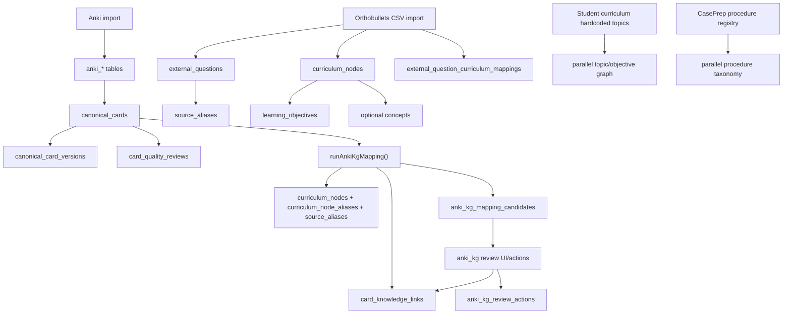
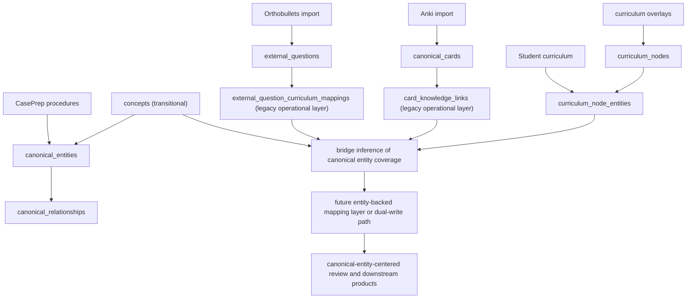

# Next-Generation KG Transition Audit And Integration Plan

Date: 2026-06-28

## Executive Summary

The safest transition is:

- keep the current Anki and Orthobullets pipelines running unchanged
- preserve `card_knowledge_links`, `external_question_curriculum_mappings`, mapping candidates, and review ledgers as the active operational layer
- populate `curriculum_node_entities` first
- use that bridge to infer canonical-entity coverage before rewriting mappers
- then add selective dual-write for reviewed/high-confidence mappings only
- only later move to direct canonical-entity-centered mapping

In other words:

- do not jump straight to an entity-first rewrite
- do not bulk migrate concepts yet
- do not delete or derive away the current mapping tables yet

Recommended transition pattern:

- **Bridge-first now**
- **Selective dual-write later**
- **Entity-first only after bridge coverage is good and review workflows are preserved**

## Current-State Audit

### 1. Current source of truth for card mappings

Current operational source of truth:

- `card_knowledge_links`

Evidence in code:

- the Anki mapper inserts and updates applied mappings in [`src/lib/education/anki-kg-mapper.ts`](/Volumes/PS3000/snaportho_dev/snaportho-web/src/lib/education/anki-kg-mapper.ts:1316)
- review actions approve/reject `card_knowledge_links` in [`src/lib/education/anki-kg-review.ts`](/Volumes/PS3000/snaportho_dev/snaportho-web/src/lib/education/anki-kg-review.ts:602)

Important nuance:

- `anki_kg_mapping_candidates` is the staging/review queue
- `anki_kg_review_actions` is the audit ledger
- but the applied mapping that downstream systems should trust is `card_knowledge_links`

### 2. Current source of truth for question mappings

Current operational source of truth:

- `external_question_curriculum_mappings`

Evidence in code:

- Orthobullets import inserts and patches primary mappings there in [`src/lib/education/orthobullets-import.ts`](/Volumes/PS3000/snaportho_dev/snaportho-web/src/lib/education/orthobullets-import.ts:2244)

Important nuance:

- this is still source-question-centered
- it primarily maps questions into curriculum nodes, with optional concept linkage
- there is no canonical question-item layer yet

### 3. Current source of truth for curriculum hierarchy

Current source of truth:

- `specialties`
- `curriculum_nodes`
- `learning_objectives`

Evidence in schema/docs:

- original ontology spine in [docs/educational-ontology-foundation.md](/Volumes/PS3000/snaportho_dev/snaportho-web/docs/educational-ontology-foundation.md:48)

Current semantic interpretation:

- `curriculum_nodes` should now be treated as curriculum overlays, not canonical domain truth

### 4. Where concepts still matter

`concepts` still matter in four real ways:

1. They are part of the current domain layer.
2. Orthobullets import can optionally seed concepts, and current concept creation is still part of that importer when enabled.
   Evidence: [`src/lib/education/orthobullets-import.ts`](/Volumes/PS3000/snaportho_dev/snaportho-web/src/lib/education/orthobullets-import.ts:1701)
3. `concept_aliases` are part of the current ontology naming layer.
4. The Anki mapper currently loads concept names and concept aliases to understand ambiguity and alias density.
   Evidence: [`src/lib/education/anki-kg-mapper.ts`](/Volumes/PS3000/snaportho_dev/snaportho-web/src/lib/education/anki-kg-mapper.ts:555)

What concepts are not yet:

- they are not the only durable domain abstraction anymore
- they are not yet bridged systematically into `canonical_entities`

### 5. Current alias system

There are three materially different alias systems:

- `concept_aliases`
- `curriculum_node_aliases`
- `source_aliases`

Current mapper behavior:

- Anki mapping is strongly dependent on `curriculum_node_aliases` and `source_aliases` for curriculum-node matching
- it does not yet target `canonical_entities`

### 6. Current review and provenance layer

Active operational review objects:

- `anki_kg_mapping_candidates`
- `anki_kg_review_actions`
- `card_quality_reviews`

These are already stable and useful. They should be preserved, not replaced, during transition.

### 7. Existing duplicated ontology logic outside the graph

#### Student curriculum

Hardcoded topic/objective/prerequisite graph exists in:

- [src/lib/student-curriculum/curriculum-data.ts](/Volumes/PS3000/snaportho_dev/snaportho-web/src/lib/student-curriculum/curriculum-data.ts:1)

It currently duplicates:

- topic identity
- aliases
- learning objectives
- prerequisite relationships
- related-topic relationships
- anatomy/classification/imaging/treatment buckets

#### CasePrep

CasePrep still has its own procedure taxonomy and metadata model:

- [src/lib/caseprep-review/types.ts](/Volumes/PS3000/snaportho_dev/snaportho-web/src/lib/caseprep-review/types.ts:13)

It currently duplicates:

- procedure identity
- specialty
- body region
- procedure family
- aliases
- replacement/deprecation semantics

This means both Student Curriculum and CasePrep are currently parallel knowledge systems, not downstream consumers of a unified domain graph.

## Current Mapping Flow Diagram

## Proposed Target Mapping Flow Diagram

## Option Comparison

### Option A — Bridge-first

Keep current mappings and use `curriculum_node_entities` to infer canonical-entity coverage.

Pros:

- lowest risk
- preserves current mapper
- preserves current ledgers
- lets ontology improve before changing mapping targets
- avoids immediate question/card remapping churn

Cons:

- canonical entity coverage is partly indirect at first
- some duplication remains during transition

Assessment:

- best immediate option

### Option B — Dual-write

Future mappings write to both old tables and new canonical-entity links.

Pros:

- creates direct entity-backed mappings gradually
- preserves backward compatibility

Cons:

- harder operational semantics
- risk of mismatch between old and new targets
- needs strict write-order and reconciliation rules

Assessment:

- good second-stage option after bridge coverage exists
- not the first step

### Option C — Entity-first rewrite

Future mapper targets canonical entities directly and old curriculum mappings become derived.

Pros:

- cleanest end state

Cons:

- highest risk
- breaks current review assumptions
- would force premature decisions on concept migration and question-item modeling

Assessment:

- too early now

### Option D — Concept migration bridge

Map existing concepts into canonical entities, then preserve old links through concept-to-entity bridges.

Pros:

- respects existing concept work
- gives a path from current domain layer into typed entities

Cons:

- concepts are not yet consistently shaped enough for full bulk migration
- risks carrying concept ambiguity directly into canonical entities

Assessment:

- useful as a selective strategy
- should be gradual and reviewed, not bulk

## Recommended Migration Strategy

Recommended combined strategy:

1. **Bridge-first as the immediate transition**
2. **Selective concept-to-entity bridging where concepts are high-signal and stable**
3. **Selective dual-write only after bridge coverage is established**
4. **Entity-first mapping only after canonical coverage, review semantics, and question modeling mature**

## Answers To The Core Questions

### 1. What is the current source of truth for card mappings?

- `card_knowledge_links`

### 2. What is the current source of truth for question mappings?

- `external_question_curriculum_mappings`

### 3. What is the current source of truth for curriculum hierarchy?

- `specialties`
- `curriculum_nodes`
- `learning_objectives`

### 4. Where do concepts still matter?

- current domain layer
- concept alias layer
- optional Orthobullets topic-concept seeding
- ambiguity/context for the Anki mapper

### 5. Should current concepts be migrated into canonical_entities, bridged gradually, or kept as a parallel domain layer?

Recommended:

- bridge gradually

Do not:

- bulk migrate all concepts now

Rationale:

- some concepts are excellent future canonical entities
- others are teaching fragments, rules, or broad buckets that should not be copied blindly

### 6. Should cards/questions map directly to canonical_entities, or through learning objectives/curriculum nodes first?

Short term:

- through curriculum nodes first, with canonical entity inference via `curriculum_node_entities`

Medium term:

- cards and questions should support direct canonical-entity linkage
- but only after bridge coverage exists

Long term:

- direct canonical-entity mapping should be primary
- curriculum-node attachment should be overlay/secondary

### 7. What should happen to existing card_knowledge_links?

- keep them as the active operational truth for cards
- do not rewrite or delete them
- treat them as legacy-but-live mappings
- later, enrich them with inferred or explicit canonical-entity associations

### 8. What should happen to external_question_curriculum_mappings?

- keep them as the active operational truth for source-question mappings
- do not replace them yet
- later, use them to derive canonical-entity coverage via `curriculum_node_entities`
- only after canonical question-item modeling exists should a direct replacement be considered

### 9. How should curriculum_node_entities be populated?

Recommended population order:

1. seed a tiny reviewed proof set
2. bridge the most stable, high-yield curriculum nodes first
3. selectively bridge stable concepts into canonical entities where obvious
4. review branch-level entity coverage before item-level remapping

Do not:

- auto-populate every curriculum node from source topics

### 10. What is the minimum transition path that enables the new KG without destabilizing the current pipeline?

Minimum safe path:

1. preserve current mapping targets
2. populate `curriculum_node_entities`
3. build read-only bridge reporting from old mappings to canonical entities
4. selectively bridge stable concepts to canonical entities
5. only then add optional dual-write for reviewed/high-confidence mappings

## What Should Be Changed Now

### 1. Populate bridge coverage, not mapper targets

Next implementation should focus on:

- `curriculum_node_entities`
- selective concept-to-canonical-entity bridging
- bridge coverage reports

### 2. Add read-only canonical coverage views or reports

These should answer:

- which cards currently imply which canonical entities through curriculum overlays
- which source questions imply which canonical entities through curriculum overlays
- where bridge coverage is missing

### 3. Define concept triage rules

Every concept should eventually fall into one of three buckets:

- migrate or bridge to canonical entity
- keep as concept-only educational abstraction
- deprecate or split later

### 4. Start with specific high-value branches

Best early domains:

- trauma hip
- femoral neck fracture
- intertrochanteric fracture
- Garden classification
- AVN
- core procedure/implant/anatomy relationships

## What Should Explicitly Not Be Changed Yet

- do not retarget `runAnkiKgMapping()` to `canonical_entities` yet
- do not replace `card_knowledge_links`
- do not replace `external_question_curriculum_mappings`
- do not bulk migrate concepts
- do not invent a canonical question-item rewrite before question governance exists
- do not rework the review UI around canonical entities yet

## How To Preserve Current Review Ledgers

### Anki

Keep:

- `anki_kg_mapping_candidates`
- `anki_kg_review_actions`
- `card_knowledge_links`

Transition rule:

- reviewed decisions remain tied to the old mapping layer
- new canonical coverage should be additive metadata or parallel read paths at first

### Orthobullets

Keep:

- `external_question_curriculum_mappings`
- topic-level import artifacts
- source aliases

Transition rule:

- do not throw away topic-level mapping history just because canonical entities are added

## How To Avoid Source-Topic Ontology Sprawl

1. Do not let imported source topics create canonical entities automatically.
2. Require bridge or canonical-entity creation to be ontology-reviewed.
3. Use `curriculum_node_entities` to attach source-seeded curriculum overlays to reviewed canonical entities.
4. Keep source labels in `source_aliases`, not as canonical naming truth.

## How To Connect Anki Cards

Short term:

- `canonical_cards` -> `card_knowledge_links` -> `curriculum_nodes` -> `curriculum_node_entities` -> `canonical_entities`

Recommended next step:

- build read-only inferred canonical-entity coverage for cards

Only later:

- add direct card-to-canonical-entity writes for reviewed/high-confidence mappings

## How To Connect Orthobullets Questions

Short term:

- `external_questions` -> `external_question_curriculum_mappings` -> `curriculum_nodes` -> `curriculum_node_entities` -> `canonical_entities`

Recommended next step:

- build read-only inferred canonical-entity coverage for source questions

Only later:

- introduce canonical question items and direct question-to-canonical-entity links

## How To Connect Hardcoded Student Curriculum And CasePrep Logic

### Student curriculum

Current issue:

- a parallel topic/prerequisite/objective graph is hardcoded in TS

Transition:

- map student topics to `curriculum_nodes` first where possible
- then attach those nodes to `canonical_entities` through `curriculum_node_entities`
- do not rewrite all student curriculum content yet

Goal:

- make student curriculum consume overlay + canonical entity coverage gradually

### CasePrep

Current issue:

- CasePrep has its own procedure taxonomy and replacement/deprecation semantics

Transition:

- treat CasePrep procedures as future canonical educational objects or modules
- map CasePrep procedure identities to canonical `procedure` entities first
- do not try to force all procedure content into the graph immediately

Goal:

- let CasePrep become a consumer of canonical procedure identity rather than its own separate ontology

## Risks

### 1. Bridge coverage remains too sparse

If `curriculum_node_entities` is not populated enough, canonical entity adoption will stall.

### 2. Concepts remain semantically ambiguous

If concept triage is not done, concept-to-entity bridging could spread ambiguity into the new layer.

### 3. Dual-write divergence

If dual-write starts too early, old and new mappings can disagree and create review confusion.

### 4. Question model gap

Without canonical question items, questions will lag cards in direct canonical adoption.

### 5. Parallel product logic keeps growing

If student curriculum and CasePrep are not linked soon enough, they will continue drifting into separate ontologies.

## Final Recommendation

The safest path is not:

- immediate mapper rewrite
- immediate direct canonical-entity mapping
- immediate concept migration

The safest path is:

- preserve old mapping truth
- bridge curriculum overlays to canonical entities
- infer entity coverage from existing mappings
- selectively bridge stable concepts
- only then add dual-write and eventual direct entity-first mapping

## Exact Next Implementation Prompt

Use this as the next build prompt:

> Implement a read-only canonical coverage bridge for the current education graph.
>
> Do not retarget the Anki mapper or Orthobullets importer yet.
>
> 1. Add a small, explicit concept-to-canonical-entity bridge mechanism for reviewed concepts only.
> 2. Add reporting or query helpers that derive canonical-entity coverage for:
>    - `canonical_cards` through `card_knowledge_links -> curriculum_nodes -> curriculum_node_entities`
>    - `external_questions` through `external_question_curriculum_mappings -> curriculum_nodes -> curriculum_node_entities`
> 3. Add gap-analysis reporting for:
>    - curriculum nodes with card/question traffic but no canonical-entity bridge
>    - concepts that likely deserve canonical-entity bridging
> 4. Preserve all current write paths:
>    - `card_knowledge_links`
>    - `external_question_curriculum_mappings`
>    - `anki_kg_mapping_candidates`
>    - `anki_kg_review_actions`
> 5. Do not build new review UI yet.
> 6. Do not dual-write yet unless it is only metadata or read-only reporting.
>
> The goal is to make canonical coverage visible and trustworthy before changing operational mapping targets.
