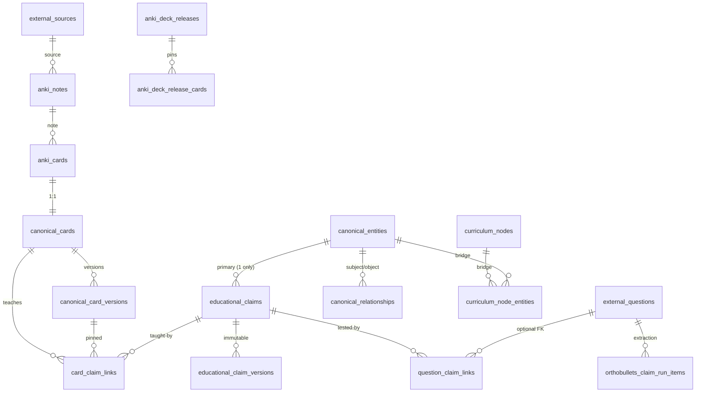

# Knowledge Graph Schema Map — 2026-09-27

Derived from migration DDL in `supabase/migrations` (152 files). Live
`SELECT` verification was impossible (DB unreachable); map `migration ↔ table`
provenance is given so parity checks can confirm each object.

## Core tables

| Table | DDL source | PK / identity | Versioning | Purpose |
|---|---|---|---|---|
| `external_sources` | ontology foundation | uuid | none | source registry (Anki, OB…) |
| `anki_notes` | 20260627 import | uuid; unique (source, note_key); guid indexed | content hashes | imported notes, fields preserved |
| `anki_cards` | 20260627 import | uuid; unique (source, card_key) | content hash | imported cards, scheduling read-only |
| `canonical_cards` | 20260627 import | uuid; unique (anki_card_id); current_version pointer | via versions | SnapOrtho-owned card registry |
| `canonical_card_versions` | 20260627 import | uuid; unique (card, version_no) + (card, content_hash) | snapshots (field/html/tags) | non-destructive version log (updatable rows) |
| `anki_deck_releases` | 20260720 versioned deck | uuid; unique release_key; lifecycle draft→published→superseded/retired | manifest checksum + predecessor | immutable release pins |
| `anki_deck_release_cards` | 20260720 versioned deck | uuid; unique per release on card, (guid,ord), ordering_key | pins card version + content hash | release membership |
| `educational_claims` | 20260705 pilot + 20260919 fingerprint + v3/v4 | uuid; deterministic `clinical-claim\|fp`; active fingerprint uidx | current_version pointer | atomic teaching assertions |
| `educational_claim_versions` | 20260919 fingerprint | uuid; unique (claim, version_no); trigger-IMMUTABLE | full snapshots + fingerprint | claim history |
| `card_claim_links` | 20260919 fingerprint | uuid; unique active (card, claim); role=`teaches` only | pins card version + claim version | card→claim teaches edges |
| `question_claim_links` | 20260919 fingerprint | uuid; unique active (provider, native, claim); roles tests_primary/secondary | pins claim version + source hash | question→claim tests edges |
| `educational_claim_gaps` | 20260919 fingerprint | uuid; 6 gap classes × 5 owners | open→resolved/wontfix | missing/weak coverage ledger |
| `canonical_entities` | 20260628 next-gen KG | uuid; slug unique; 11 types; 8-state lifecycle | deprecate/replace, never delete | curated domain truth (+v4 provisionals) |
| `canonical_relationships` | 20260628 next-gen KG | uuid; typed endpoints incl card/question/curriculum — NO claim endpoint | lifecycle_status | entity↔entity/domain edges |
| `curriculum_nodes` | 20260626 ontology | uuid; slug unique; self-tree, 7 node types | editorial | navigation taxonomy |
| `external_questions` | 20260626 phase2 | uuid; unique (source, external_id); METADATA ONLY | last_seen only | question registry (no stems) |
| `external_question_curriculum_mappings` | 20260626 phase2 | uuid; conservative, needs_review | is_primary | question→curriculum overlay |
| `card_canonical_entity_links` | 20260628 retarget | uuid | review_status | legacy card→entity teaches path |
| `question_canonical_entity_links` | 20260628 retarget | uuid; retarget_path/match_basis/confidence | review_status | question→entity additive links |
| `decision_points` | 20260705 pilot | uuid; subject entity; trigger/action text | review_status | if/then logic (pilot-scale usage) |
| `kg_automation_proposals` | 20260628 automation | uuid; 14 proposal types | batches/memberships | review queue incl create_canonical_entity |
| `card_claim_backfill_runs/items` | 20260923 backfill | uuid; unique (run, card_version); service-role-only + forced RLS | totals/status | durable per-card outcomes, payloads for unresolved |
| `orthobullets_claim_runs/items` | 20260926 v3 + v4 | uuid; stage machine discovered→complete; leases/retries/token usage | source fingerprint per item | OB extraction runs |
| `kg_production_releases/objects/neighborhoods/exclusions` | 20260716 beta | release-gated publication | beta/reviewed states | what BroBot may serve |

## Mermaid ER (core claim path)

## Key functions / RPCs

- `educational_claim_fingerprint_hash` (v1 structural) and
  `educational_claim_assertion_fingerprint_hash` (v3/v4, +claim text);
  `sync_*` triggers recompute on write; algorithm_version selects function.
- `commit_orthobullets_machine_claim` (v4 signature; advisory-lock dedup;
  supersedes prior tests_primary; auto-validates claims).
- `resolve_or_create_orthobullets_v4_entity` (authoritative-or-provisional
  resolution; creates `status=proposed` rows in `canonical_entities`).
- `search_orthobullets_v4_entity_candidates` (question links → exact label →
  alias → curriculum bridge → trigram).
- `retrieve_brobot_kg_shadow` (entity/relationship retrieval from pinned
  production release; no claim inputs).
- `refresh_orthobullets_claim_run` (run counters; completed_with_gaps).

## Missing objects (target-model gaps)

No `question_versions`/`question_history`, no `claim_relationships`
(supports/contradicts/supersedes/prerequisite), no multi-entity claim edge
table, no `mentions` role or citation table, no embeddings column on claims.
All are additive; none require rewriting existing tables.
